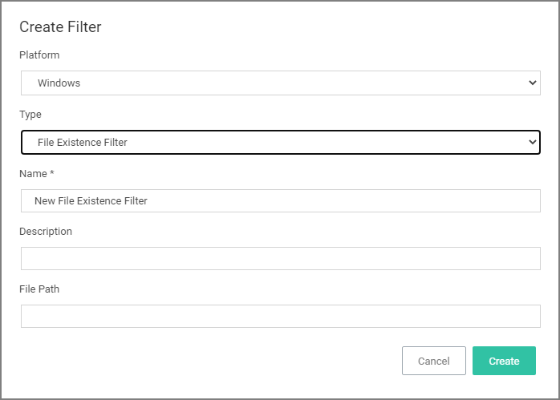
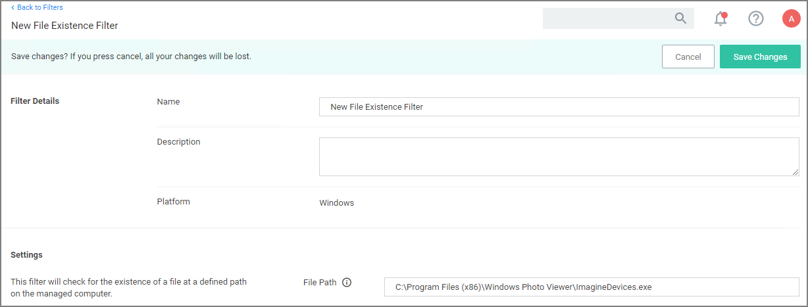

[title]: # (File Existence)
[tags]: # (filter types)
[priority]: # (2)
# File Existence Filter

This type of filter identifies whether a file exists. *No out-of-box filters exist in Privilege Manager for this type*.

This filter is available for both Windows and macOS systems.

## Parameters

* Path, this must be an exact file path. Windows Environment Variables are supported though, %ProgramFiles% for example.

