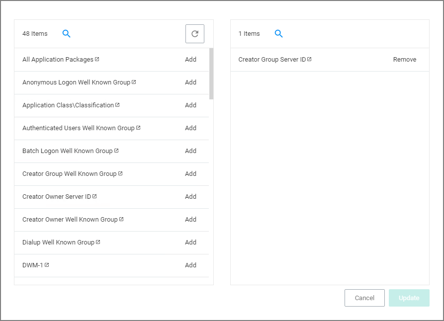

[title]: # (File Owner Filter)
[tags]: # (filter types)
[priority]: # (2)
# File Owner Filter

This filter identifies files based on ownership.

## Examples

1. Navigate to __Admin | More…__ and select __Filters__.
1. In the search field for the __Type__ column enter File owner.

   
1. Select a filter to view its details and/or create a copy to customize the filter.

   
1. Click __Edit__.
1. Set the needed parameters.

   
1. Click __Save__.

   
