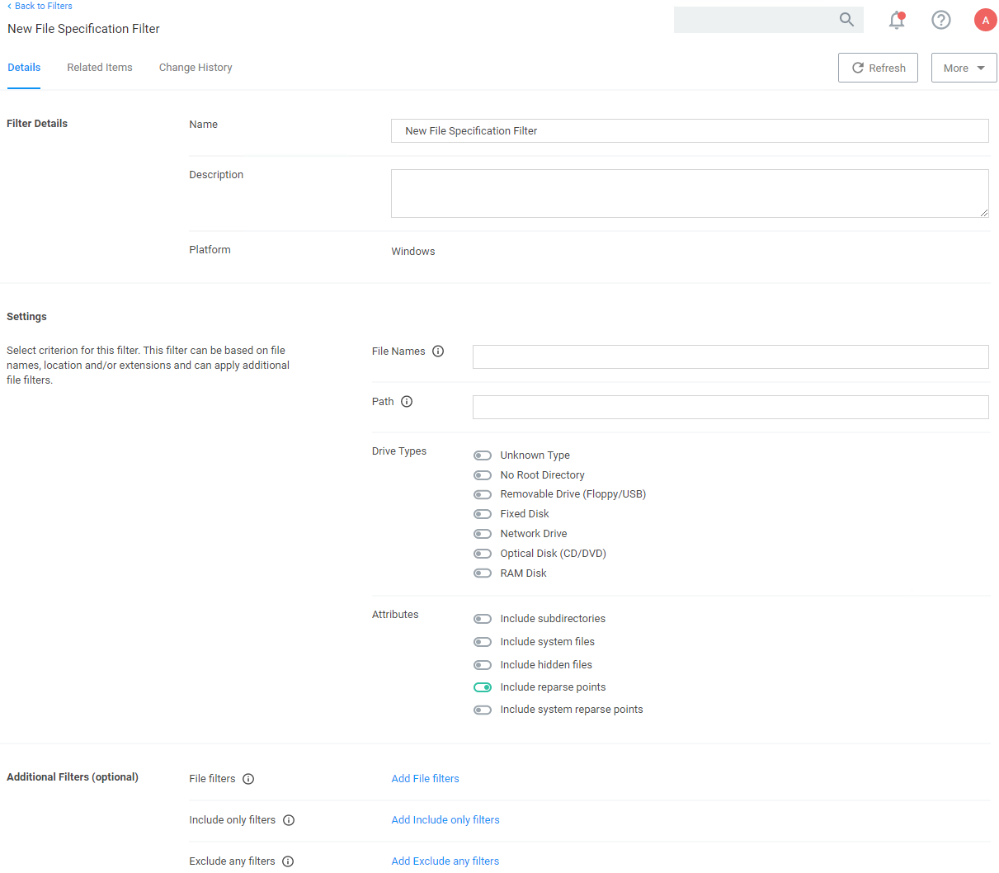

[title]: # (File Specification)
[tags]: # (filter types)
[priority]: # (2)
# File Specification Filter

This filter identifies files based on their file path, or location on a computer.

This filter is available for both Windows and macOS systems. Use this filter for macOS endpoints only to target known scripts or command-line tools; otherwise use the [Default File Specification (macOS)](../macOS/file-specification.md) filter.

## Example

1. Navigate to __Admin | More…__ and select __Filters__.
1. In the search field for the __Type__ column enter file specification filter.

   
1. Select a filter to view its details and/or create a copy to customize the filter.

   
1. Click __Edit__.
1. Set the needed parameters.

   
1. Click __Save__.
