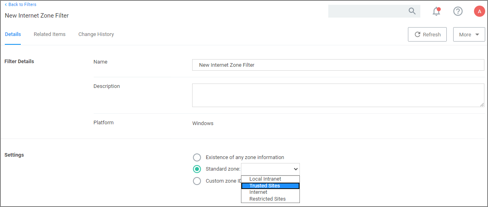

[title]: # (Internet Zone Filter)
[tags]: # (filter types)
[priority]: # (2)
# Internet Zone Filter

This filter identifies what internet zone a computer is connected to on your network, such as Trusted Sites and Local Intranet. *No out-of-box filters exist in Privilege Manager for this type*.

## Parameters

* Existence of any zone information
* Standard zone:

  * Local Intranet
  * Trusted Sites
  * Internet
  * Restricted Sites
* Custom Zone IDs
