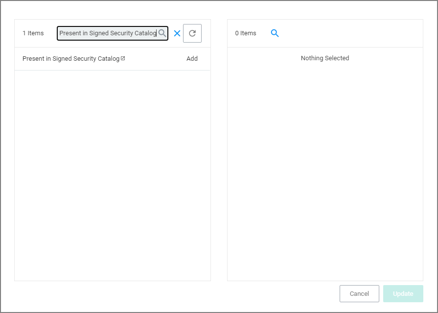

[title]: # (Unable to Access Cortana and Search for Windows 10)
[tags]: # (filter types)
[priority]: # (2)
# Unable to Access Cortana and Search for Windows 10

This issue might be due to the __Present in Signed Security Catalog__ not being added to the __Exclusion Filters__ section in a policy.

## How to Resolve

1. Launch __Privilege Manager__
1. Click __ADMIN__ | __Policies__.

   
1. Click on a previously created policy.
1. Click __Edit__.
1. Click on the __Conditions__ tab | __Add Exclusion Filter__.

   
1. Search for __Present in Signed Security Catalog__.
1. Select the check box for __Present in Signed Security__ filter | click __Add__.

   
1. Click __Save__.
1. Click on the __Deployment__ tab.

   
1. Click __Cache Policy__ | __Run Policy Targeting Update__.

>**Note**: Once the agents check back into the web console which by default occurs every 30 minutes, the machines will get the new policy changes. However
if you would like to test the policy update on a specific machine, please continue to step 11.

11. Go to the Machine(s) where you want to update the policy and open the Agent Utility. 

    e.g., `C:\Program Files\Thycotic\Agents\Agent`

12. Click __Update__.

    
