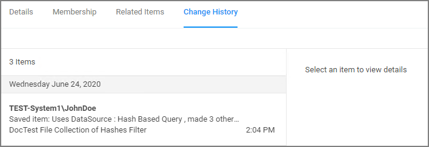
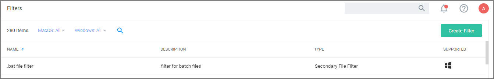
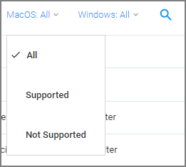
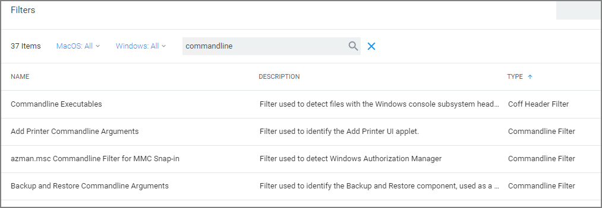
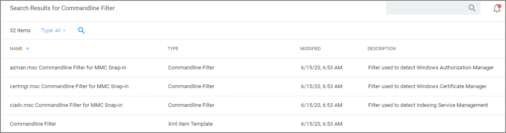

[title]: # (Filter Types)
[tags]: # (description, overview)
[priority]: # (5000)
# Filter Types and Descriptions

There are different types of filters. When creating a new filter for Windows or macOS, the "Filter Type" dropdown gives you a list of options that include the categories:

* [Application Filters](application/index.md)
* [File Filters](file/index.md)
* [Inventory Filters - Windows only option](inventory/index.md)
* [macOS Specific Filters](macOS/index.md)

These are loose groupings that signify a few different approaches to the filtering method or targets.

## Common Filter Characteristics

Each filter has a Details area that contains the filter name, description, and platform association. These details are usually specified when you create the filter, either by choosing __Create Filter__, editing an existing filter, or duplicating an existing filter.

Those characteristics are used for searches or filtering and allow users to easily find existing filters.

>**Note**: Every Filter is associated with a data source during its creation. That data source is not to be changed. Except for the Security Catalog File Filter where the data source needs to be added after the filter has been created.

### Filter Change History

Each filter has a __Change History__ tab, where audit information can be reviewed from the time the filter was created in the system.

Refer to [Change History](../../admin/config/history/index.md) to learn more about drilling down into the change history of resources and the report.

## How to Search for Filters

All out-of-the-box filters can be searched, duplicated, and then customized to be used in policies.

1. Navigate to __Admin | Filters__.

   

   The list of all filters is sortable by Name (default), Description, Type, and OS Support.

   You may limit your list output, by changing from the default __All__ or Supported selection for macOS or Windows to Not Supported. 

   
1. Using the search option next to the OS drop-down, lets you search the list contents based on the column the contents is sorted by. So if your list is sorted by __Name__, but you are looking for all commandline filter types you have in the system, sort your list by __Type__ first.
1. Then click __Search__ and enter a search term, for this example _commandline_.

   

You can also use the search option on the top-right from any page of your Privilege Manager console and get the a list of commandline filters returned. If you use this search option, the search field does not retain your search term. The results are based on the search term matching the Name and/or Type, so the list will contain more items than searching based on column selection.

The columns returned for this search are sorted by Name (default), Type, Modified Date, and Description.
