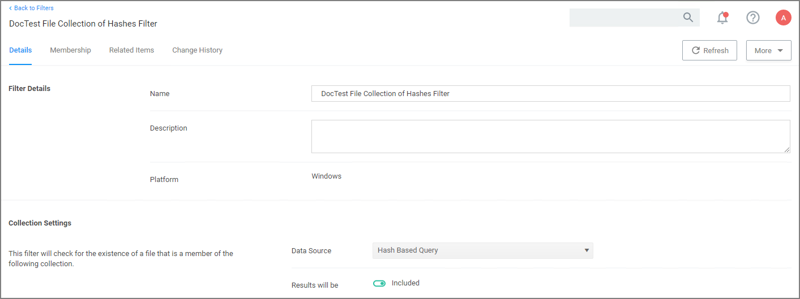
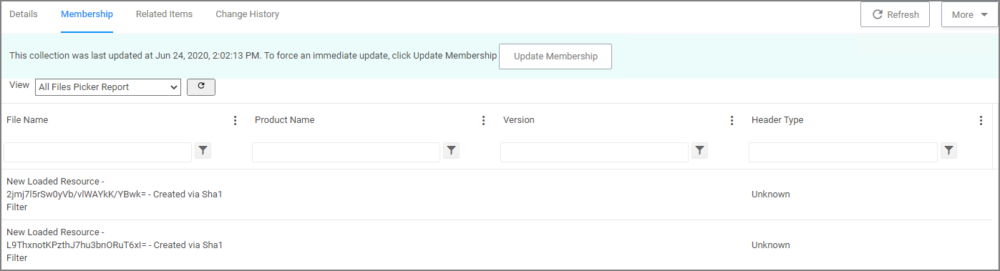

[title]: # (File Collection from List of Sha1 Hashes Filter)
[tags]: # (filter types)
[priority]: # (2)
# File Collection from List of Sha1 Hashes Filter

This type of filter identifies file inventory based on Secure Hash Algorithms. *No out-of-box filters exist in Privilege Manager for this type*.

When creating this filter the target hashes need to be entered as a comma-separated list:

This filter is available for both Windows and macOS systems.

## Parameters

Once the filter is created, the following settings can be edited:

* Data Source:

  * Hash Based Query (do not change the data source)
* Results will be:
 
  * Included (default)
  * Excluded

Under the Membership tab various reports can be viewed:

* All Files Picker Report
* Win32 File Picker Report
* Default Resource Picker Report

Example showing the Default Resource Picker Report view:

