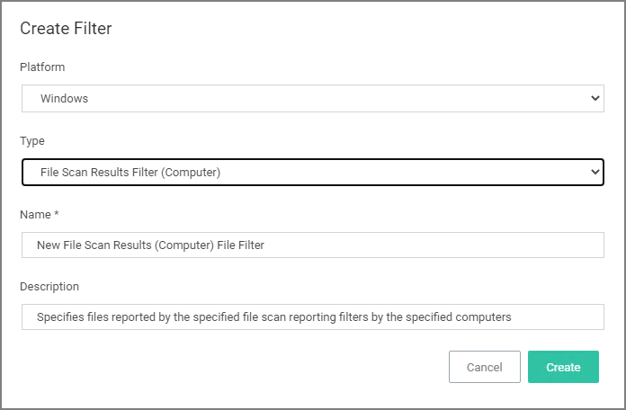
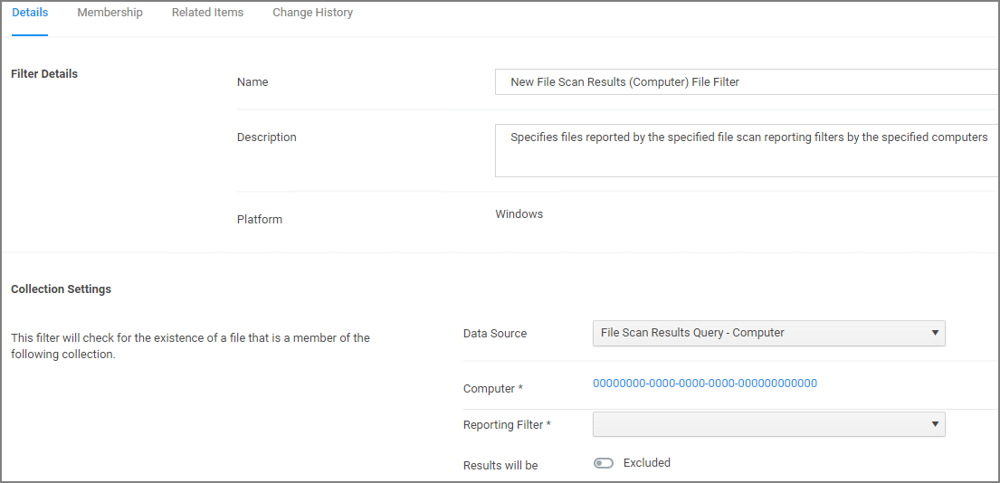

[title]: # (File Scan Results Filter - Computer)
[tags]: # (filter types)
[priority]: # (2)
# File Scan Results Filter (Computer)

This type of filter identifies file inventory based on another computer's file scan results. This allows for one computer that has been setup properly to be used as a source for this filter. *No out-of-box filters exist in Privilege Manager for this type*.

This filter is available for both Windows and macOS systems.

## Parameters

Once the filter is created the following settings can be edited:

* Data Source, this should not be edited. The information here is specific to the task of the File Scan Results Filter for computers.
* Computer, this is the actual computer resource that has to be selected for the scan.
* Reporting Filter
* Results will be either excluded (default) or included.

