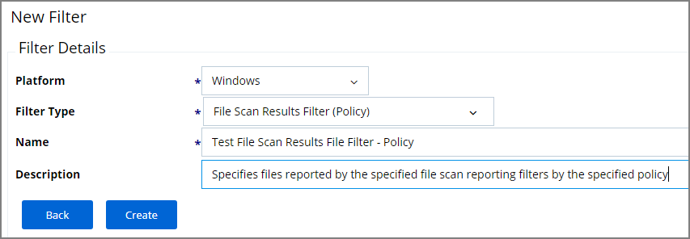
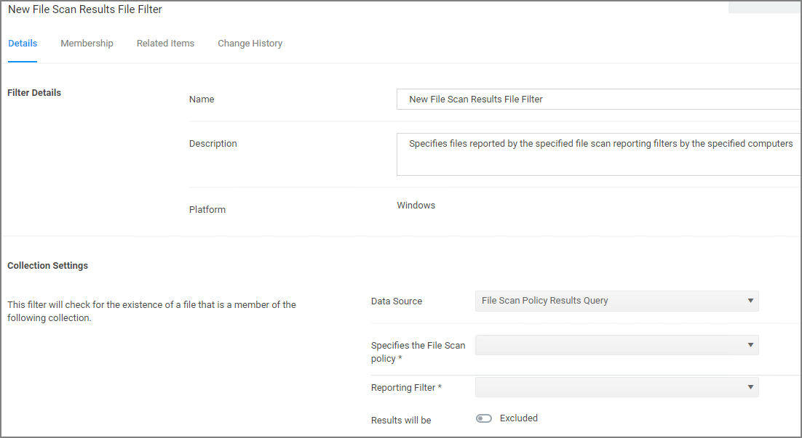

[title]: # (File Scan Results Filter - Policy)
[tags]: # (filter types)
[priority]: # (2)
# File Scan Results Filter (Policy)

This type of filter identifies file inventory based on Privilege Manager Policies. *No out-of-box filters exist in Privilege Manager for this type*.

## Parameters

Once the filter is created the following settings can be edited:

* Data Source, this should not be edited, it is the File Scan Policy Results Query.
* Specifies the File Scan Policy, this is the actual Policy resource that has to be selected for the scan.
* Reporting Filter
* Results will be either excluded (default) or included.

