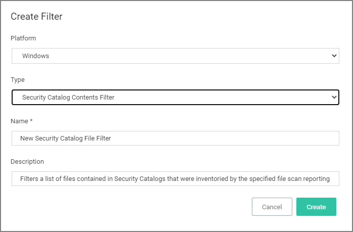
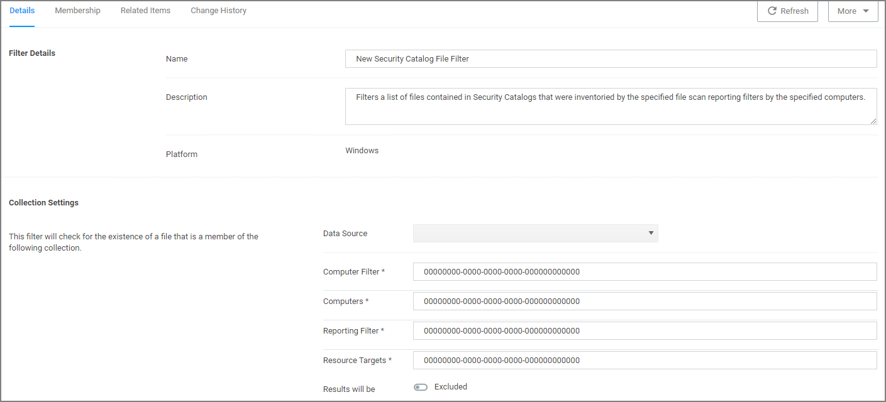

[title]: # (Security Catalog Contents)
[tags]: # (filter types)
[priority]: # (2)
# Security Catalog Contents Filter

This is a special collection of files to whitelist or blacklist. This filter type is similar to other Inventory Filters, particularly our Security Catalog Filter. *No out-of-box filters exist in Privilege Manager for this type*.

## Parameters

Once the filter is created the following settings can be edited:

* Data Source
* Computer Filter
* Computers
* Reporting Filter
* Resource Targets
* Results will be either excluded (default) or included.

