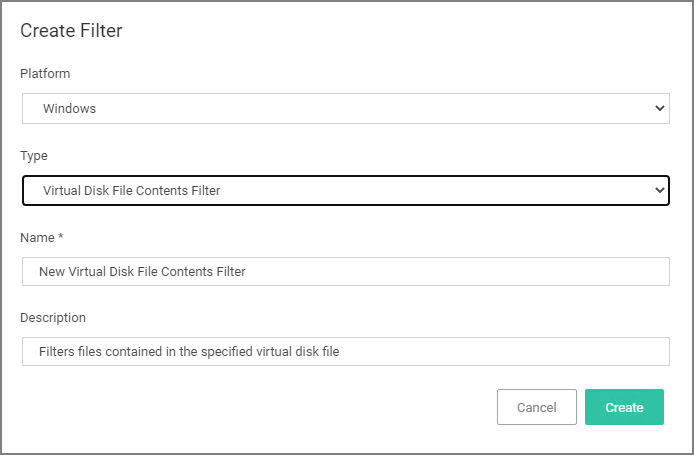

[title]: # (Virtual Disk File Contents Filter)
[tags]: # (filter types)
[priority]: # (2)
# Virtual Disk File Contents Filter

The Virtual Disk File Contents Filter filters files contained in the specified virtual disk file. *No out-of-box filters exist in Privilege Manager for this type*.

## Parameters

Once the filter is created the following settings can be edited:

* Data Source, (do not edit) this is the MSI File Contents Query.
* File:

  * Parameters (these are required)

    * Win32 Executable
    * Product Name
  * Select Resource, this is the actual MSI file resource that has to be selected for the scan.
* Results will be either excluded (default) or included.

### Viewing and Editing the Parameters

### Viewing and Adding the Resource(s)

