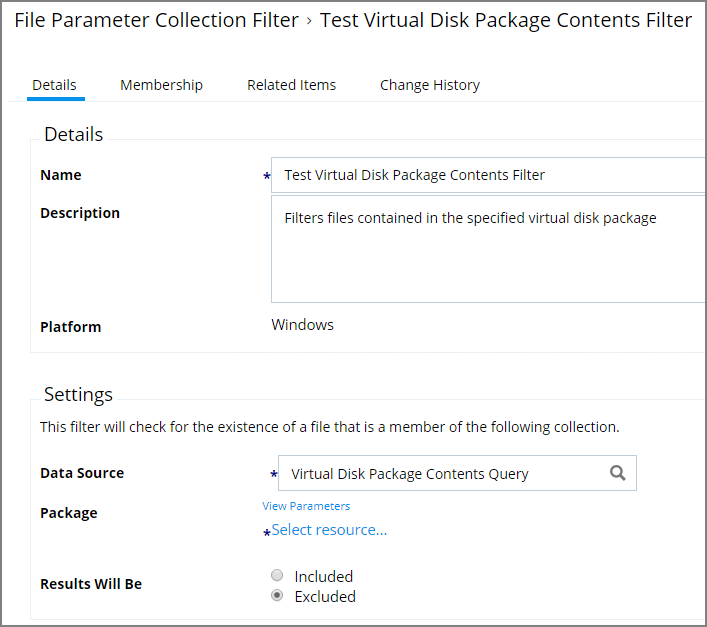
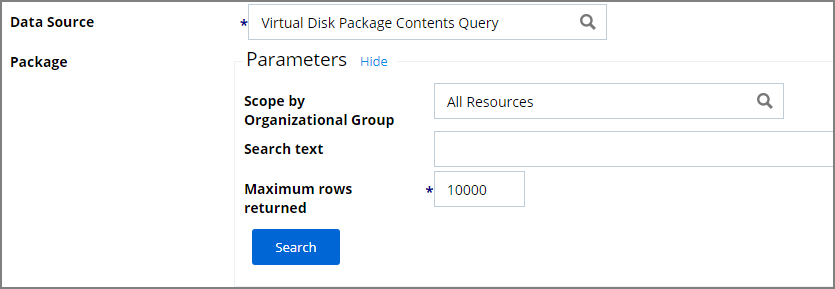
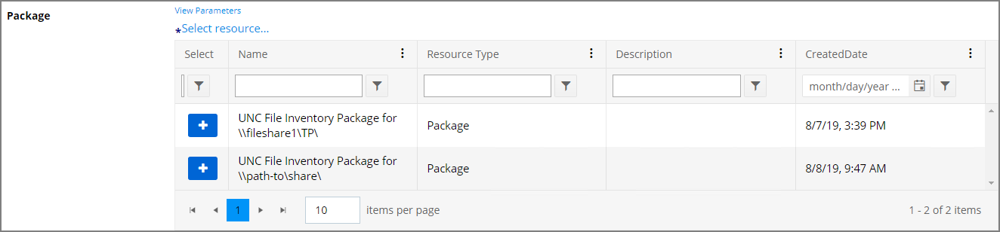

[title]: # (Virtual Disk Package Contents Filter)
[tags]: # (filter types)
[priority]: # (2)
# Virtual Disk Package Contents Filter

Filters files contained in the specified virtual disk package. *No out-of-box filters exist in Privilege Manager for this type*.

## Parameters

Once the filter is created the following settings can be edited:

* Data Source, (do not edit) this is the Virtual Disk Package Contents Query.
* Package:

  * Parameters:

    * Scope by Organizational Group
    * Search text
    * Maximum rows returned, this is a required parameter and the default is 10000.
  * Select Resource, this is the actual package resource that has to be selected for the query.
* Results will be either excluded (default) or included.

### Viewing and Editing the Parameters

### Viewing and Adding the Resource(s)

