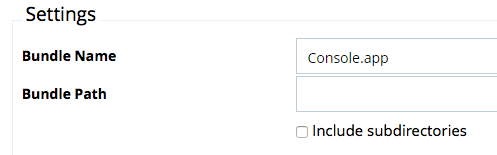

[title]: # (App Bundle)
[tags]: # (filter types)
[priority]: # (3)
# App Bundle Filter

This type of filter identifies app bundles for macOS systems.

With Privilege Manager 10.7.1 the .app extension is automatically appended to an app bundle name. If you are using a version prior to 10.7.1, verify that the complete name with the .app extension is provided under Settings in the __Bundle Name__ field when editing the filters parameters.

## Parameters

* Bundle Name
* Bundle Path

  * Include subdirectories

  
* List of bundle properties the filter has to match. Those are:

  * App Category
  * Bundle Identifier
  * Bundle Name
  * Bundle Version
  * Bundle Version (short)
  * Executable File
  * Info String
  * Min System Version
