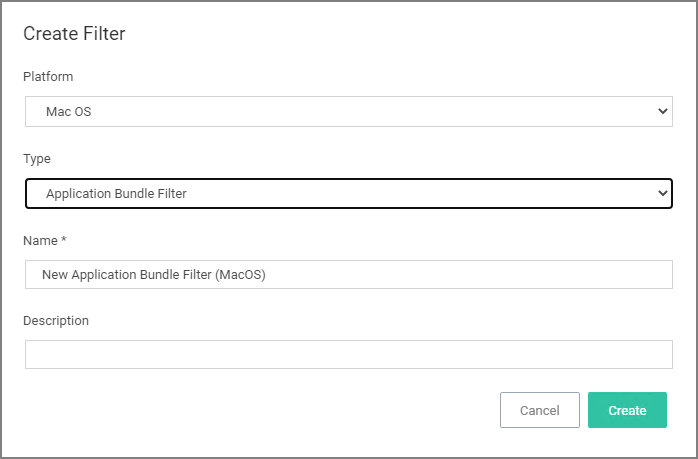
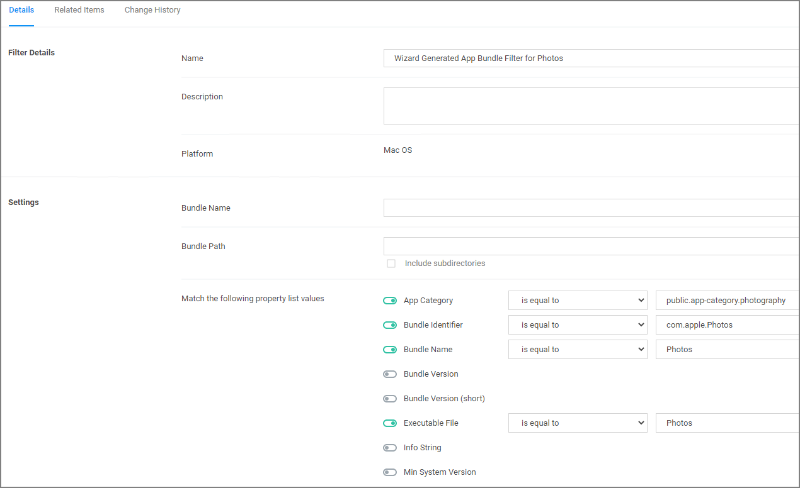

[title]: # (App Bundle)
[tags]: # (filter types)
[priority]: # (3)
# App Bundle Filter
This type of filter identifies app bundles for macOS systems.

   

Prior to Privilege Manager 10.7.1, the value of the Bundle Name field requires the inclusion of the .app extension (e.g. Console.app). The Bundle Name field should have an entry like __console.app__ or __photos.app__ to correctly apply the filter. If it is not present, the filter will fail to properly match.
With Privilege Manager 10.7.1, the presence of the .app extension is properly calculated during policy processing.

## Pre-10.7.1 Example

The bundle name should appear when creating the filter.

   

## Parameters

* Bundle Name
* Bundle Path

  * Include subdirectories

The following bundle properties can be used to identify an application bundle in an Application Bundle filter. These properties are found in the info.plist for the application on macOS systems.

* App Category
* Bundle Identifier
* Bundle Name
* Bundle Version
* Bundle Version (short)
* Executable File
* Info String
* Min System Version

>**Note:** The __Bundle Name__ field is separate from the Bundle Name in the property list. If you have the Bundle Name field populated and it doesn't match the binary being executed, the filter will fail to match and not process the property list values in the Info.plist file.
>If an app is discovered as a new loaded resource and assigned to a policy, a filter is created and pre-populated based on the information pulled from the info.plist file.

   

### Info.plist Example for Photos

```
<key>CFBundleExecutable</key>
<string>Photos</string>
<key>CFBundleHelpBookFolder</key>
<string>Photos.help</string>
<key>CFBundleHelpBookName</key>
<string>com.apple.Photos.help</string>
<key>CFBundleIconFile</key>
<string>AppIcon</string>
<key>CFBundleIconName</key>
<key>CFBundleIdentifier</key>
<string>com.apple.Photos</string>
<key>CFBundleInfoDictionaryVersion</key>
<string>6.0</string>
```
