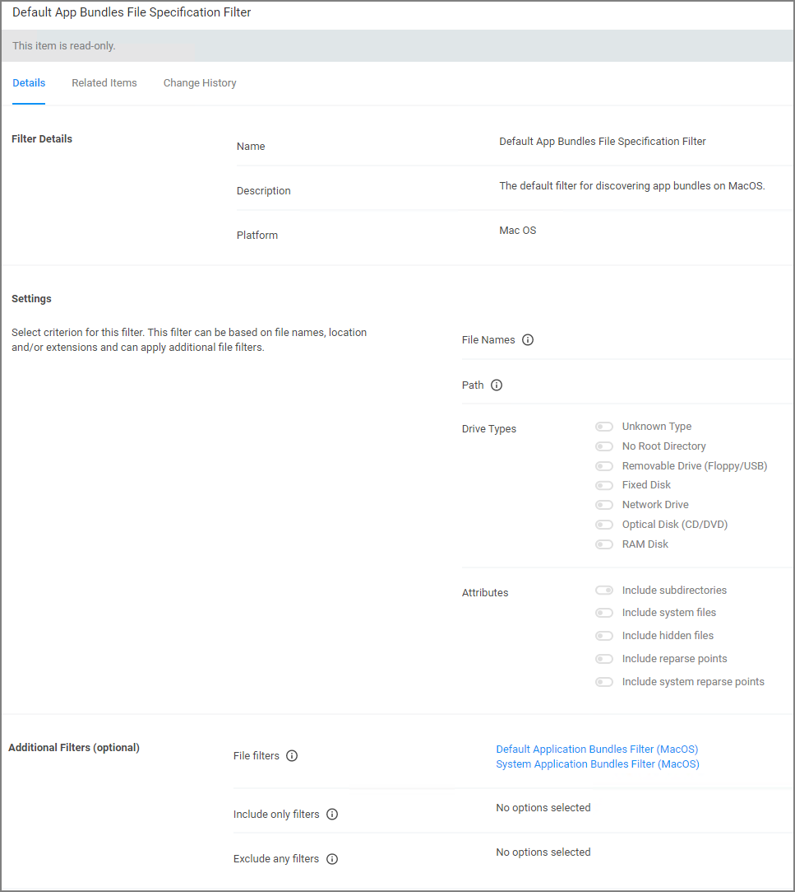
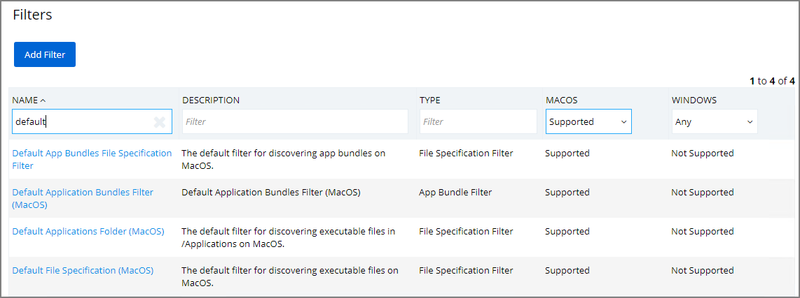

[title]: # (Default App Bundles - File Specification)
[tags]: # (filter types)
[priority]: # (4)
# Default App Bundles File Specification Filter

This type of filter identifies application bundles for macOS systems. With this application bundles filter in place, macOS application bundles are inventoried regardless of their installation path in either /Applications or /System/Applications) on all versions of macOS.

By default this is a read-only filter which uses the following Additional Filters:

* File filters:

  * [Default Application Bundles Filter (MacOS)](def-app-bundle.md)
  * [System Application Bundles Filter (MacOS)](sys-app-bundle.md)

The option to include subdirectories is enabled by default.

## Example

1. Navigate to __Admin | Filters__.
1. In the search field next to the supported/not supported OS drop-downs, search for _default app_.

   
1. Select the __Default App Bundles File Specification Filter__ filter to view its details and/or create a copy to customize the filter.
1. Click __Duplicate__.
1. Set the needed parameters.
1. Click __Save Changes__.
