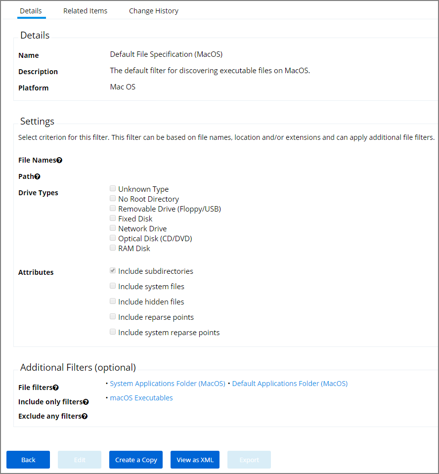
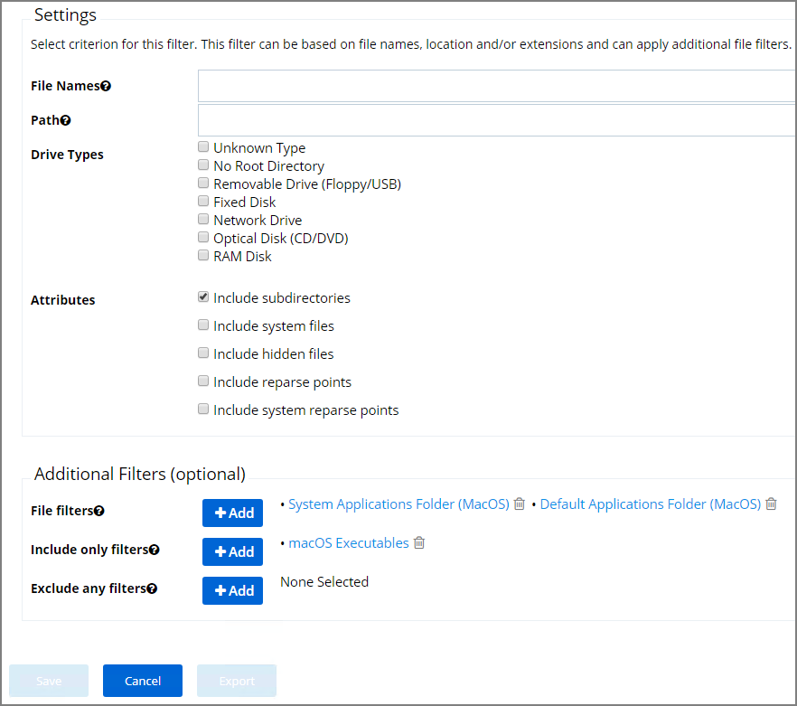

[title]: # (Default File Specification)
[tags]: # (filter types)
[priority]: # (4)
# Default File Specification (macOS)

This filter identifies files based on their file path or location on a computer.

This filter is available for macOS systems.

By default this is a read-only filter which uses the following Additional Filters:

* File filters:

  * [System Application Folder - MacOS](sys-app-folder.md)
  * [Default Application Folder - MacOS](def-app-folder.md)

* Include only filters:

  * [macOS Executables](macos-exe.md)

The option to include subdirectories is enabled by default.

## Example

1. Navigate to __Admin | More…__ and select __Filters__.
1. In the search field for the __Name__ column, search for default.

    filter")
1. Select the __Default File Specification (MacOS)__ filter to view its details and/or create a copy to customize the filter.
1. Click __Edit__.
1. Set the needed parameters.

   
1. Click __Save__.
