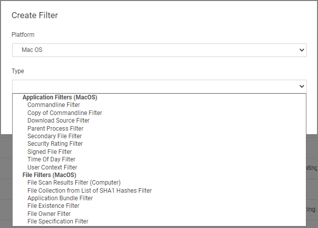

[title]: # (macOS)
[tags]: # (filter types)
[priority]: # (2)
# macOS Specific Filters

Most of the Application and File type filters apply to Windows as much as macOS platforms. There are some macOS specific filters that are covered in this section.

This is the default drop-down list when adding a new filter for macOS:

## List of MacOS Filters

Application Filter Types:

* [Commandline Filter](../application/cmdline.md)
* [Download Source Filter](../application/download-source.md)
* [Parent Process Filter](../application/parent-process.md)
* [Secondary File Filter](../application/secondaryfilefilters.md)
* [Security Rating Filter](../application/security-ratings.md)
* [Signed File Filter](../application/signed-file.md)
* [Time Of Day Filter](../application/time-of-day.md)
* [User Context Filter](../application/user-context.md)

File Filter Types:

* [Application Bundle Filter](app-bundle.md)
* [File Collection from List of SHA1 Hashes Filter](../inventory/file-collect-list-sha1-hash.md)
* [File Existence Filter](../file/file-existence.md)
* [File Owner Filter](../file/file-owner.md)
* [File Scan Results Filter - Computer](../inventory/file-scan-results-comp.md)
* [File Specification Filter](../file/file-specification.md)