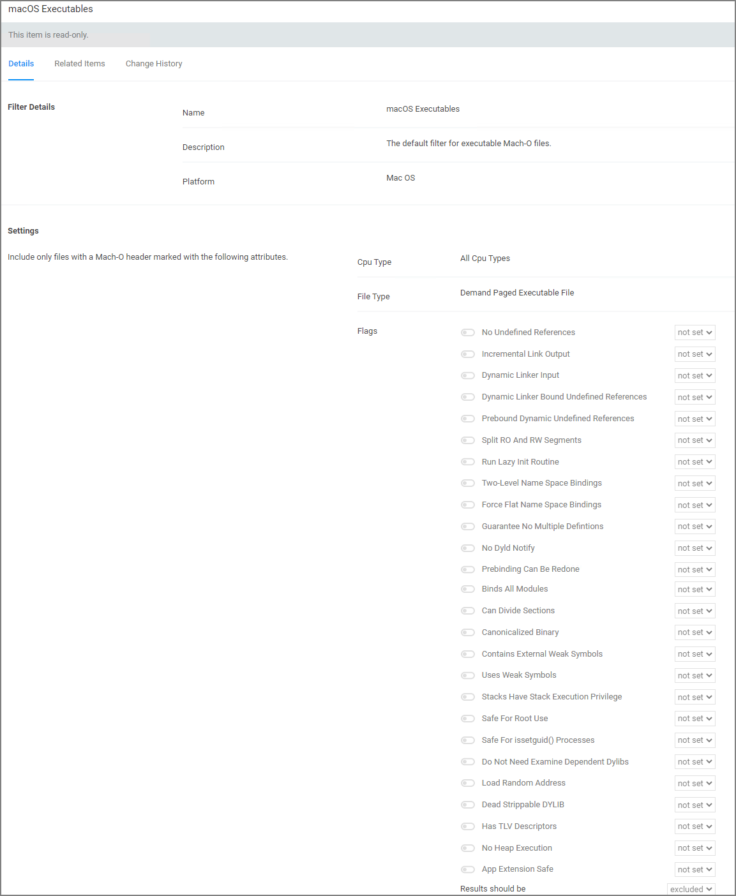

[title]: # (macOS Executables)
[tags]: # (filter types)
[priority]: # (7)
# macOS Executables

The default filter for executable Mach-O files. This filter is available for macOS systems.

Include only files with a Mach-O header marked with attributes set via the filter Settings:

