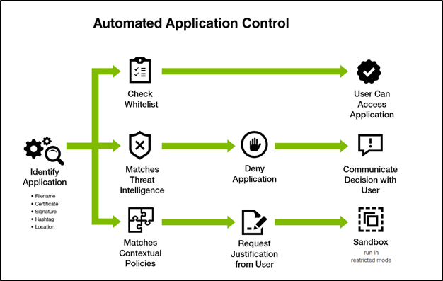

[title]: # (Application Control Overview)
[tags]: # (overview)
[priority]: # (4000)
# Application Control Overview

<!-- TODO: Add Overview paragraph -->

## Dashboard
From Privilege Manager’s Home click the right-hand Application Control section to enter your Application Control Dashboard. Tiles provide shortcuts to the different components housed within Application Control. You can Pin tiles to the top of your screen to enhance navigation:

<User-added image>

## What is a Policy?
In Application Control, layered Policies create the backbone, or parameters, that dictate precisely how privileges are accessed across your network. They define what a user can run, and where. A policy is made up of customizable filters that apply an action to specific Computer Groups. In other words, each policy is defined by:

* Filters:     What criteria needs to be met to apply this policy?
* Targets:     Where should this policy be applied?
* Actions:     What should happen to the applications this policy applies to? (i.e. blocked, allowed, etc.)

During the creation of a Policy you will specify Actions and Targets, but Filters are created separately and then assigned to Policies.

## Overview of the Configuration Process

This Setup Guide will walk you through the specific steps you can take to configure a few popular example policies in Privilege Manager. While there are many different types of policies, the setup process must follow these basic steps:

1. Collect File Data—This enables Privilege Manager to recognize specific files and file types in your environment. The file data that you want to target with policies are called Events. All imported files can be viewed in the Event Discovery | Files page.
1. Create Filters—This step sorts important file data (Events) according to different criteria.
1. Create Policies—This step defines what 1) Actions to perform on applications and the 2) Targets (Locations) for those actions.
1. Assign Filters to Policies—This step directs a Policy’s actions to the appropriate Events happening on your network. This step also allows a Policy to be Enabled, or activated.
1. Order your Policies based on priority level—Once your policies are created, the order they execute across your network matters. See the Policy Priority section in this guide for more details.

## Collecting File Data

Before Privilege Manager can do anything else for Application Control, it must be able to recognize files or file types in your environment like applications or executables that run. File data can be collected in several ways:

* Event Discovery: Discover active applications on your network by setting up Learning Mode Policies
* File Upload: Directly upload a specific file that you want to target
* Remote File Inventory Task (Windows/MacOS): Scans endpoints directly and imports all file data (both active and inactive files) that exist on the targeted machine/s.