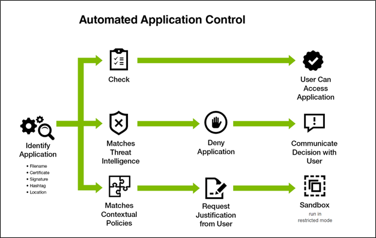

[title]: # (Application Control)
[tags]: # (overview)
[priority]: # (4000)
# Application Control

Application Control in Privilege Manager allows administrators to manage all application activity on endpoints. Applications requiring admin rights or root access can be automatically elevated if trusted, allowed applications can be whitelisted, and malicious applications can be blocked.

In other words, the key to keeping your organization's employees working both securely and effectively without notable disruptions to their work is by tailoring a robust, role-based Application Control system. On the other hand, managing local administrator and root accounts through Local Security is the fastest way to lock down your network from malicious endpoint attacks that exploit administrator access.

## Dashboard

From Privilege Manager's Home click the right-hand Application Control tile to enter your Application Control Dashboard. Tiles provide shortcuts to the different components housed within Application Control. You can pin tiles to the top of your screen to enhance navigation:

