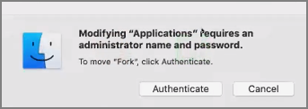
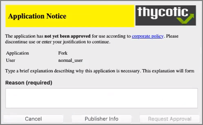

[title]: # (Request Application Installation)
[tags]: # (standard user, policy)
[priority]: # (4101)
# Request Application Installation

Privilege Manager can allow macOS users to install packages on demand. Do the following to create a policy to allow users to request installation of certain packages. For this to work, your endpoint must be online. If the system is offline, refer to the Offline Approval process documentation.

1. Navigate to __Admin | Policies__ and select __Add Policy__.
1. Choose the Mac OS Platform and select __Show All Templates__ and then __Other: Approve Installer Packages__.

   
1. Customize the Name and Description and click __Create__.
1. Enable the policy after it has been created and update policies at the endpoint.

Once the policy is enabled and in place at the endpoint, a user will typically go through the following steps to request an application installation:

1. Mount the DMG containing the application you’d like to install to Applications. If the DMG contains an application bundle that can be dragged to the Applications folder, do so. If the DMG contains an installer application, double-click and proceed with the steps outlined in installing an application.
2. The Authentication required dialog opens:

   
3. Click the Authenticate button. The following Application Notice opens:

   
4. Enter the Reason why the application should be installed and click the Request Approval button. The Waiting for approval response dialog opens.

   
5. Once approved, the “This application has been approved…” text displays. Click the Continue button to proceed with the installation. If you click Cancel, the application will not be copied to the Applications folder and you may need to request approval again.

   