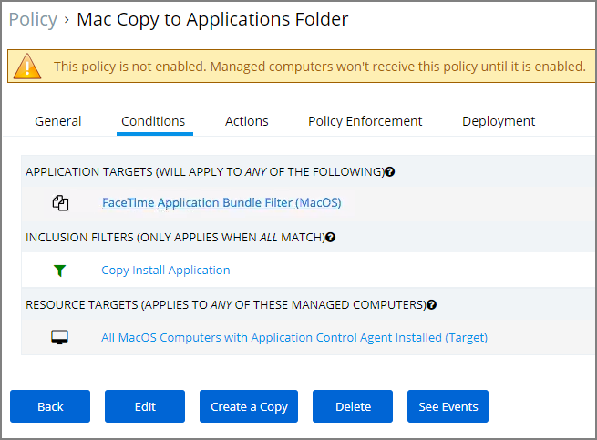

[title]: # (Allow Copy/Install of Applications)
[tags]: # (standard user, policy, macOS)
[priority]: # (5100)
# Allow Copy/Install of Applications

A policy can be created to allow or deny standard users to install specific applications by copying/pulling the application into the Applications folder. Follow this example to create a policy that will enable this functionality for your Mac OS user.

1. Navigate to __Admin | Policies__ and click the __Add New Policy__ button.
1. From the Platform drop-down select __Mac OS__.
1. From the Policy Type drop-down select __Show All Templates__.
1. From the Template Type drop-down select __Other: Allow Standard Users to Copy to Applications Directory (via Drag and Drop)__, this can also be done via __Other: Empty Policy__.

   
1. Enter a name and description for the new policy and click __Create__.
1. Once the policy is created, it can be modified to be restricted to certain applications instead of targeting every application:
   1. Click __+ Add Application Target__ to specify an application bundles filter for Mac OS applications.
   1. Click __+ Add Inclusion Filter__ to specify the Copy Install Application filter.
   1. Click __Save__.

   
1. Navigate to the __General__ tab.
1. Click __Edit__.
1. Select the __Enabled__ checkbox to enable the policy.

   
1. Click __Save__.

>**Note**:
>The new Copy Install Application Filter should not be used with the existing Privilege Manager Copy/Installer Helper Parent Process Filter, which should be removed from any policy before adding the new Copy Install Application Filter to the policy.

## Updating Existing Policies to Use the Copy Install Application Filter

If you have policies that currently use the Privilege Manager Copy/Installer Helper Parent Process Filter use the following steps to update them to use the Copy Install Application Filter in the Privilege Manager UI:

1. Navigate to __Admin | Policies__.
1. Click __Edit__ and navigate to __Conditions__ tab.
1. Under Inclusion Filters remove the __Privilege manager copy/installer helper parent process filter__.
1. Under Add Inclusion Filter search for and select __Copy Install Application__ and click __Add__.
1. Navigate to the Actions tab and remove __Allow copy to/Applications/Directory__.
1. Click __Add Action__ and select Application Approval Request Message Action then click __Add__.
1. Navigate to Policy Enforcement and select any of the options:

   * Continue enforcing policies after enforcing this policy
   * Continue enforcing policies for child processes after enforcing this policy

On the macOS endpoint,

1. Login as Admin user.
1. Open the macOS Agent via Terminal and run an update using command:

   ```shell
   sudo /usr/local/thycotic/agent/agentUtil.sh updateclientitems
   ```

The agent updates with new and updated policies and synchronize.