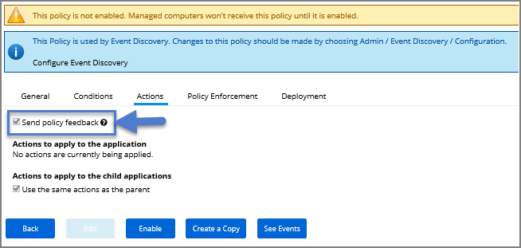
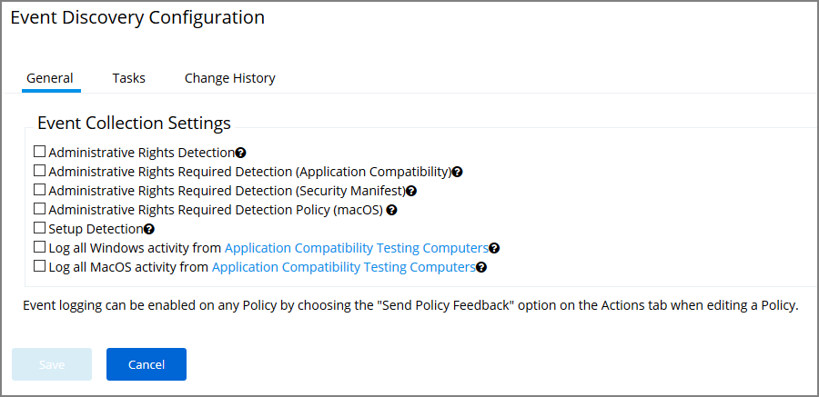
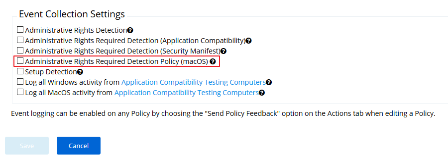
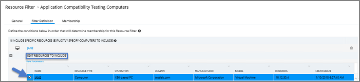
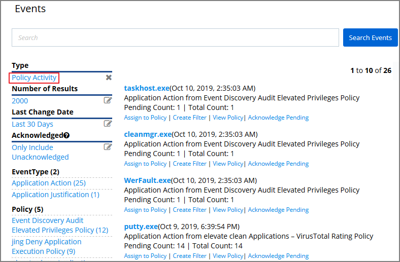
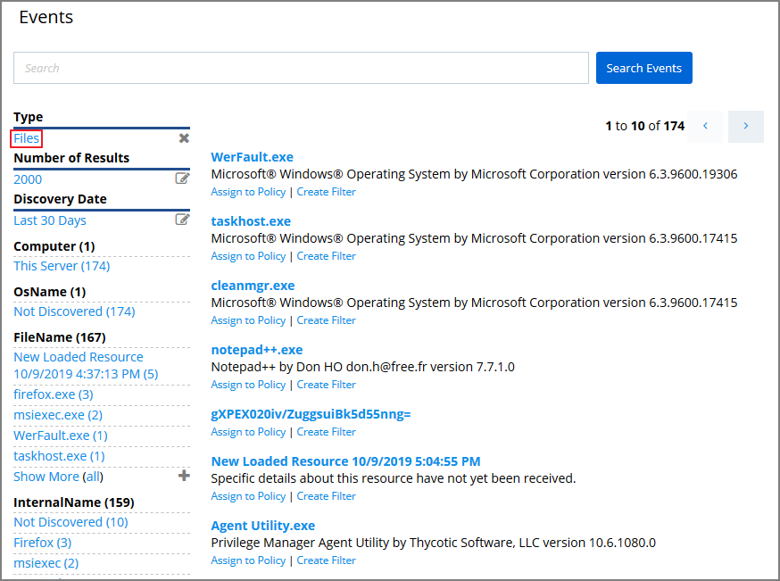
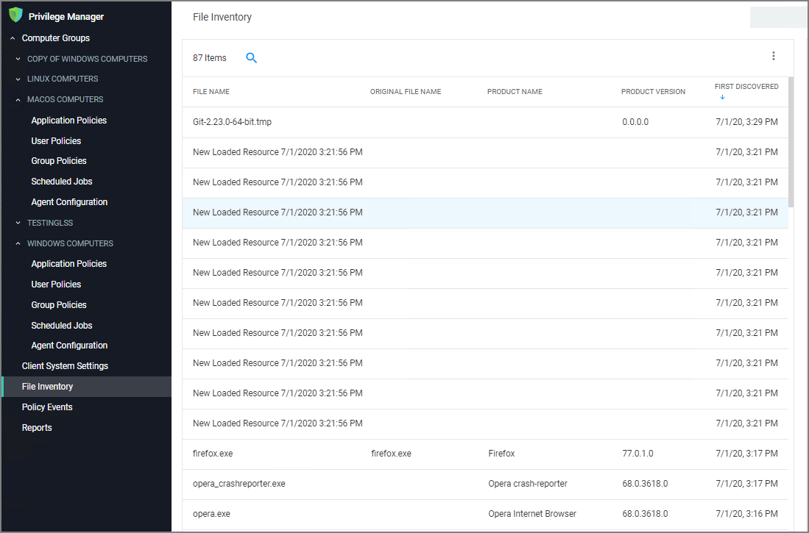
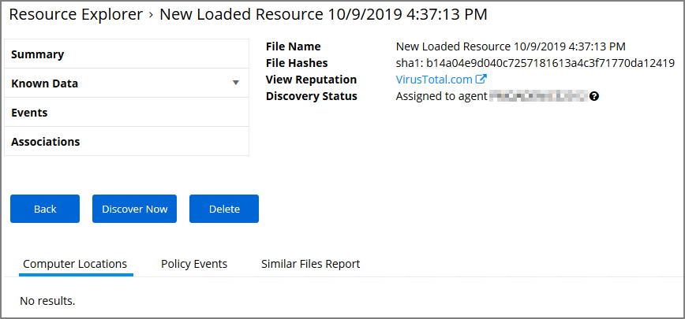

[title]: # (Learning Mode Policies)
[tags]: # (event discovery, policy feedback)
[priority]: # (3)
# Learning Mode Policies

At the most basic level, a Learning Mode Policy is a policy that takes no action, it exists only to gather data and you can use the data it gathers for audits or for assigning actions to application events retrospectively. For trials and Proof of Concept (PoC) environments these can be pointed at specific endpoints in order to learn about events that are already happening, or in order to test-run specific applications that you want to quickly introduce into Privilege Manager.

Any Learning Mode Policy will have the Send Policy Feedback check-box checked under the Policy's Actions tab.

>**Note**:
>Send Policy Feedback is generally disabled in production environments outside of specific auditing or data-collecting initiatives due to the large amount of data these policies can gather.

## Discover Applications that Require Administrator Rights

The most influential applications are those that require administrator credentials to run. For setting up endpoints that are organized by Least Privilege, you can use a Learning Mode Policy to discover all events requiring Administrator rights.

1. From Application Control's Dashboard, navigate to Event Discovery.
1. Click on the Configuration tile.
1. Here, you see a list of pre-configured policies:

   
1. Click __Edit__ and check the boxes of the Collection Settings: __Administrative Rights Detection__, __Administrative Rights Required Detection__ (Application Compatibility), __Administrative Rights Required Detection__ (Security Manifest), and __Setup Detection__.
1. Click the “__?__” icons beside these options for explanations of each setting. Each Collection Setting listed here is a Policy that flags any event on endpoints that required a User Account Control (UAC) prompt.

### macOS specific Support 10.7 and up

In Privilege Manager versions prior to 10.7, in order to discover applications requiring root access on macOS endpoints, Privilege Manager requires the creating of a policy using 2 filters:

* Executables Declared as Privileged Filter
* Codesign Entitled Elevated Application Filter

In 10.7 this policy is created by default with a single check box on the Discovery Configuration page to enable or disable the policy.

To enable this feature in 10.7 and up:

1. Navigate to __Admin | Event Discovery__ and open the __Configuration__ tile.
1. Select the checkbox for __Administrative Rights Required Detection Policy (macOS)__.

   

## Discover All Events on Test Endpoints

Another type of Learning Mode Policy will discover all events on targeted machines regardless of whether the application requires Administrator Rights. This policy is used in test environments to quickly target policies at untrusted/unwanted applications, but is not recommended for production settings.

1. From the __Event Discovery | Configuration__ screen select __Edit__.
1. Select the checkboxes for Log all Windows/MacOS activity from Application Compatibility Testing Computers.
1. Simply checking these boxes will not activate this policy. To begin collecting data you must first specify target computers. To do so, click the text __Application Compatibility Testing Computers__.
1. Under the Filter Definition tab, click __Edit__, then __Edit Resources to Include__.
1. Here you can add specific __Resource Filters__, or target machines that your new policies should run on.

   
1. When target computers are selected, click __Close__, then __Save__.

## View Policy Results

To view all feedback, or event, sent from your existing policies with the Send Policy Feedback activity checked, navigate from Dashboard to __Event Discovery | Policy Activity__. Events will be listed in the main section and on the left sidebar you can scope results for certain policies, computers, time frame, etc. You can use this view to assign any events to policies by clicking Assign to Policy under the event listing.

## View Files
You can also quickly glean any new files found by Privilege Manager in the __Event Discovery | Files Screen__. Distinct from the Policy Events screen view, the Files page only shows files rather than displaying all events attached to current policies.

## New Loaded Resource

At the beginning of your policy creation process you will see many new events labeled as __New Loaded Resource__. This is because importing files in Privilege Manager is not the same thing as discovering information about the files. Discovery of file details is done by scheduled tasks by default, but if you want to discover file details immediately, do the following:

1. Navigate to __Event Discovery | Files__.
1. Select New Loaded Resource.

   
1. Click one of your New Loaded Resource files.
1. Click Discover Now. This process may take a few minutes. If the file is not discovered, check to make sure your endpoint target resource is running.

   

>**Note**:
>Files may not be discovered if they have already been deleted in your system.
