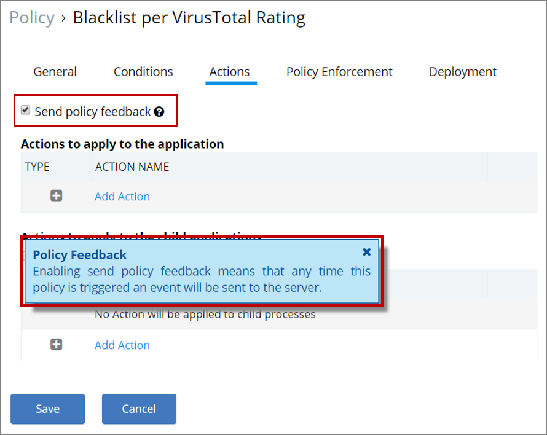
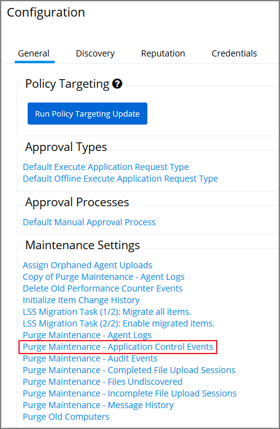
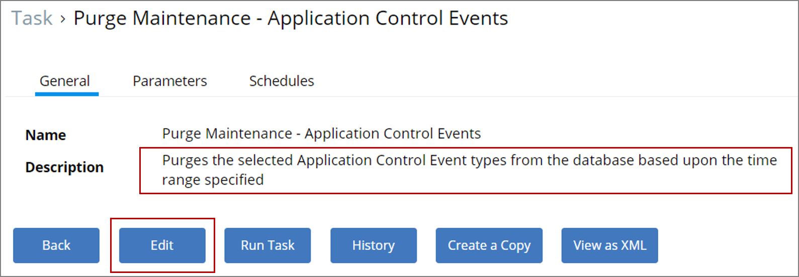
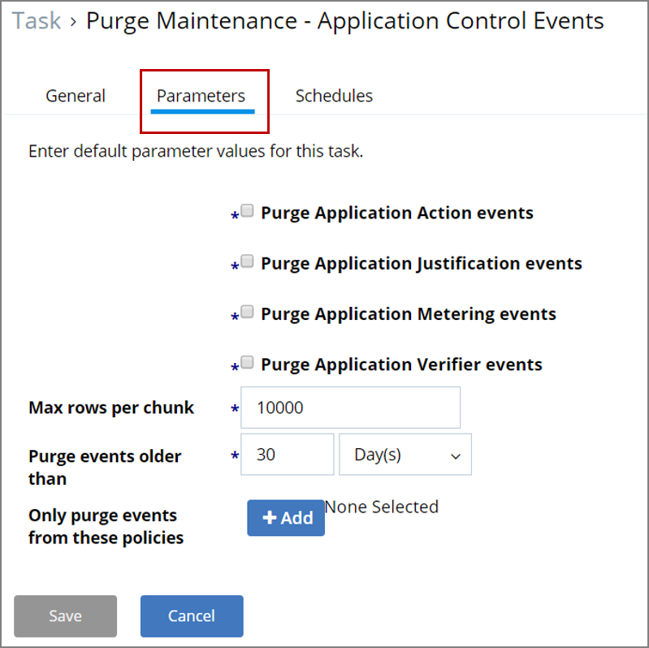
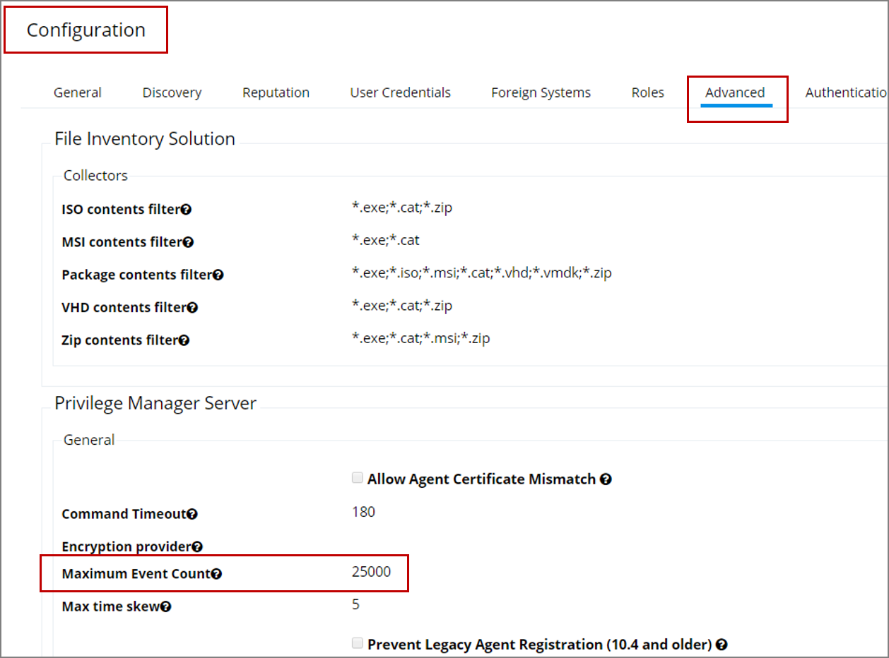
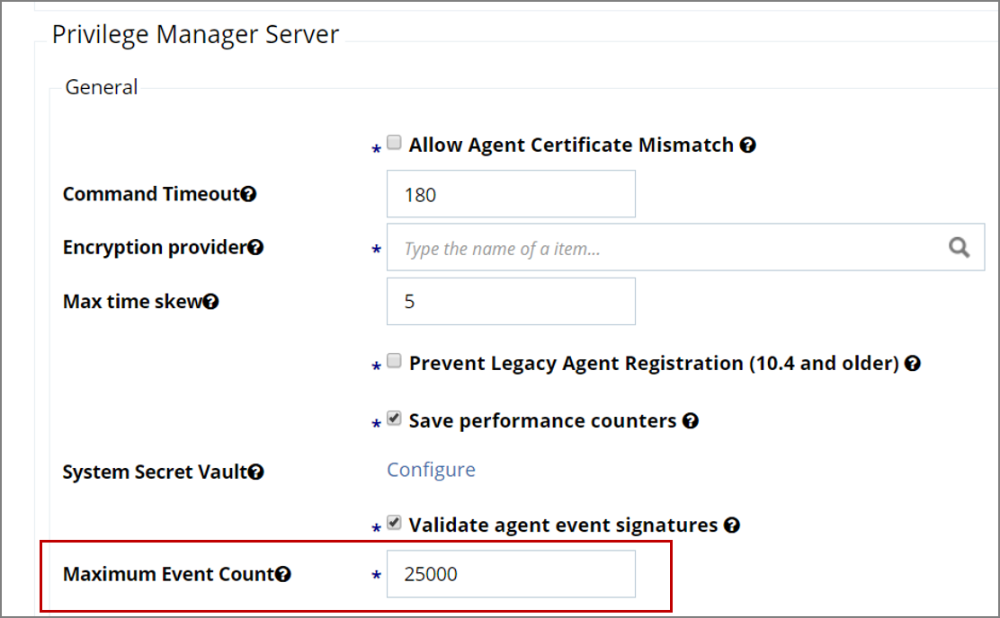

[title]: # (Application Control Events)
[tags]: # (event discovery, notifications)
[priority]: # (4)
# Application Control Events

This topic is about the maximum number of application control events to be stored in Privilege Manager. It explains what causes these events to be stored, how they can be purged from storage, the default setting for maximum number of events to be stored, and how that setting can be modified.

## Events

Application control events (which we will henceforth refer to just as "events") are created if you choose to have one or more policies send feedback (from the endpoint to the server) each time the policy is triggered.

To view or set the option to request this policy feedback, navigate to:

* Admin | Policies | [policy name in list of policies] | Actions tab

  

The help tip (shown in the blue message box in the screenshot) for the "Send policy feedback" option explains how events are generated to be stored: "Enabling send policy feedback means that any time this policy is triggered an event will be sent to the server."

## Storage and Manual Purging of Events

In Privilege Manager versions prior to 10.6, all events continued to be stored unless manually purged. Event storage uses database space and can impact performance of dashboard queries so it is sometimes desirable to purge the stored events.

### Manually Purge Events

1. Navigate to __Admin | Configuration | General__ tab

  
1. In the "Maintenance Settings" section of this page, click on "Purge Maintenance - Application Control Events".

  

  The Description text explains what this feature does: "Purges the selected Application Control Event types from the database based upon the time range specified".
1. Click on Edit and then navigate to the Parameters tab.

  

  Here you can select parameters and set values to suit your needs for purging stored events. Click Save after you have completed the desired changes.

## Maximum Event Count Option

Privilege Manager version 10.6 includes an option to specify the maximum number of events to be stored (rather than let the system continue to add events to be stored until manually purged). This option is explained below.

### Maximum Event Count: Basics

1. Navigate to __Admin | Configuration | Advanced__ tab.

  

The "Privilege Manager Server" section of the page shows the option "Maximum Event Count" and its default value, which is 25,000.

You can use the Edit button on this page to change the value of Maximum Event Count. Do bear in mind, however, that storing a large number of events could cause database issues and slow down dashboard queries.

  

>**Note**:
>In the Cloud version of Privilege Manager, the Maximum Event Count cannot be changed by the user; it is fixed at its default value.

### Maximum Event Count: Additional Information

The points below provide additional information about the Maximum Event Count:

* The count value is a total for all policies; it is not a per policy setting.
* The count is treated as a rolling window; if a new event would cause the count to exceed the maximum limit, the oldest event is removed.
* The manual purge, as described in a previous section, is still available.
* As mentioned in the previous section, the Maximum Event Count cannot be changed by the user in the Cloud version of Privilege Manager; there it is fixed at its default value.
