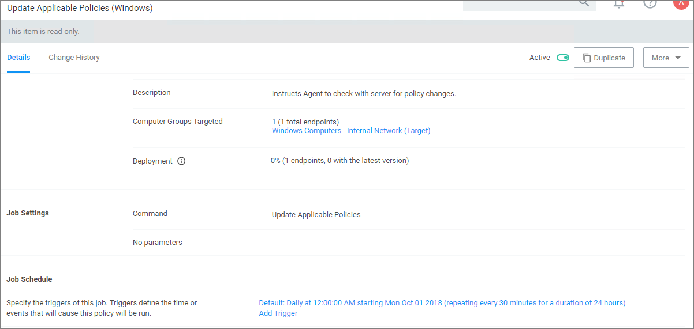

[title]: # (Sending Policies to Endpoints)
[tags]: # (Application Control,Policy,Endpoints)
[priority]: # (2)
# Sending Policies to Endpoints

After setting up your first policies, keep in mind that even after you enable them, new policies are not immediately sent to target endpoints. Instead, policies are updated on endpoints via the schedule defined by the Update Applicable Policies task.

1. Go to __Admin | Policies | General Tab__ and search for the Update Applicable Policies task from your list of Scheduled tasks:

   
1. To edit the time scheduled that sets off this task, click the Trigger tab.

   
1. Clicking on the existing schedule link in edit mode, allows modifications.

   

   In production environments having a delayed deployment schedule prevents performance issues when adjusting policies and rolling them out across a large number of agents on your network. However, when setting up new policies you may want to immediately activate them on testing endpoints and verify your configurations are working correctly.

Remember to Save any changes you make to activate this schedule.

## View Deployment Status

Within a Policy’s Detail View, Navigate to the Deployment tab. This will tell you how many computers the policy is already deployed on:


## Update Policies on an Endpoint using Powershell (prior version 10.7)

On Privilege Manager version prior to 10.7, the fastest way to deploy or update your policies on a specific testing endpoint is by running a simple Powershell script directly on your test machine where a Thycotic Agent is installed.

1. On your endpoint machine, right-click on the Windows Powershell application and select Run as Administrator.
1. Navigate to the Agent directory by entering the following command and then enter:

   ```shell
   cd "C:\Program Files\Thycotic\Powershell\Arellia.Agent"
   ```
1. Next type

   ```shell
   UpdateClientItems.ps1
   ```
1. Hit enter.

<!-- NOT Required with implementation change for 10.7
TODO - update <User-added image>

Your results will look something like this:

TODO - update <User-added image>

In this example we see that a new “Blacklist + Quarantine” policy was successfully added to the endpoint machine. -->

>**Note**:
>If your policies are not immediately updated, wait a few minutes and try running the script again.

After you’ve updated your test endpoints, you can try running applications that are targeted by your policies to make sure the policies are configured correctly. You will also see the policy's Deployment tab updated if refreshed.

## Agent Event Log Viewer

Another helpful place to look when setting up new policies is your Agent’s Event Log Viewer. On your endpoint machine, 

1. Navigate to your Thycotic Agent files. This is usually located in `C:\Program Files\Thycotic\Powershell\Arellia.Agent`.
1. Right-click on __AgentLogViewer__ and select Run with Powershell. This will open your Agent Event Log Viewer, which shows updates in real time as the agent communicates with the Privilege Manager server. For remote access, Agent logs are also viewable through the Windows Event Viewer.
1. Scroll all the way to the top of the page to see the most recent activity from your Thycotic Agent.
1. Uncheck the Information box on the upper right-hand corner to narrow search results for any Errors and Warning messages that may be occurring. You can also double-click any line item for more detailed information about each event.

Now that you know how to update your endpoints and check to make sure your policies are working, it’s time to start building new policies!
