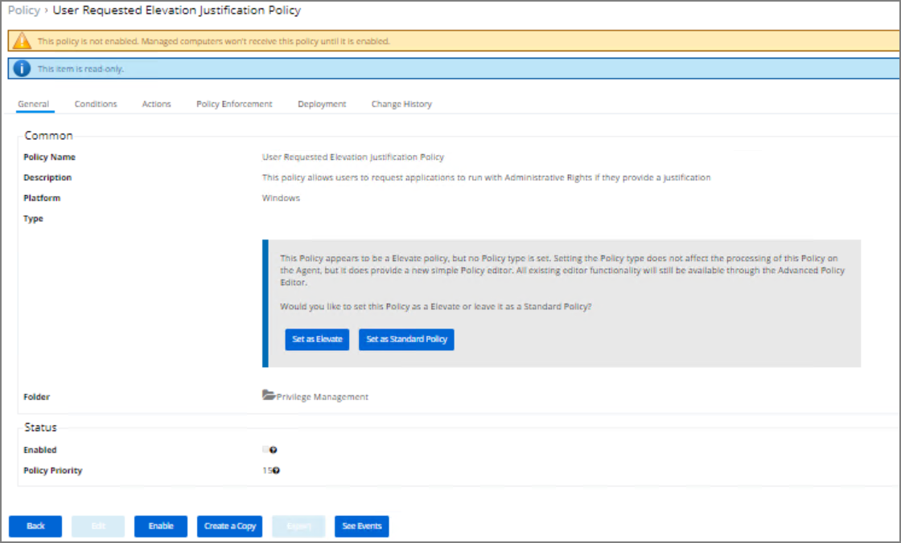
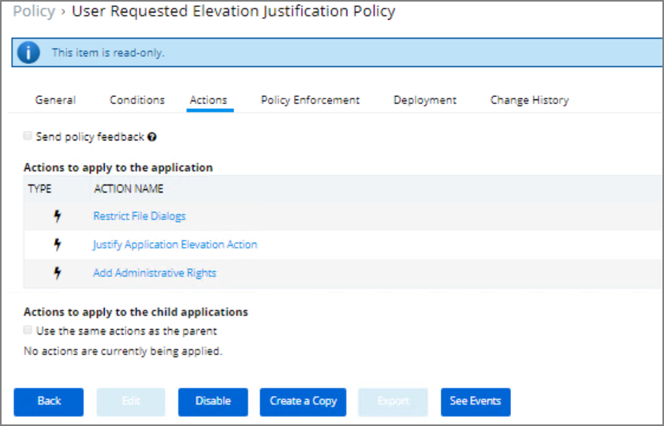
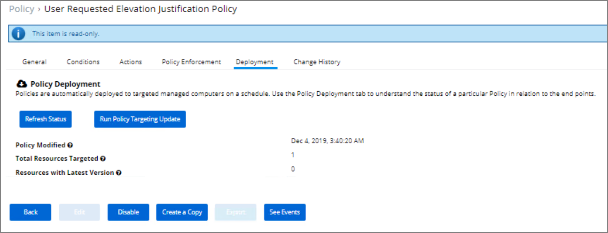
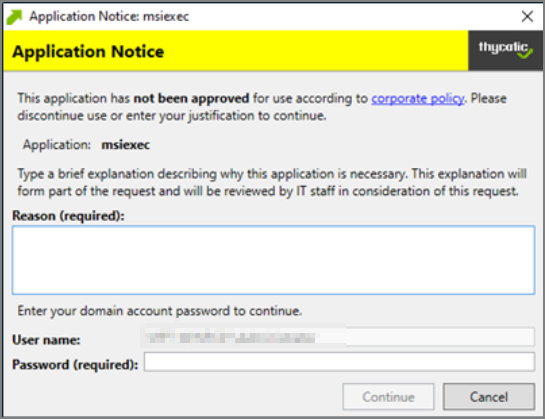

[title]: # (Help Desk Approvals)
[tags]: # (elevation request)
[priority]: # (3)
## Help Desk Approvals

Application Control Solution (ACS) enables end users to request elevation and then have their request approved or denied by the help desk. You can approve or deny requests via the Thycotic Management Server (TMS), or forward requests to a third-party ticketing system such as:

* LANDESK Service Desk
* Microsoft SharePoint
* ServiceNow

## Enable Elevation Requests

To enable elevation requests:

1. Navigate to __ADMIN | Policies__.
1. In Policy Name search field enter __User Requested Elevation Justification Policy__.

    
1. Click the Enable box at the bottom of the window.

   
1. Click __Create a Copy__.
1. Enter a name and description for your new policy.
1. Select either Elevate or Standard User.
1. To further customize the policy, click __Edit__.
1. Navigate to the __Actions__ tab. The default actions are __Restrict File Dialogs, Justify Application Elevation Action and Add Administrative Rights__. You can also create a new request message for a third-party integration.

   
1. Navigate to the __Deployment__ tab and click on __Run Policy Targeting Update__.
After you are done customizing the policy, enable and save it. Once the agent receives the update, the new....
   
After you are done customizing the policy, enable and save it. Once the agent receives the update, the new message looks like this:

   

Users will enter their written request in the Reason (required) field and then send the request to the AMS.

## End users
When end users try to open a restricted application, they must enter a reason for needing the application and send it for approval:

While the request is being evaluated, whenever end users start the application they have requested elevation for, a status pending message will appear:

After the request has been approved or denied, then end users will receive the approval or denial message:

## Approve requests
To approve or deny requests in the Security Manager Console, go to Application Execution Requests to view all application requests:

To approve or deny requests in the Help Desk Console, click the Approve Requests tab:

## What's covered

* Disclose passwords
* Approve requests
* Reports

To access the Thycotic Help Desk Console, type the following URL into your web browser: https://{your server name}/AMS/HelpDesk.

The Help Desk Console is an area where employees who do not have full access to the Security Manager Console can perform their job functions, such as viewing and disclosing passwords, and responding to various requests.

For details about giving specific users access to the Help Desk see Giving Help Desk Users Access to Privilege Manager. 

The Help Desk Console includes the tabs as described in the following topics.

### Disclose Passwords

If the Privilege Manager Local Security Solution is installed, then the Disclose Passwords tab will appear. In this area you can select a computer, view its managed passwords, and disclose those passwords. To see the process for viewing a password in the Help Desk Console, go to Disclosing Randomized Passwords via the Help Desk View.

### Approve Requests

In the Approve Requests tab you can approve or deny various requests. This tab is available with the default console configuration, but the available options will vary depending on which solutions are installed. Different Thycotic solutions have different request types. To learn more about responding to requests, go to Request Elevation.

### Reports

The Reports tab will be empty until reports are added to the Helpdesk Reports folder. This way, Administrators can make specific reports available to employees who do not have full access to all reporting.
