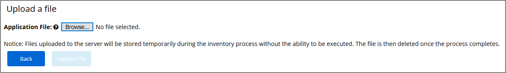
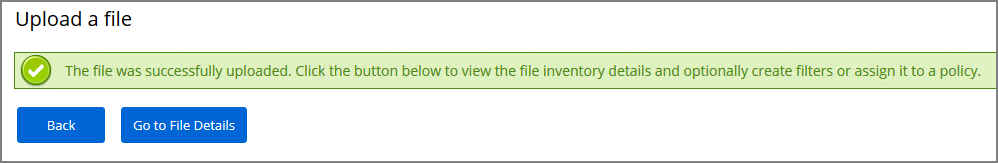
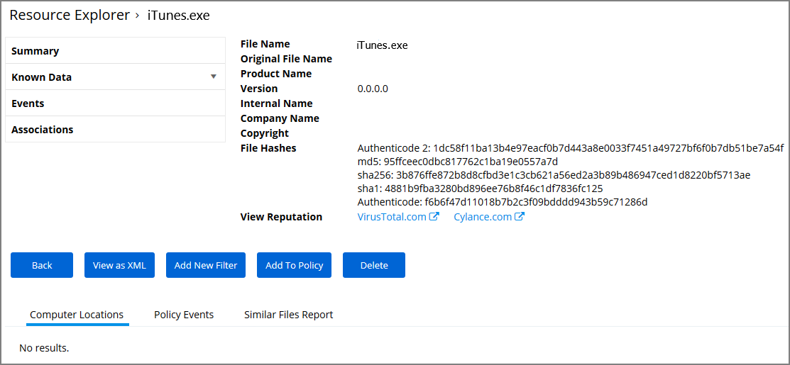

[title]: # (iTunes with File Upload)
[tags]: # (deny)
[priority]: # (4301)
# iTunes with File Upload

As we've seen, there are multiple ways to introduce a new application into Privilege Manager before assigning a policy to it. For this example we will perform a File Upload for the iTunes installer to quickly Blacklist the iTunes program from running on target endpoints.

>**Note:** When the iTunes default filter is used to verify the correct Company name is entered to match the application targeted by the policy.
  
First create the iTunes filter by using downloaded iTunes files:

1. On the Application Control dashboard home page, select the __Upload File__ tile or navigate to __TOOLS | File Upload__.
1. Browse to select file (i.e. the iTunes installer), click __Upload File__.

   
1. When the file successfully uploads, choose __Go to File Details__.

   
1. The Resource Explorer opens for the uploaded file. Click __Add New Filter__.

   
1. Check, modify, and/or enter the Filter criteria you want to block like the File Name, the Original File Name, and the Product Name.
1. Click __Create__.

Next create the iTunes Deny Policy:

1. Click on the __Deny (Blacklist) Applications__ tile on the Application Control dashboard.
1. Click __Create a New Policy__.
1. Select a __Platform__, then __Blacklist: Deny Specific Applications__.
1. Add Name and Description, click __Create__.
1. In the __Advanced Policy View__ under the __Conditions__ tab, select __Edit__.
1. Add the __Inclusion Filter__.
1. Select your iTunes filter/s.
1. click __Add__, then __Save__.
1. Under the General tab, click Edit.
1. Select __Enabled__ to enable the policy.
1. Click __Save__.

Under the Actions tab, do not change the settings, but notice it is set to Deny Execute Message. This will produce a pop-up message to the user telling them this application execution is denied.

You can edit the policy further, if needed. Adjust the Policy Priority as needed. Policy Priority will be discussed in detail later in this document.
