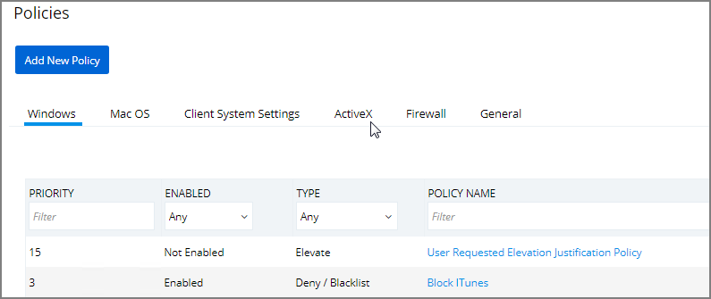
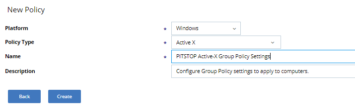
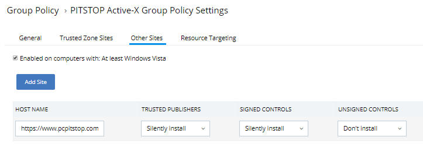
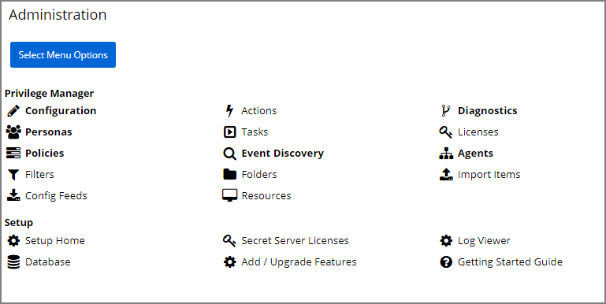
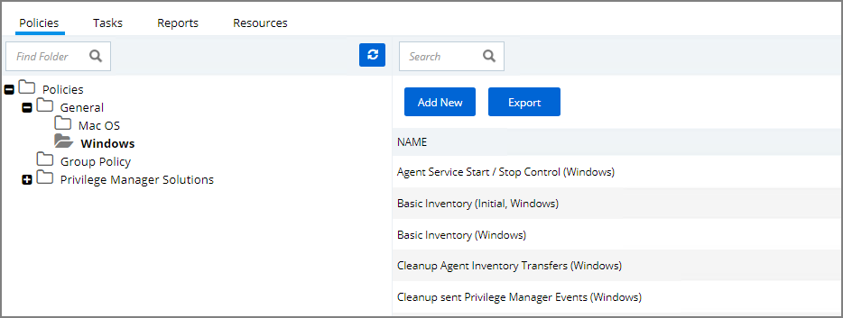
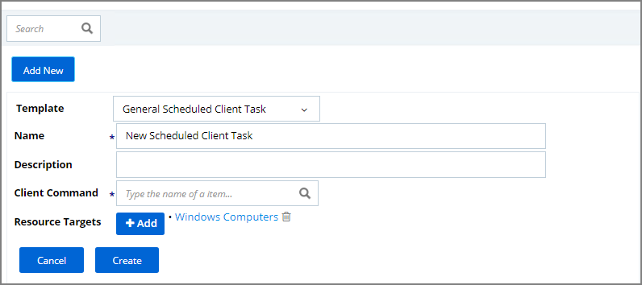
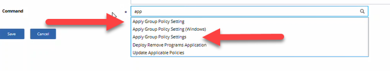
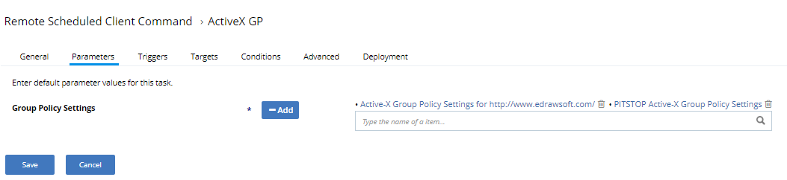
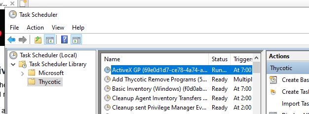
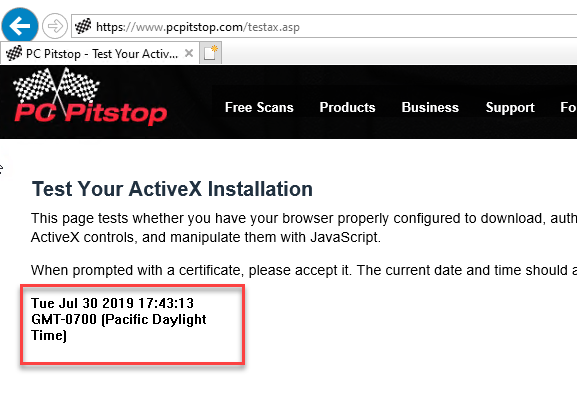

[title]: # (Setting up ActiveX Policies)
[tags]: # (elevate)
[priority]: # (2)
# Setting up ActiveX Policies

Setting up ActiveX Policies – this is to allow add-ins to be installed over at a browser (in this example Internet Explorer). To test if ActiveX can be installed without prompting UAC, we can do a test run at <http://pcpitstop.com/>; ActiveX installation is in turn provided at <https://pcpitstop.com/testax.asp>.

>**Note:** You will need to import local group policy definitions before editing your Active-X Group Policy Settings.

## Overview

1. Create a policy for the list of websites.
1. Create a task to send the policies to the endpoints (this is for Resource Targeting).
1. Test the policy.

## Creating the Policy

1. Navigate to **Admin** | **Policies** | **ActiveX** tab.

   
1. Click on **Add New Policy**.

   
1. After the Policy has been created, navigate to the **Other Sites** Tab and add
the URL (protocols included).

   

Other options to consider:

* Ignore Invalid Certificate Date

* Ignore Invalid Certificate Name (CN)

* Ignore Unknown Certification Authority (CA)

* Ignore Wrong Certificate Usage

## Task and Resource Targeting

1. Navigate to __ADMIN | More… | Folders__.

   
1. Open the folder tree and navigate to **Policies | General | Windows**.

   
1. Click **Add New**.

1. From the Template drop-down select **General Scheduled Client Task**.

1. Enter a Name and Description.

1. For Client Command select **Apply Group Policy Settings**.

1. Verify/add the Resource Target selection.

1. Click **Create**.

   

   >**Note:** Apply Group Policy Settings when you have 2 or more ActiveX
policies to add to the Parameters.

   

1. Navigate to the **Parameters** Tab to add the ActiveX Policy that you
    previously created.

   

## Configure the Triggers and the Targets

Proceed to configuring both the Policy and Task functions. On completing this
configuration, Privilege Manager Triggers feature will then send the configured
task to the targeted endpoint.

To view the Task, go to the **Task Scheduler**. You must have administrator
access to view the task inside Thycotic folder.

   

## Test the Policy

Go to the website:
[https://pcpitstop.com/testax.asp](http://pcpitstop.com/testax.asp) and install
the **Add-in**.

You should see the **Time and Date** as seen in the image below.

   
