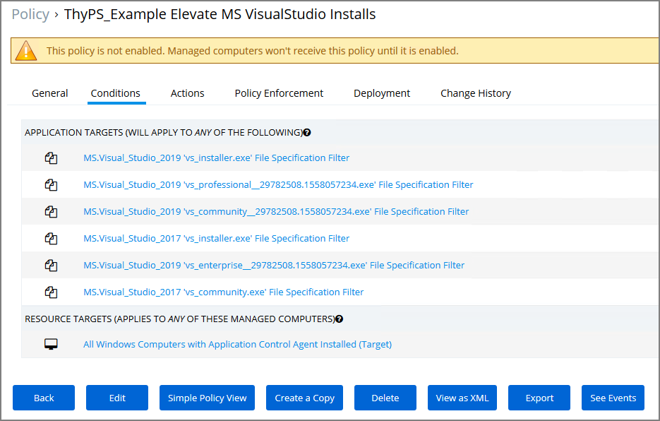

[title]: # (MS Visual Studio Installations)
[tags]: # (elevate, xml example)
[priority]: # (4401)
# MS Visual Studio Installations

At the bottom of this page Thycotic is providing a policy and filter xml example, named __ThyPS_Example Elevate MS VisualStudio Installs__ with a Policy Priority of 9.

The Policy incorporates six File Specification Filters for Visual Studio Installers, two for 2017 and four for 2019.

Each File Specification Filter incorporates a Certificate Filter for the signing cert and a Win 32 Filter for the targeted file attributes.

## Import the XML Example

1. In Privilege Manager, navigate to __ADMIN | Diagnostics__ and click __Import Items__.
2. Copy the complete xml example data below.
3. Paste the XML into the new Item(s) area in the Privilege Manager console.
4. Click __Import__.

## Background Notes

The four Microsoft Initial download files and subsequent two Windows Start Menu target files have been defined as Application targets in this policy.



If you use this policy in your environment, check frequently to update when new versions are released. Verify if there are any versions of Visual Studio you would need to include for your customization. To cover additional versions, use these filters as a basis and download desired versions from Microsoft. 

Additionally, work is needed to sort out what needs elevation when using the application’s various modules. Not every Module install was tested with these filters.

The Applications Elevation Policy should be a separate Policy, as it should be located differently in the Policy Stack.

Prior to rolling this out to a production environment, proper testing by a developer should be performed.

## XML Example Code

```xml
<items>

<ApplicationControlPolicyContract xmlns:adc="http://schemas.arellia.com/dc/" xmlns:arr="http://schemas.microsoft.com/2003/10/Serialization/Arrays" xmlns:mss="http://schemas.microsoft.com/2003/10/Serialization/" xmlns:dc="http://schemas.datacontract.org/2004/07/System" xmlns:i="http://www.w3.org/2001/XMLSchema-instance" xmlns="http://schemas.arellia.com/dc/ApplicationControl/Policy/">
    <adc:Description>This policy elevates the security rights for Microsoft Visual Studio All Versions Installers</adc:Description>
    <adc:FolderId>d60954d0-4bd3-4e2d-92cc-a00606d0e651</adc:FolderId>
    <adc:ItemId>8d22702a-5707-4a14-a8a7-9a0b44223a5c</adc:ItemId>
    <adc:Name>ThyPS_Example Elevate MS VisualStudio Installs</adc:Name>
    <adc:ProductId>27bedb8a-db37-4d53-b748-bc6651461fe4</adc:ProductId>
    <adc:Tags>
        <arr:string>pm.platform.windows</arr:string>
        <arr:string>pm.policyType:elevate</arr:string>
    </adc:Tags>
    <adc:ApplyToResourcesSettings xmlns:d2p1="http://schemas.arellia.com/dc/Resource/">
        <d2p1:AllowedTargetRoleTypeId>493435f7-3b17-4c4c-b07f-c23e7ab7781f</d2p1:AllowedTargetRoleTypeId>
        <d2p1:RequiresScopingSecurity>false</d2p1:RequiresScopingSecurity>
        <d2p1:RestrictionCollectionId>00000000-0000-0000-0000-000000000000</d2p1:RestrictionCollectionId>
        <d2p1:ScopingSecurityOperationId>00000000-0000-0000-0000-000000000000</d2p1:ScopingSecurityOperationId>
    </adc:ApplyToResourcesSettings>
    <adc:DefaultResourceTargetIds>
        <arr:guid>ef3bbe43-b0ea-4330-ae49-459e43995bf5</arr:guid>
    </adc:DefaultResourceTargetIds>
    <adc:Enabled>false</adc:Enabled>
    <ApplicationActionIds>
        <arr:guid>54bfa458-bdfc-4e1b-8033-9c7888179f6c</arr:guid>
    </ApplicationActionIds>
    <AppliesToAllProcesses>false</AppliesToAllProcesses>
    <ChildApplicationActionIds>
        <arr:guid>54bfa458-bdfc-4e1b-8033-9c7888179f6c</arr:guid>
    </ChildApplicationActionIds>
    <ChildAssociations />
    <EndsProcessing>true</EndsProcessing>
    <EndsProcessingChild>true</EndsProcessingChild>
    <ManditoryFilterIds />
    <NegativeFileFilterIds />
    <OwnsItemIds />
    <PositiveFileFilterIds>
        <arr:guid>5ff8f14e-ad97-4a4a-9028-458380ec76b6</arr:guid>
        <arr:guid>bab16f71-3ea2-4728-ad5c-59f6089ca568</arr:guid>
        <arr:guid>704d588d-cc9c-48e9-884d-752f312cae4d</arr:guid>
        <arr:guid>a9c03b35-82b6-4fe6-843b-892b92e62e52</arr:guid>
        <arr:guid>deeb22e9-f407-45d0-b8d8-d5ca3f69dc20</arr:guid>
        <arr:guid>7c189c15-2585-4a8e-a69d-e9195cde55e2</arr:guid>
    </PositiveFileFilterIds>
    <Priority>9</Priority>
    <SendActionEvent>false</SendActionEvent>
    <Stage2Processing>false</Stage2Processing>
</ApplicationControlPolicyContract>

<FileSpecificationFilterContract xmlns:adc="http://schemas.arellia.com/dc/" xmlns:arr="http://schemas.microsoft.com/2003/10/Serialization/Arrays" xmlns:mss="http://schemas.microsoft.com/2003/10/Serialization/" xmlns:dc="http://schemas.datacontract.org/2004/07/System" xmlns:d1p4="http://schemas.arellia.com/dc/ClientItem/" xmlns:i="http://www.w3.org/2001/XMLSchema-instance" xmlns="http://schemas.arellia.com/dc/FileInventory/Filters/">
    <adc:FolderId>bd1b4d12-8dfc-4fcf-a6ea-fe09159ff055</adc:FolderId>
    <adc:ItemId>5ff8f14e-ad97-4a4a-9028-458380ec76b6</adc:ItemId>
    <adc:Name>MS.Visual_Studio_2019 'vs_installer.exe' File Specification Filter</adc:Name>
    <adc:ProductId>27bedb8a-db37-4d53-b748-bc6651461fe4</adc:ProductId>
    <adc:Tags>
        <arr:string>pm.platform.windows</arr:string>
    </adc:Tags>
    <ChildAssociations>
        <arr:anyType i:type="adc:ItemAssociations">
            <adc:AssociationTypeId>efb89861-0aed-5592-be87-6c8992773a87</adc:AssociationTypeId>
            <adc:AssociatedItemIds />
        </arr:anyType>
        <arr:anyType i:type="adc:ItemAssociations">
            <adc:AssociationTypeId>c01776a1-dffd-5842-94ad-aedbafc19515</adc:AssociationTypeId>
            <adc:AssociatedItemIds />
        </arr:anyType>
    </ChildAssociations>
    <DriveTypes>0</DriveTypes>
    <ExcludeFilterIds />
    <FilePath i:nil="true" />
    <FileSpec i:nil="true" />
    <IncludeFilterIds />
    <IncludeHidden>false</IncludeHidden>
    <IncludeReparse>true</IncludeReparse>
    <IncludeSubdirectories>false</IncludeSubdirectories>
    <IncludeSystem>false</IncludeSystem>
    <IncludeSystemReparse>false</IncludeSystemReparse>
    <ManditoryFilterIds>
        <arr:guid>028860aa-0094-4e8e-98ac-801eb6adde24</arr:guid>
        <arr:guid>4481df90-f1ae-4dd4-b641-b7a373908536</arr:guid>
    </ManditoryFilterIds>
    <OwnsItemIds />
</FileSpecificationFilterContract>

<DigitalCertFilterContract xmlns:adc="http://schemas.arellia.com/dc/" xmlns:arr="http://schemas.microsoft.com/2003/10/Serialization/Arrays" xmlns:mss="http://schemas.microsoft.com/2003/10/Serialization/" xmlns:dc="http://schemas.datacontract.org/2004/07/System" xmlns:d1p4="http://schemas.arellia.com/dc/ClientItem/" xmlns:i="http://www.w3.org/2001/XMLSchema-instance" xmlns="http://schemas.arellia.com/dc/FileInventory/Filters/">
    <adc:FolderId>bd1b4d12-8dfc-4fcf-a6ea-fe09159ff055</adc:FolderId>
    <adc:ItemId>028860aa-0094-4e8e-98ac-801eb6adde24</adc:ItemId>
    <adc:Name>Certificate Filter for 'vs_installer.exe'</adc:Name>
    <adc:ProductId>27bedb8a-db37-4d53-b748-bc6651461fe4</adc:ProductId>
    <adc:Tags>
        <arr:string>pm.platform.windows</arr:string>
    </adc:Tags>
    <ChildAssociations />
    <DigitalCertIds>
        <arr:guid>9dc17888-b5cf-5d98-b3cb-35c1994e9622</arr:guid>
    </DigitalCertIds>
    <OwnsItemIds />
</DigitalCertFilterContract>

<Win32ExeFilterContract xmlns:adc="http://schemas.arellia.com/dc/" xmlns:arr="http://schemas.microsoft.com/2003/10/Serialization/Arrays" xmlns:mss="http://schemas.microsoft.com/2003/10/Serialization/" xmlns:dc="http://schemas.datacontract.org/2004/07/System" xmlns:d1p4="http://schemas.arellia.com/dc/ClientItem/" xmlns:i="http://www.w3.org/2001/XMLSchema-instance" xmlns="http://schemas.arellia.com/dc/FileInventory/Filters/">
    <adc:FolderId>bd1b4d12-8dfc-4fcf-a6ea-fe09159ff055</adc:FolderId>
    <adc:ItemId>4481df90-f1ae-4dd4-b641-b7a373908536</adc:ItemId>
    <adc:Name>Win 32 Filter for 'vs_installer.exe'</adc:Name>
    <adc:ProductId>27bedb8a-db37-4d53-b748-bc6651461fe4</adc:ProductId>
    <adc:Tags>
        <arr:string>pm.platform.windows</arr:string>
    </adc:Tags>
    <CompanyName>Microsoft Corporation</CompanyName>
    <DriveTypes>0</DriveTypes>
    <ExeProductName>Visual Studio</ExeProductName>
    <FileName />
    <FilePath />
    <FilePathSubdir>true</FilePathSubdir>
    <FileVersion />
    <InternalName />
    <LocalDiscoveryInterval>0</LocalDiscoveryInterval>
    <OriginalFileName />
    <ProductVersion />
    <UseLocalDiscoveryInterval>false</UseLocalDiscoveryInterval>
</Win32ExeFilterContract>

<FileSpecificationFilterContract xmlns:adc="http://schemas.arellia.com/dc/" xmlns:arr="http://schemas.microsoft.com/2003/10/Serialization/Arrays" xmlns:mss="http://schemas.microsoft.com/2003/10/Serialization/" xmlns:dc="http://schemas.datacontract.org/2004/07/System" xmlns:d1p4="http://schemas.arellia.com/dc/ClientItem/" xmlns:i="http://www.w3.org/2001/XMLSchema-instance" xmlns="http://schemas.arellia.com/dc/FileInventory/Filters/">
    <adc:FolderId>bd1b4d12-8dfc-4fcf-a6ea-fe09159ff055</adc:FolderId>
    <adc:ItemId>bab16f71-3ea2-4728-ad5c-59f6089ca568</adc:ItemId>
    <adc:Name>MS.Visual_Studio_2019 'vs_professional__29782508.1558057234.exe' File Specification Filter</adc:Name>
    <adc:ProductId>27bedb8a-db37-4d53-b748-bc6651461fe4</adc:ProductId>
    <adc:Tags>
        <arr:string>pm.platform.windows</arr:string>
    </adc:Tags>
    <ChildAssociations>
        <arr:anyType i:type="adc:ItemAssociations">
            <adc:AssociationTypeId>efb89861-0aed-5592-be87-6c8992773a87</adc:AssociationTypeId>
            <adc:AssociatedItemIds />
        </arr:anyType>
        <arr:anyType i:type="adc:ItemAssociations">
            <adc:AssociationTypeId>c01776a1-dffd-5842-94ad-aedbafc19515</adc:AssociationTypeId>
            <adc:AssociatedItemIds />
        </arr:anyType>
    </ChildAssociations>
    <DriveTypes>0</DriveTypes>
    <ExcludeFilterIds />
    <FilePath i:nil="true" />
    <FileSpec i:nil="true" />
    <IncludeFilterIds />
    <IncludeHidden>false</IncludeHidden>
    <IncludeReparse>true</IncludeReparse>
    <IncludeSubdirectories>false</IncludeSubdirectories>
    <IncludeSystem>false</IncludeSystem>
    <IncludeSystemReparse>false</IncludeSystemReparse>
    <ManditoryFilterIds>
        <arr:guid>af7d812d-6973-4d9f-bce7-89a0007527b3</arr:guid>
        <arr:guid>30c81576-a3b3-438c-ae97-a940cbc767f1</arr:guid>
    </ManditoryFilterIds>
    <OwnsItemIds />
</FileSpecificationFilterContract>

<Win32ExeFilterContract xmlns:adc="http://schemas.arellia.com/dc/" xmlns:arr="http://schemas.microsoft.com/2003/10/Serialization/Arrays" xmlns:mss="http://schemas.microsoft.com/2003/10/Serialization/" xmlns:dc="http://schemas.datacontract.org/2004/07/System" xmlns:d1p4="http://schemas.arellia.com/dc/ClientItem/" xmlns:i="http://www.w3.org/2001/XMLSchema-instance" xmlns="http://schemas.arellia.com/dc/FileInventory/Filters/">
    <adc:FolderId>bd1b4d12-8dfc-4fcf-a6ea-fe09159ff055</adc:FolderId>
    <adc:ItemId>af7d812d-6973-4d9f-bce7-89a0007527b3</adc:ItemId>
    <adc:Name>Win 32 Filter for 'vs_professional__29782508.1558057234.exe'</adc:Name>
    <adc:ProductId>27bedb8a-db37-4d53-b748-bc6651461fe4</adc:ProductId>
    <adc:Tags>
        <arr:string>pm.platform.windows</arr:string>
    </adc:Tags>
    <CompanyName>Microsoft Corporation</CompanyName>
    <DriveTypes>0</DriveTypes>
    <ExeProductName>Microsoft Visual Studio Professional</ExeProductName>
    <FileName />
    <FilePath />
    <FilePathSubdir>true</FilePathSubdir>
    <FileVersion />
    <InternalName />
    <LocalDiscoveryInterval>0</LocalDiscoveryInterval>
    <OriginalFileName />
    <ProductVersion />
    <UseLocalDiscoveryInterval>false</UseLocalDiscoveryInterval>
</Win32ExeFilterContract>

<DigitalCertFilterContract xmlns:adc="http://schemas.arellia.com/dc/" xmlns:arr="http://schemas.microsoft.com/2003/10/Serialization/Arrays" xmlns:mss="http://schemas.microsoft.com/2003/10/Serialization/" xmlns:dc="http://schemas.datacontract.org/2004/07/System" xmlns:d1p4="http://schemas.arellia.com/dc/ClientItem/" xmlns:i="http://www.w3.org/2001/XMLSchema-instance" xmlns="http://schemas.arellia.com/dc/FileInventory/Filters/">
    <adc:FolderId>bd1b4d12-8dfc-4fcf-a6ea-fe09159ff055</adc:FolderId>
    <adc:ItemId>30c81576-a3b3-438c-ae97-a940cbc767f1</adc:ItemId>
    <adc:Name>Certificate Filter for 'vs_professional__29782508.1558057234.exe'</adc:Name>
    <adc:ProductId>27bedb8a-db37-4d53-b748-bc6651461fe4</adc:ProductId>
    <adc:Tags>
        <arr:string>pm.platform.windows</arr:string>
    </adc:Tags>
    <ChildAssociations />
    <DigitalCertIds>
        <arr:guid>9dc17888-b5cf-5d98-b3cb-35c1994e9622</arr:guid>
    </DigitalCertIds>
    <OwnsItemIds />
</DigitalCertFilterContract>

<FileSpecificationFilterContract xmlns:adc="http://schemas.arellia.com/dc/" xmlns:arr="http://schemas.microsoft.com/2003/10/Serialization/Arrays" xmlns:mss="http://schemas.microsoft.com/2003/10/Serialization/" xmlns:dc="http://schemas.datacontract.org/2004/07/System" xmlns:d1p4="http://schemas.arellia.com/dc/ClientItem/" xmlns:i="http://www.w3.org/2001/XMLSchema-instance" xmlns="http://schemas.arellia.com/dc/FileInventory/Filters/">
    <adc:FolderId>bd1b4d12-8dfc-4fcf-a6ea-fe09159ff055</adc:FolderId>
    <adc:ItemId>704d588d-cc9c-48e9-884d-752f312cae4d</adc:ItemId>
    <adc:Name>MS.Visual_Studio_2019 'vs_community__29782508.1558057234.exe' File Specification Filter</adc:Name>
    <adc:ProductId>27bedb8a-db37-4d53-b748-bc6651461fe4</adc:ProductId>
    <adc:Tags>
        <arr:string>pm.platform.windows</arr:string>
    </adc:Tags>
    <ChildAssociations>
        <arr:anyType i:type="adc:ItemAssociations">
            <adc:AssociationTypeId>efb89861-0aed-5592-be87-6c8992773a87</adc:AssociationTypeId>
            <adc:AssociatedItemIds />
        </arr:anyType>
        <arr:anyType i:type="adc:ItemAssociations">
            <adc:AssociationTypeId>c01776a1-dffd-5842-94ad-aedbafc19515</adc:AssociationTypeId>
            <adc:AssociatedItemIds />
        </arr:anyType>
    </ChildAssociations>
    <DriveTypes>0</DriveTypes>
    <ExcludeFilterIds />
    <FilePath i:nil="true" />
    <FileSpec i:nil="true" />
    <IncludeFilterIds />
    <IncludeHidden>false</IncludeHidden>
    <IncludeReparse>true</IncludeReparse>
    <IncludeSubdirectories>false</IncludeSubdirectories>
    <IncludeSystem>false</IncludeSystem>
    <IncludeSystemReparse>false</IncludeSystemReparse>
    <ManditoryFilterIds>
        <arr:guid>dc4cfe9a-f9d6-434c-a48d-3cc143ced3f3</arr:guid>
        <arr:guid>d6d19b19-a6e8-4ca1-b47b-8bb63b9caacc</arr:guid>
    </ManditoryFilterIds>
    <OwnsItemIds />
</FileSpecificationFilterContract>

<DigitalCertFilterContract xmlns:adc="http://schemas.arellia.com/dc/" xmlns:arr="http://schemas.microsoft.com/2003/10/Serialization/Arrays" xmlns:mss="http://schemas.microsoft.com/2003/10/Serialization/" xmlns:dc="http://schemas.datacontract.org/2004/07/System" xmlns:d1p4="http://schemas.arellia.com/dc/ClientItem/" xmlns:i="http://www.w3.org/2001/XMLSchema-instance" xmlns="http://schemas.arellia.com/dc/FileInventory/Filters/">
    <adc:FolderId>bd1b4d12-8dfc-4fcf-a6ea-fe09159ff055</adc:FolderId>
    <adc:ItemId>dc4cfe9a-f9d6-434c-a48d-3cc143ced3f3</adc:ItemId>
    <adc:Name>Certificate Filter for 'vs_community__29782508.1558057234.exe'</adc:Name>
    <adc:ProductId>27bedb8a-db37-4d53-b748-bc6651461fe4</adc:ProductId>
    <adc:Tags>
        <arr:string>pm.platform.windows</arr:string>
    </adc:Tags>
    <ChildAssociations />
    <DigitalCertIds>
        <arr:guid>9dc17888-b5cf-5d98-b3cb-35c1994e9622</arr:guid>
    </DigitalCertIds>
    <OwnsItemIds />
</DigitalCertFilterContract>

<Win32ExeFilterContract xmlns:adc="http://schemas.arellia.com/dc/" xmlns:arr="http://schemas.microsoft.com/2003/10/Serialization/Arrays" xmlns:mss="http://schemas.microsoft.com/2003/10/Serialization/" xmlns:dc="http://schemas.datacontract.org/2004/07/System" xmlns:d1p4="http://schemas.arellia.com/dc/ClientItem/" xmlns:i="http://www.w3.org/2001/XMLSchema-instance" xmlns="http://schemas.arellia.com/dc/FileInventory/Filters/">
    <adc:FolderId>bd1b4d12-8dfc-4fcf-a6ea-fe09159ff055</adc:FolderId>
    <adc:ItemId>d6d19b19-a6e8-4ca1-b47b-8bb63b9caacc</adc:ItemId>
    <adc:Name>Win 32 Filter for 'vs_community__29782508.1558057234.exe'</adc:Name>
    <adc:ProductId>27bedb8a-db37-4d53-b748-bc6651461fe4</adc:ProductId>
    <adc:Tags>
        <arr:string>pm.platform.windows</arr:string>
    </adc:Tags>
    <CompanyName>Microsoft Corporation</CompanyName>
    <DriveTypes>0</DriveTypes>
    <ExeProductName>Microsoft Visual Studio Community</ExeProductName>
    <FileName />
    <FilePath />
    <FilePathSubdir>true</FilePathSubdir>
    <FileVersion />
    <InternalName />
    <LocalDiscoveryInterval>0</LocalDiscoveryInterval>
    <OriginalFileName />
    <ProductVersion />
    <UseLocalDiscoveryInterval>false</UseLocalDiscoveryInterval>
</Win32ExeFilterContract>

<FileSpecificationFilterContract xmlns:adc="http://schemas.arellia.com/dc/" xmlns:arr="http://schemas.microsoft.com/2003/10/Serialization/Arrays" xmlns:mss="http://schemas.microsoft.com/2003/10/Serialization/" xmlns:dc="http://schemas.datacontract.org/2004/07/System" xmlns:d1p4="http://schemas.arellia.com/dc/ClientItem/" xmlns:i="http://www.w3.org/2001/XMLSchema-instance" xmlns="http://schemas.arellia.com/dc/FileInventory/Filters/">
    <adc:FolderId>bd1b4d12-8dfc-4fcf-a6ea-fe09159ff055</adc:FolderId>
    <adc:ItemId>a9c03b35-82b6-4fe6-843b-892b92e62e52</adc:ItemId>
    <adc:Name>MS.Visual_Studio_2017 'vs_installer.exe' File Specification Filter </adc:Name>
    <adc:ProductId>27bedb8a-db37-4d53-b748-bc6651461fe4</adc:ProductId>
    <adc:Tags>
        <arr:string>pm.platform.windows</arr:string>
    </adc:Tags>
    <ChildAssociations>
        <arr:anyType i:type="adc:ItemAssociations">
            <adc:AssociationTypeId>efb89861-0aed-5592-be87-6c8992773a87</adc:AssociationTypeId>
            <adc:AssociatedItemIds />
        </arr:anyType>
        <arr:anyType i:type="adc:ItemAssociations">
            <adc:AssociationTypeId>c01776a1-dffd-5842-94ad-aedbafc19515</adc:AssociationTypeId>
            <adc:AssociatedItemIds />
        </arr:anyType>
    </ChildAssociations>
    <DriveTypes>0</DriveTypes>
    <ExcludeFilterIds />
    <FilePath i:nil="true" />
    <FileSpec i:nil="true" />
    <IncludeFilterIds />
    <IncludeHidden>false</IncludeHidden>
    <IncludeReparse>true</IncludeReparse>
    <IncludeSubdirectories>false</IncludeSubdirectories>
    <IncludeSystem>false</IncludeSystem>
    <IncludeSystemReparse>false</IncludeSystemReparse>
    <ManditoryFilterIds>
        <arr:guid>9f6e2cec-c9ea-4daa-8d12-26161951728a</arr:guid>
        <arr:guid>75ba3d2a-b6bb-4e2b-b8b1-f3f820736f3b</arr:guid>
    </ManditoryFilterIds>
    <OwnsItemIds />
</FileSpecificationFilterContract>

<Win32ExeFilterContract xmlns:adc="http://schemas.arellia.com/dc/" xmlns:arr="http://schemas.microsoft.com/2003/10/Serialization/Arrays" xmlns:mss="http://schemas.microsoft.com/2003/10/Serialization/" xmlns:dc="http://schemas.datacontract.org/2004/07/System" xmlns:d1p4="http://schemas.arellia.com/dc/ClientItem/" xmlns:i="http://www.w3.org/2001/XMLSchema-instance" xmlns="http://schemas.arellia.com/dc/FileInventory/Filters/">
    <adc:FolderId>bd1b4d12-8dfc-4fcf-a6ea-fe09159ff055</adc:FolderId>
    <adc:ItemId>9f6e2cec-c9ea-4daa-8d12-26161951728a</adc:ItemId>
    <adc:Name>Win 32 Filter for 'vs_installer.exe'</adc:Name>
    <adc:ProductId>27bedb8a-db37-4d53-b748-bc6651461fe4</adc:ProductId>
    <adc:Tags>
        <arr:string>pm.platform.windows</arr:string>
    </adc:Tags>
    <CompanyName>Microsoft Corporation</CompanyName>
    <DriveTypes>0</DriveTypes>
    <ExeProductName>Visual Studio</ExeProductName>
    <FileName />
    <FilePath />
    <FilePathSubdir>true</FilePathSubdir>
    <FileVersion />
    <InternalName />
    <LocalDiscoveryInterval>0</LocalDiscoveryInterval>
    <OriginalFileName />
    <ProductVersion />
    <UseLocalDiscoveryInterval>false</UseLocalDiscoveryInterval>
</Win32ExeFilterContract>

<DigitalCertFilterContract xmlns:adc="http://schemas.arellia.com/dc/" xmlns:arr="http://schemas.microsoft.com/2003/10/Serialization/Arrays" xmlns:mss="http://schemas.microsoft.com/2003/10/Serialization/" xmlns:dc="http://schemas.datacontract.org/2004/07/System" xmlns:d1p4="http://schemas.arellia.com/dc/ClientItem/" xmlns:i="http://www.w3.org/2001/XMLSchema-instance" xmlns="http://schemas.arellia.com/dc/FileInventory/Filters/">
    <adc:FolderId>bd1b4d12-8dfc-4fcf-a6ea-fe09159ff055</adc:FolderId>
    <adc:ItemId>75ba3d2a-b6bb-4e2b-b8b1-f3f820736f3b</adc:ItemId>
    <adc:Name>Certificate Filter for 'vs_installer.exe'</adc:Name>
    <adc:ProductId>27bedb8a-db37-4d53-b748-bc6651461fe4</adc:ProductId>
    <adc:Tags>
        <arr:string>pm.platform.windows</arr:string>
    </adc:Tags>
    <ChildAssociations />
    <DigitalCertIds>
        <arr:guid>a380d6a2-1d68-5a9b-92d2-405b36c712ba</arr:guid>
    </DigitalCertIds>
    <OwnsItemIds />
</DigitalCertFilterContract>

<FileSpecificationFilterContract xmlns:adc="http://schemas.arellia.com/dc/" xmlns:arr="http://schemas.microsoft.com/2003/10/Serialization/Arrays" xmlns:mss="http://schemas.microsoft.com/2003/10/Serialization/" xmlns:dc="http://schemas.datacontract.org/2004/07/System" xmlns:d1p4="http://schemas.arellia.com/dc/ClientItem/" xmlns:i="http://www.w3.org/2001/XMLSchema-instance" xmlns="http://schemas.arellia.com/dc/FileInventory/Filters/">
    <adc:FolderId>bd1b4d12-8dfc-4fcf-a6ea-fe09159ff055</adc:FolderId>
    <adc:ItemId>deeb22e9-f407-45d0-b8d8-d5ca3f69dc20</adc:ItemId>
    <adc:Name>MS.Visual_Studio_2019 'vs_enterprise__29782508.1558057234.exe' File Specification Filter</adc:Name>
    <adc:ProductId>27bedb8a-db37-4d53-b748-bc6651461fe4</adc:ProductId>
    <adc:Tags>
        <arr:string>pm.platform.windows</arr:string>
    </adc:Tags>
    <ChildAssociations>
        <arr:anyType i:type="adc:ItemAssociations">
            <adc:AssociationTypeId>efb89861-0aed-5592-be87-6c8992773a87</adc:AssociationTypeId>
            <adc:AssociatedItemIds />
        </arr:anyType>
        <arr:anyType i:type="adc:ItemAssociations">
            <adc:AssociationTypeId>c01776a1-dffd-5842-94ad-aedbafc19515</adc:AssociationTypeId>
            <adc:AssociatedItemIds />
        </arr:anyType>
    </ChildAssociations>
    <DriveTypes>0</DriveTypes>
    <ExcludeFilterIds />
    <FilePath i:nil="true" />
    <FileSpec i:nil="true" />
    <IncludeFilterIds />
    <IncludeHidden>false</IncludeHidden>
    <IncludeReparse>true</IncludeReparse>
    <IncludeSubdirectories>false</IncludeSubdirectories>
    <IncludeSystem>false</IncludeSystem>
    <IncludeSystemReparse>false</IncludeSystemReparse>
    <ManditoryFilterIds>
        <arr:guid>9933eee7-c241-4d23-9c0b-19c41e7ad4a0</arr:guid>
        <arr:guid>e3b75f3a-08d1-4fbf-b682-69109bb0ff28</arr:guid>
    </ManditoryFilterIds>
    <OwnsItemIds />
</FileSpecificationFilterContract>

<Win32ExeFilterContract xmlns:adc="http://schemas.arellia.com/dc/" xmlns:arr="http://schemas.microsoft.com/2003/10/Serialization/Arrays" xmlns:mss="http://schemas.microsoft.com/2003/10/Serialization/" xmlns:dc="http://schemas.datacontract.org/2004/07/System" xmlns:d1p4="http://schemas.arellia.com/dc/ClientItem/" xmlns:i="http://www.w3.org/2001/XMLSchema-instance" xmlns="http://schemas.arellia.com/dc/FileInventory/Filters/">
    <adc:FolderId>bd1b4d12-8dfc-4fcf-a6ea-fe09159ff055</adc:FolderId>
    <adc:ItemId>9933eee7-c241-4d23-9c0b-19c41e7ad4a0</adc:ItemId>
    <adc:Name>Win 32 Filter for 'vs_enterprise__29782508.1558057234.exe'</adc:Name>
    <adc:ProductId>27bedb8a-db37-4d53-b748-bc6651461fe4</adc:ProductId>
    <adc:Tags>
        <arr:string>pm.platform.windows</arr:string>
    </adc:Tags>
    <CompanyName>Microsoft Corporation</CompanyName>
    <DriveTypes>0</DriveTypes>
    <ExeProductName>Microsoft Visual Studio Enterprise</ExeProductName>
    <FileName />
    <FilePath />
    <FilePathSubdir>true</FilePathSubdir>
    <FileVersion />
    <InternalName />
    <LocalDiscoveryInterval>0</LocalDiscoveryInterval>
    <OriginalFileName />
    <ProductVersion />
    <UseLocalDiscoveryInterval>false</UseLocalDiscoveryInterval>
</Win32ExeFilterContract>

<DigitalCertFilterContract xmlns:adc="http://schemas.arellia.com/dc/" xmlns:arr="http://schemas.microsoft.com/2003/10/Serialization/Arrays" xmlns:mss="http://schemas.microsoft.com/2003/10/Serialization/" xmlns:dc="http://schemas.datacontract.org/2004/07/System" xmlns:d1p4="http://schemas.arellia.com/dc/ClientItem/" xmlns:i="http://www.w3.org/2001/XMLSchema-instance" xmlns="http://schemas.arellia.com/dc/FileInventory/Filters/">
    <adc:FolderId>bd1b4d12-8dfc-4fcf-a6ea-fe09159ff055</adc:FolderId>
    <adc:ItemId>e3b75f3a-08d1-4fbf-b682-69109bb0ff28</adc:ItemId>
    <adc:Name>Certificate Filter for 'vs_enterprise__29782508.1558057234.exe'</adc:Name>
    <adc:ProductId>27bedb8a-db37-4d53-b748-bc6651461fe4</adc:ProductId>
    <adc:Tags>
        <arr:string>pm.platform.windows</arr:string>
    </adc:Tags>
    <ChildAssociations />
    <DigitalCertIds>
        <arr:guid>9dc17888-b5cf-5d98-b3cb-35c1994e9622</arr:guid>
    </DigitalCertIds>
    <OwnsItemIds />
</DigitalCertFilterContract>

<FileSpecificationFilterContract xmlns:adc="http://schemas.arellia.com/dc/" xmlns:arr="http://schemas.microsoft.com/2003/10/Serialization/Arrays" xmlns:mss="http://schemas.microsoft.com/2003/10/Serialization/" xmlns:dc="http://schemas.datacontract.org/2004/07/System" xmlns:d1p4="http://schemas.arellia.com/dc/ClientItem/" xmlns:i="http://www.w3.org/2001/XMLSchema-instance" xmlns="http://schemas.arellia.com/dc/FileInventory/Filters/">
    <adc:FolderId>bd1b4d12-8dfc-4fcf-a6ea-fe09159ff055</adc:FolderId>
    <adc:ItemId>7c189c15-2585-4a8e-a69d-e9195cde55e2</adc:ItemId>
    <adc:Name>MS.Visual_Studio_2017 'vs_community.exe' File Specification Filter</adc:Name>
    <adc:ProductId>27bedb8a-db37-4d53-b748-bc6651461fe4</adc:ProductId>
    <adc:Tags>
        <arr:string>pm.platform.windows</arr:string>
    </adc:Tags>
    <ChildAssociations>
        <arr:anyType i:type="adc:ItemAssociations">
            <adc:AssociationTypeId>efb89861-0aed-5592-be87-6c8992773a87</adc:AssociationTypeId>
            <adc:AssociatedItemIds />
        </arr:anyType>
        <arr:anyType i:type="adc:ItemAssociations">
            <adc:AssociationTypeId>c01776a1-dffd-5842-94ad-aedbafc19515</adc:AssociationTypeId>
            <adc:AssociatedItemIds />
        </arr:anyType>
    </ChildAssociations>
    <DriveTypes>0</DriveTypes>
    <ExcludeFilterIds />
    <FilePath i:nil="true" />
    <FileSpec i:nil="true" />
    <IncludeFilterIds />
    <IncludeHidden>false</IncludeHidden>
    <IncludeReparse>true</IncludeReparse>
    <IncludeSubdirectories>false</IncludeSubdirectories>
    <IncludeSystem>false</IncludeSystem>
    <IncludeSystemReparse>false</IncludeSystemReparse>
    <ManditoryFilterIds>
        <arr:guid>8f27f957-d04d-48d0-974f-0657d5fdec12</arr:guid>
        <arr:guid>9b32f0a4-3b38-41e6-85f7-889f57be8c63</arr:guid>
    </ManditoryFilterIds>
    <OwnsItemIds />
</FileSpecificationFilterContract>

<Win32ExeFilterContract xmlns:adc="http://schemas.arellia.com/dc/" xmlns:arr="http://schemas.microsoft.com/2003/10/Serialization/Arrays" xmlns:mss="http://schemas.microsoft.com/2003/10/Serialization/" xmlns:dc="http://schemas.datacontract.org/2004/07/System" xmlns:d1p4="http://schemas.arellia.com/dc/ClientItem/" xmlns:i="http://www.w3.org/2001/XMLSchema-instance" xmlns="http://schemas.arellia.com/dc/FileInventory/Filters/">
    <adc:FolderId>bd1b4d12-8dfc-4fcf-a6ea-fe09159ff055</adc:FolderId>
    <adc:ItemId>8f27f957-d04d-48d0-974f-0657d5fdec12</adc:ItemId>
    <adc:Name>Win 32 Filter for 'vs_community.exe'</adc:Name>
    <adc:ProductId>27bedb8a-db37-4d53-b748-bc6651461fe4</adc:ProductId>
    <adc:Tags>
        <arr:string>pm.platform.windows</arr:string>
    </adc:Tags>
    <CompanyName>Microsoft Corporation</CompanyName>
    <DriveTypes>0</DriveTypes>
    <ExeProductName>Microsoft Visual Studio</ExeProductName>
    <FileName />
    <FilePath />
    <FilePathSubdir>true</FilePathSubdir>
    <FileVersion />
    <InternalName />
    <LocalDiscoveryInterval>0</LocalDiscoveryInterval>
    <OriginalFileName />
    <ProductVersion />
    <UseLocalDiscoveryInterval>false</UseLocalDiscoveryInterval>
</Win32ExeFilterContract>

<DigitalCertFilterContract xmlns:adc="http://schemas.arellia.com/dc/" xmlns:arr="http://schemas.microsoft.com/2003/10/Serialization/Arrays" xmlns:mss="http://schemas.microsoft.com/2003/10/Serialization/" xmlns:dc="http://schemas.datacontract.org/2004/07/System" xmlns:d1p4="http://schemas.arellia.com/dc/ClientItem/" xmlns:i="http://www.w3.org/2001/XMLSchema-instance" xmlns="http://schemas.arellia.com/dc/FileInventory/Filters/">
    <adc:FolderId>bd1b4d12-8dfc-4fcf-a6ea-fe09159ff055</adc:FolderId>
    <adc:ItemId>9b32f0a4-3b38-41e6-85f7-889f57be8c63</adc:ItemId>
    <adc:Name>Certificate Filter for 'vs_community.exe'</adc:Name>
    <adc:ProductId>27bedb8a-db37-4d53-b748-bc6651461fe4</adc:ProductId>
    <adc:Tags>
        <arr:string>pm.platform.windows</arr:string>
    </adc:Tags>
    <ChildAssociations />
    <DigitalCertIds>
        <arr:guid>5ead300d-c7e4-5637-948e-cb0ed829a072</arr:guid>
    </DigitalCertIds>
    <OwnsItemIds />
</DigitalCertFilterContract>

</items>
```