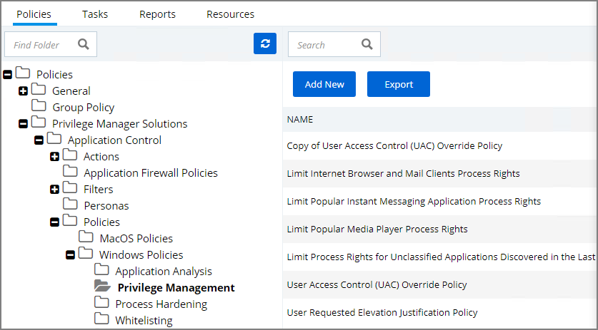
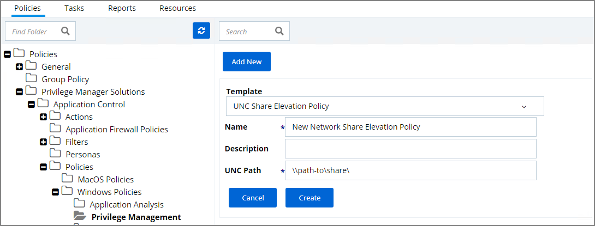
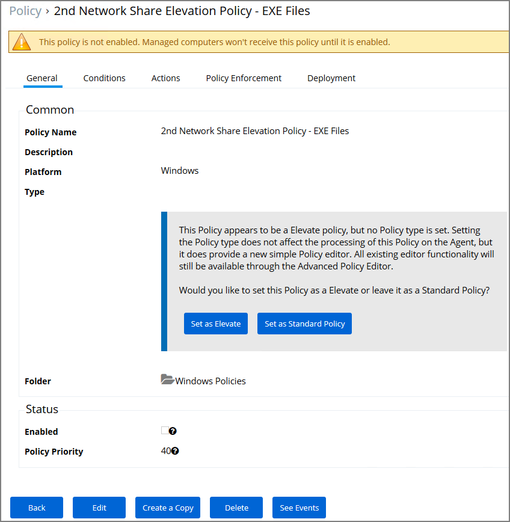

[title]: # (Network Share Apps)
[tags]: # (elevate)
[priority]: # (4)
# Network Share Apps

Many organizations put trusted installers on a network share that employees can use. Those installers can be elevated automatically from the shared network location by assigning an elevation policy to the network share location.

There are different options to elevate rights to launch applications from a network share location.

* One option is to create a file specification filter setting the path for the network share location. Then use that filter in a policy to apply administrative rights to all application launches from that path.
* The other option is to download the Application Control - UNC Elevation Policy Template via Config Feeds and customize the template.

## Applying Administrator Rights to a Network Share

### Creating the Filter

1. In the Privilege Manager Console navigate to __Admin | More | Filters__.
1. On the Filter page, click __Add New Filter__.
1. On the New Filter page, select the platform. This can be either __Both Windows / Mac OS__, __Windows__, or __Mac OS__. For this example, select __Windows__.
1. From the Filter Type drop*down select __File Specification Filter__. This also allows you to link in hashes or signatures.

   
1. Enter the name and a description for the filter, for example "network share" and "filter to elevate applications installed from network share".
1. Click __Create__.
1. The page for the new filter opens, click __Edit__.
1. Under __Details__, click __Edit__.
1. Add the Path that points to your Fileshare folder, click __Save__. Use the same UNC path format for both macOS and Windows endpoints.

### Creating the New Policy

1. Navigate to Policies, click __Add New Policy__
1. In the New Policy screen, select Windows as a Platform. 
1. Select Show All Templates as a Policy Type, then Other: Empty Policy.
1. Add a Name and Description, click __Create__.
1. Select the Conditions tab, click __Edit__.
1. Click __Add Inclusion Filter__.
1. In the Search bar, type in the name of your new Filter and select it, click __Add__.
1. Click __Save__.
1. Navigate to the Actions tab. choose 
1. Click __Edit__.
1. Click __Add Action__.
1. Select the box for __Add Administrative Rights__.
1. Click Add and Save.
1. To activate your policy, click Edit under the General Tab and select the Enable box. 
1. Click __Save__.

## Using the UNC Elevation Policy Template

Use the UNC Elevation Policy Template to create a customized policy that lets you scan a network share and automatically elevates launches of MSI and EXE files from that share.

1. Navigate to __Admin | More__, select __Config Feeds__.
1. Find __Privilege Manager Product Configuration Feeds__, click __Select Items__.
1. Find __Application Control Solution__, click __Select Items__.
1. Find __Application Control - UNC Elevation Policy Template__, click __Download__. The template is being installed.
1. Navigate to __Admin | More__, click __Folders__.
1. In the folder tree open __Privilege Manager Solutions | Application Control | Policies | Privilege Management__.

   
1. Click __Add New__.
1. From the template drop-down select __UNC Share Elevation Policy__.
1. Enter a name and description.
1. Enter the UNC Path to the network share. Use the same UNC path format for both macOS and Windows endpoints.

   
1. Click __Create__.
1. The Policy is created, but needs some attention. Confirm that this is an elevation policy and click __Set as Elevate__.

   
1. Click __Edit__.
1. Under Status select __Enabled__, if Status is not visible on your page, select __Advanced Policy View__.
1. Change the priority based on how this policy needs to interact with other policies for your organization, click __Save__.
