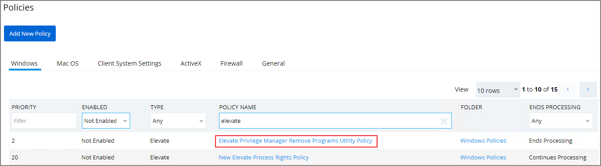
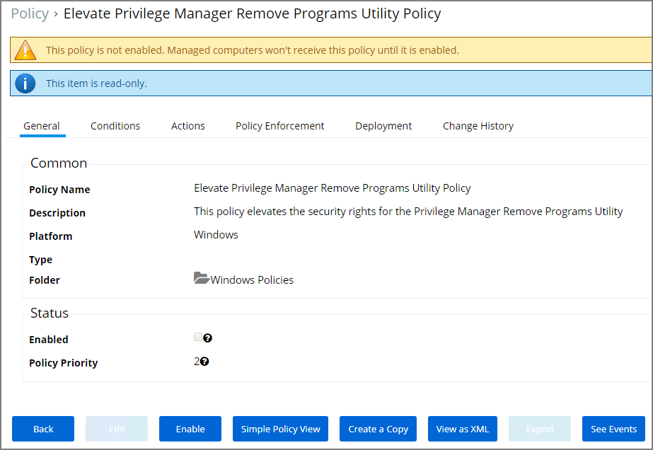

[title]: # (Elevating the Remove Programs Utility)
[tags]: # (elevate)
[priority]: # (5)
# Elevating the Privilege Manager Remove Programs Utility Policy

If standard users need to be able to use the Remove Program Utility the __Elevate Privilege Manager Remove Programs Utility Policy__ needs to be elevated.

1. Navigate to __Admin | Policies__.
1. Search for __Elevate Privilege Manager Remove Programs Utility Policy__.

   
1. Click on the policy link __Elevate Privilege Manager Remove Programs Utility Policy__.

   

   The default policy is read-only. If you need to customize any policy settings like the Conditions, Actions (like an approval action to run it), Policy Enforcement, or the Deployment, create a copy to make edits.
1. Click __Enable__ to enable the policy.

Refer to [Using the Remove Programs Utility](../../../../how-to/maintenance/remove-programs-utility.md) for further details about the utility set-up and functionality.
