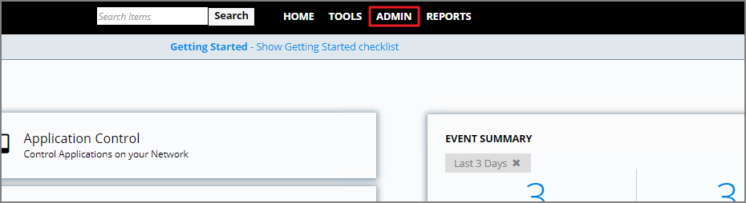
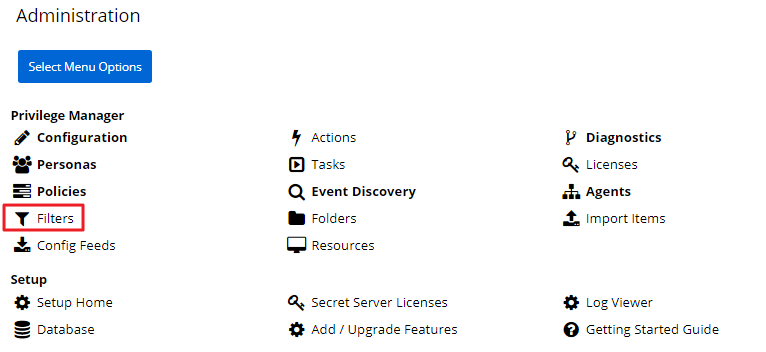
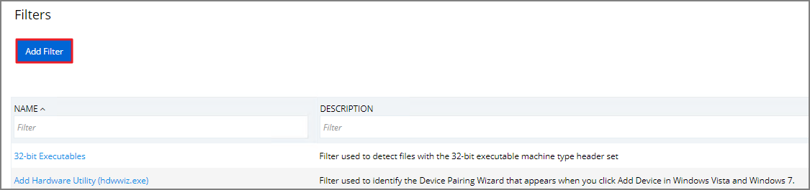
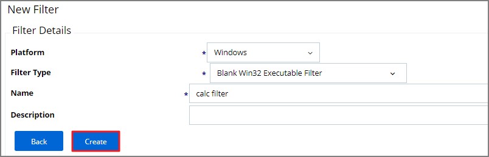
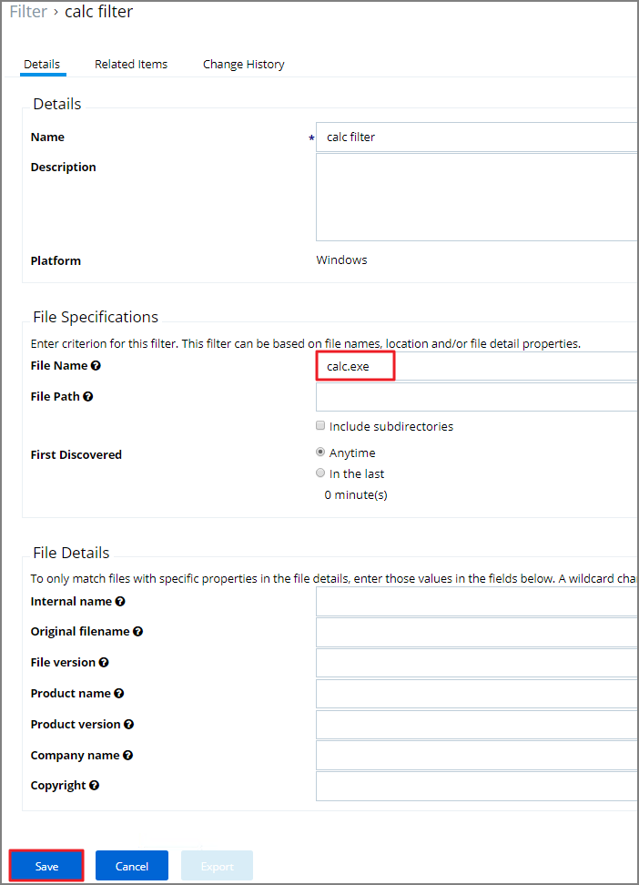
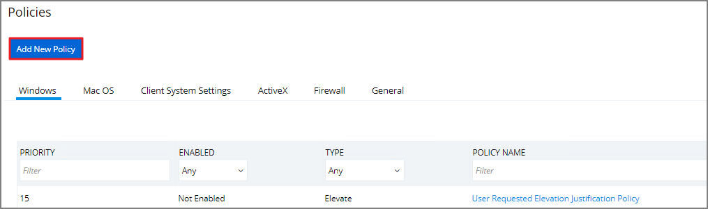
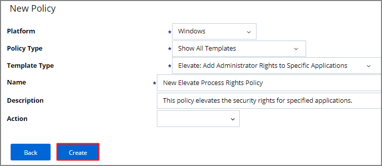
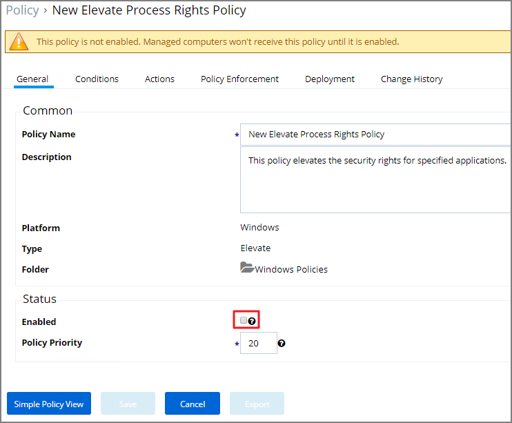
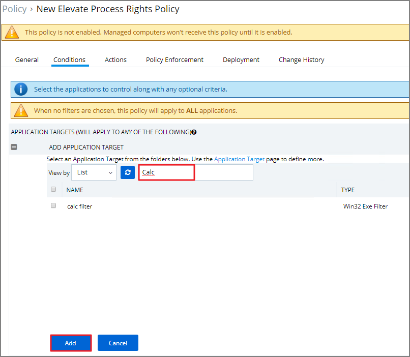

[title]: # (User Justification)
[tags]: # (elevate)
[priority]: # (10)
# User Justification Required to Run

This policy type requires a user to provide a justification for why they need to run an application before elevating with administrator privileges.  User Justification refers to the policy action.  Since Conditions and Actions are independent, this action can be applied to any condition.  In this use case, we will simply apply this action to a specific application.

First, create a filter that identifies the application.

1. Navigate to __ADMIN | Filters__.

   
   
1. Click on __Add Filter__.
   >**Note:** In this use case, we will target the Calculator application (calc.exe).

   
1. From the Platform drop-down select __Windows__.
1. From the Filter type drop-down select __Blank Win32 Executable__ Filter.  
1. Add a name and description, click __Create__.

   
1. Click __Edit__ at the bottom of the page.
1. Enter __calc.exe__ in the File Name field.
1. Click __Save__.

   

You can now use this Condition filter in the policy to govern the calc.exe executable.

## How to Create the Policy

1. Navigate to __ADMIN | Policies__.
1. Click on Add __New Policy__.

   
1. From the Platform drop-down select __Windows__.
1. From the Policy Type drop-down select __Elevate Application Privileges__.
1. Add a name and description.
1. From the the Action drop-down select __Request Justification__.
1. click __Create__.

   
1. Click __Edit__  and check the __Enabled__ box.

   
1. Navigate to the __Conditions__ tab.
1. Click __Add Application Target__.
1. Search and select the __Calc__ filter.
1. Click __Add__.  

   
1. Click on __Save__.

   >**Note:** This saves the policy to the policy list accessed from the Home screen – click on Policies to view from the Home page.  Once the policy is delivered to the endpoint agent, calc.exe will require the user to enter a justification reason for running this application.  This policy will be applied to all users on all computers.

## To adjust this policy to apply to specific users or endpoints

1. Click on __Advanced Policy__ view in the policy’s General tab.
1. Navigate to the __Conditions__ tab
1. Click add __Inclusion/Exclusion filters__ and __Computer Groups__.

The user will see a justification message as a result of the policy.
When the user adds a reason, they will then click the __Continue__ button and the application is allowed to execute.

>**Note:** You can then view a user’s provided reasons in Privilege Manager on the __ADMIN | Events Discovery | Policy Activity page or under Reports | Application Justification Summary Details Report__.
