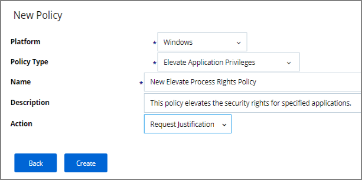

[title]: # (User Justification Required to Run)
[tags]: # (elevate)
[priority]: # (10)
# User Justification Required to Run

This policy type requires a user to provide a justification for why they need to run an application before elevating with administrator privileges.  User Justification refers to the policy action.  Since Conditions and Actions are independent, this action can be applied to any condition.  In this use case, we will simply apply this action to a specific application.

First, create a filter that identifies the application.

1. Navigate to __ADMIN__ | __Filters__.

   
   
1. Click on __Add Filter__.
   >**Note:** In this use case, we will target the Calculator application (calc.exe).

   
1. Click __Windows__ for your Platform, then __Blank Win32 Executable__ Filter.  
1. Add __Name__ and __Description__.
1. Click on __Create__.

   
1. Click __Edit__ at the bottom of the page.
1. Enter __calc.exe__ in the File Name field.
1. Click __Save__.

   

You can now use this Condition filter in the policy to govern the calc.exe executable.

## How to Create the Policy

1. Navigate to __ADMIN__ | __Policies__.
1. Click on Add __New Policy__.

   
1. Click __Windows__ as a Platform | click __Show All Templates__. From the Template Type dropdown Click __Elevate: Add Administrator Rights to Specific Applications__.
1. Add a __Name__ and __Description__.
1. Click __Create__.

   
1. Click __Edit__ | check the __Enabled__ box.

   
1. Click the __Conditions__ tab.
1. Click __Add Application Target__ and search for the name of your __Calc__ filter.
1. Select this filter | Click __Add__.  

   
1. Click on __Save__.

   >**Note:** This saves the policy to the policy list accessed from the Home screen – click on Policies to view from the Home page.  Once the policy is delivered to the endpoint agent, calc.exe will require the user to enter a justification reason for running this application.  This policy will be applied to all users on all computers.

## To adjust this policy to apply to specific users or endpoints

1. Click on the __Advanced Policy__ View in the policy’s General tab.
1. Click the __Conditions__ tab | click add __Inclusion/Exclusion filters__ and __Computer Groups__.

The user will see a justification message as a result of the policy.
When the user adds a reason, they will then click the __Continue__ button and the application is allowed to execute.

>**Note:** You can then view a user’s provided reasons in Privilege Manager on the __ADMIN__ | __Events Discovery__ | __Policy Activity__ page or under __Reports__ | __Application Justification Summary Details Report__.
