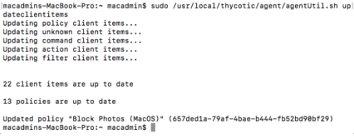
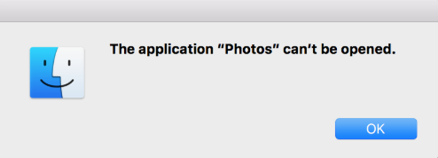

[title]: # (Require Justification - FireFox)
[tags]: # (standard user, policy, macOS)
[priority]: # (4802)
# Deny Photos

With your Learning Mode policy properly set up, anything you do on your Mac test machine will be discovered by Privilege Manager. For this example we will create a policy that blocks the Photos application as well as the PhotoBooth application.

1. Begin by opening the Photos and PhotoBooth applications on your macOS test endpoint. Then, in __Event Discovery | Policies__, check to make sure new items have been registered by your Event Discovery Testing Computers (MacOS) policy. These may be listed as __New Loaded Resources__. Click into these items and then click the __Discover Now__ button. It still may take time to properly load details about these new events.
1. Next, navigate to __Admin | Policies__ and __Add New Policy__. Select __Mac OS__ as a Platform, __Blacklist / Deny Application Execution__ for Policy Type and then __Blacklist: Deny Specific Applications__. Name your new policy __Block Photos (MacOS)__ and add a __Description__. Click __Create__.
1. Return to __Admin | Event Discovery | Policy Activity__. You should see an event titled __Photos__ and another titled __PhotoBooth__. Click __Create Filter__ underneath each of these events and then __Create__.
1. Navigate back to __Admin | Policies | MacOS__ tab, select the __Block Photos (MacOS)__ policy that you created in step 2. Under the __Conditions__ tab, click __Edit__, then __Add Application Target__. Search for the two filter names you created in step 3. __Add__ both filters to this policy. Verify the __Resource Targets__ section at the bottom of this page lists the correct target computer group for Mac machines that you want to apply this policy to. Then navigate to the __General__ tab and check the __Enabled__box. Click __Save__.

To make sure your policy is effective, pull up Terminal on your testing macOS endpoint and run `sudo /usr/local/thycotic/agent/agentUtil.sh updateclientitems` command.

Once this Deny-policy is updated on your endpoint, when you click Photobooth or Photos, you will see this message: 

