[title]: # (Deny Photos)
[tags]: # (standard user, policy, macOS)
[priority]: # (7)
# Deny Photos Application

With your Learning Mode policy properly set up, anything you do on your Mac test machine will be discovered by Privilege Manager. For this example we will create a policy that blocks the Photos and Photo Booth applications.

## Event Discovery

Open the Photos and PhotoBooth applications on an macOS test endpoint. When these applications are opened, Privilege Manager discovers these as an _Application Action from Event Discovery Testing Computers Audit Policy (MacOS)_.

1. In the Privilege Manager Console, navigate to __Event Discovery | Policy Activity__.

   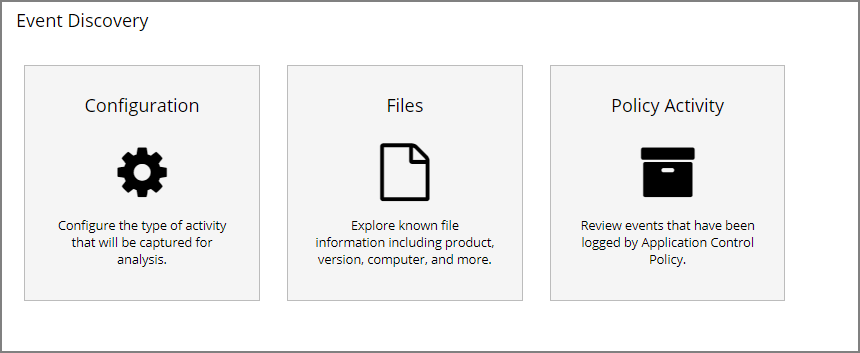
1. Verify new items have been registered by your Event Discovery Testing Computers (MacOS) policy. These may be listed as __New Loaded Resources__.

   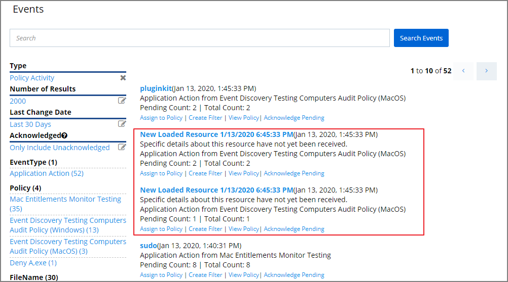
   1. Select a __New Loaded Resource__ link.
   1. On the loaded Resource Explorer page, click the __Discover Now__ button. It still may take time to properly load details about these new events, usually indicated by a __Discovery Status__ of __New__.

      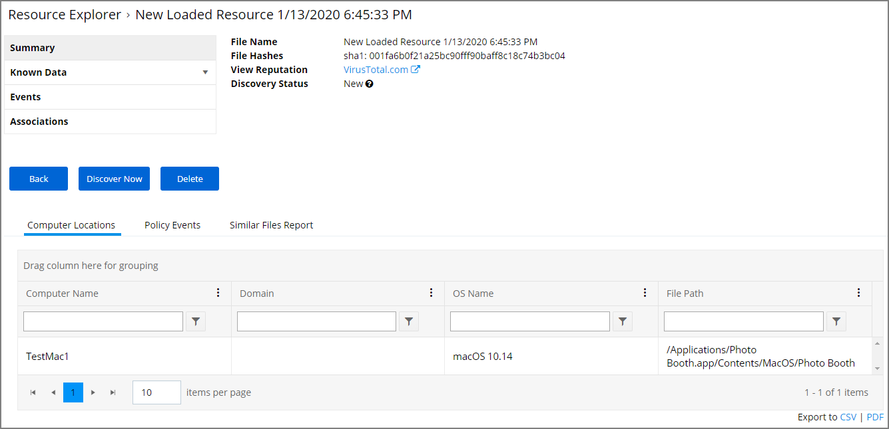

      Clicking the Discover Now button creates and executes a __Manual client-side resource discovery__ task. If you click the status link the task page opens (not shown in this example sequence).

When a resource is fully discovered it is displayed with full name on the discovery events page:

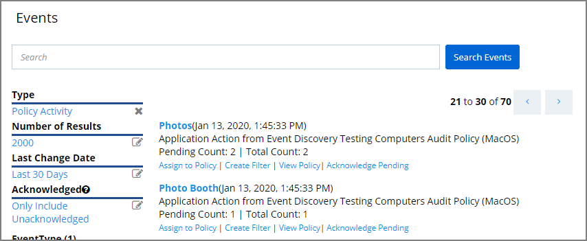

From the events page you can now use the __Assign to Policy__ or __Create Filter__ links to create specific policies for the discovered applications.

## Assign to Policy

Once the resources have been fully discovered, the fastest way to either create a new policy or add to an existing one is via the Assign to Policy link on the Events page.

1. Click the __Assign to Policy__ link.
1. The Resource Explorer opens for the selected resource, here it is the Photo Booth application.

   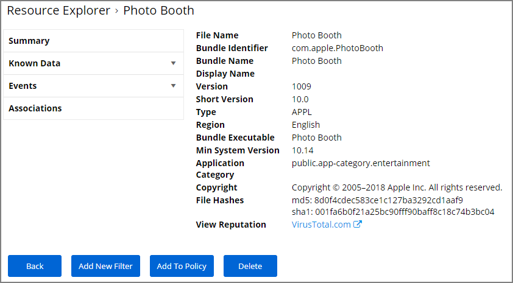
1. Click __Add To Policy__.

   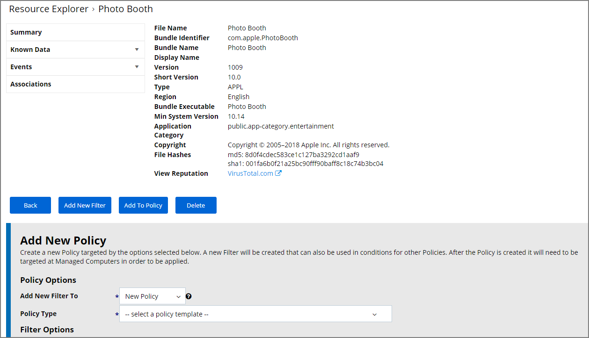

   This lets you either create a new policy or add to an existing policy. No matter which option you choose, a new filter for the resource (Photo Booth) is automatically created and all fields are pre-populated based on the discovered application details.
1. From the __Add New Filter to__ drop-down select __New Policy__.
   1. From the __Policy Type__ drop-down select __Blacklist: Deny Specific Applications__.
   1. In the Name field enter __Deny Photo Booth Application Execution Policy__ as a new policy name.
   1. Under Filter Options, only select __File Name__ and __Path__ filter options if you want to limit the filter to match the exact name and installation path. By default these are not pre-populated to avoid unintentional limitations. Customize the filter options if needed.

   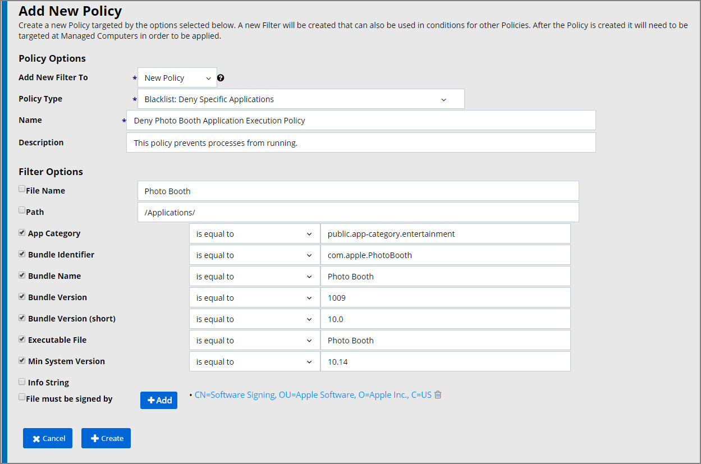
1. Click __Create__.
1. Navigate back to the Events page and select the __Assign to Policy__ link underneath the Photos resource.
1. From the __Add New Filter To__ drop-down select __Existing Policy__.
   1. In the __Policy Name__ search field enter the policy name created for the Photo Booth app.
   1. Specify and customize filter options.

   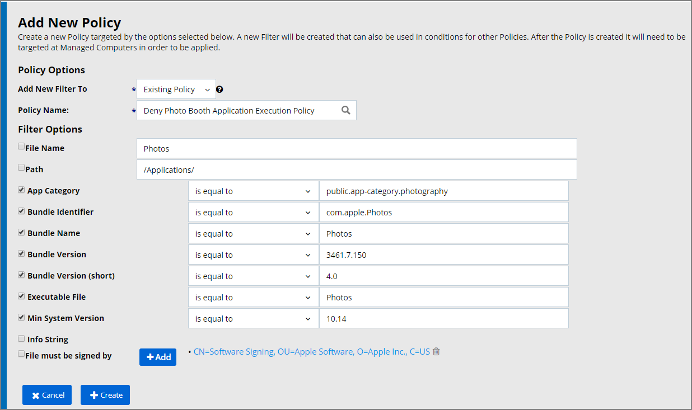
1. Click __Create__.

## Policy Verification

To make sure your policy is effective, pull up Terminal on your testing macOS endpoint and run the `sudo /usr/local/thycotic/agent/agentUtil.sh updateclientitems` command.

   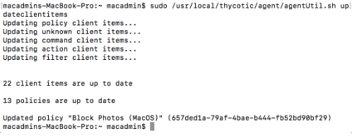

Once this Deny-policy is updated on your endpoint, when you click Photo Booth or Photos, you will see a message like this:

   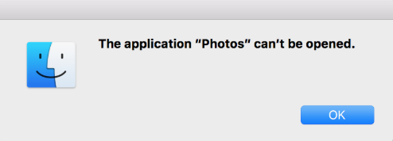

## Create a Filter Only

If you just want to create a filter based on the discovered resource, use the Create Filter option link underneath the discovered resource.

1. Navigate to __Admin | Event Discovery | Policy Activity__. You should see an event titled __Photos__ and another titled __Photo Booth__.
1. Select __Create Filter__ underneath each of these events. (Example shows create filter action for Photo Booth app.)

   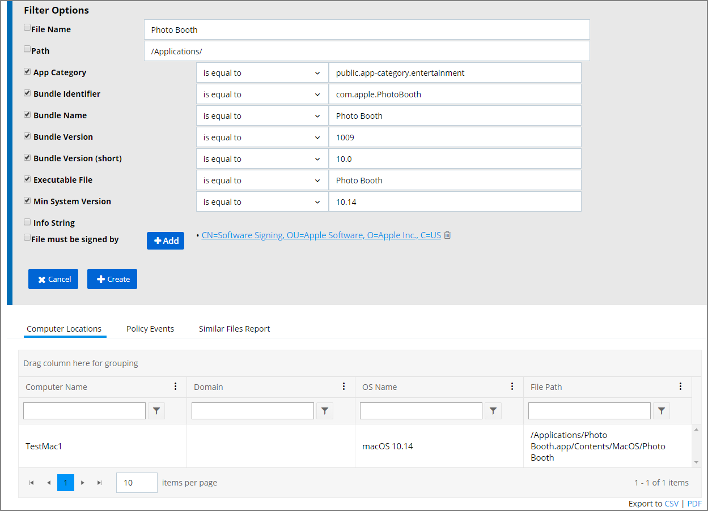
1. Customize the filter options if needed.
1. Click __Create__.

The filter can later be added to new or existing policies.
