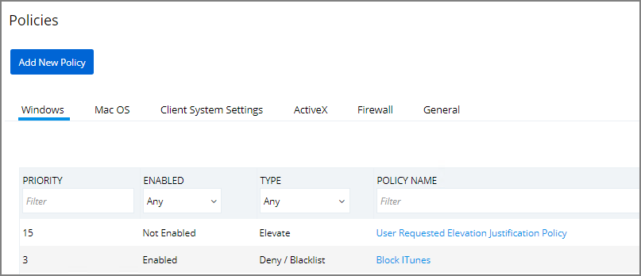
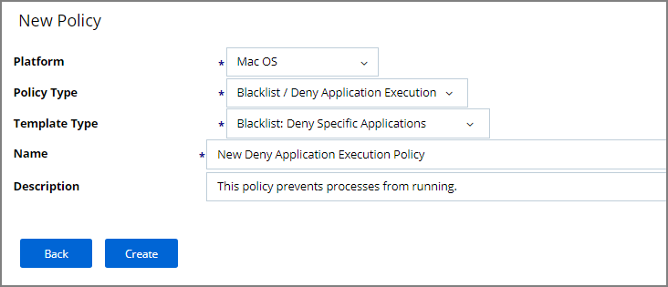

[title]: # (Deny Photos)
[tags]: # (standard user, policy, macOS)
[priority]: # (7)
# Deny Photos Application

With your Learning Mode policy properly set up, anything you do on your Mac test machine will be discovered by Privilege Manager. For this example we will create a policy that blocks the Photos application as well as the PhotoBooth application.

## Event Discovery

1. Begin by opening the Photos and PhotoBooth applications on your macOS test endpoint. Then, in __Event Discovery | Policies__.

   
1. Check to make sure new items have been registered by your Event Discovery Testing Computers (MacOS) policy. These may be listed as __New Loaded Resources__.
1. Click into these items and then click the __Discover Now__ button. It still may take time to properly load details about these new events.

## Create Filter
1. Navigate to __Admin | Event Discovery | Policy Activity__. You should see an event titled __Photos__ and another titled __PhotoBooth__.
1. Select __Create Filter__ underneath each of these events and then __Create__.
1. Navigate back to __Admin | Policies | MacOS__ tab.
1. Select the __Block Photos (MacOS)__ policy that you created in step 2.
1. Navigate to the __Conditions__ tab.
1. click __Edit__.
1. Select __Add Application Target__.
1. Search for the two filter names you created in step 3.
1. __Add__ both filters to this policy.
1. Verify the __Resource Targets__ section at the bottom of this page lists the correct target computer group for Mac machines that you want to apply this policy to.
1. Navigate to the __General__ tab and check the __Enabled__ box.
1. Click __Save__.

## Create Policy
1. Navigate to __Admin | Policies__ and __Add New Policy__.

   
1. Select __Mac OS__ as a Platform.
1. Select __Blacklist / Deny Application Execution__ for Policy Type.
1. Select __Blacklist: Deny Specific Applications__ for Template Type.
1. Name your new policy __Block Photos (MacOS)__ and add a __Description__. Click __Create__.

   

To make sure your policy is effective, pull up Terminal on your testing macOS endpoint and run `sudo /usr/local/thycotic/agent/agentUtil.sh updateclientitems` command.

   

Once this Deny-policy is updated on your endpoint, when you click Photobooth or Photos, you will see this message:

   
