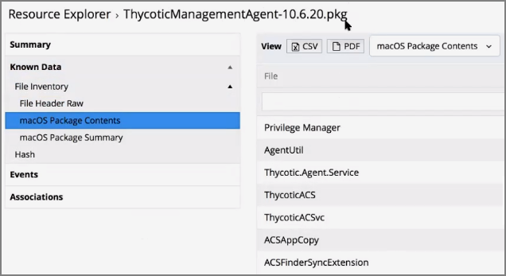
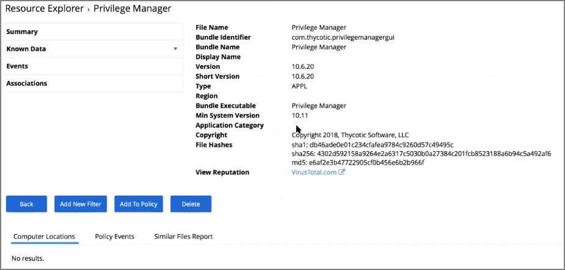
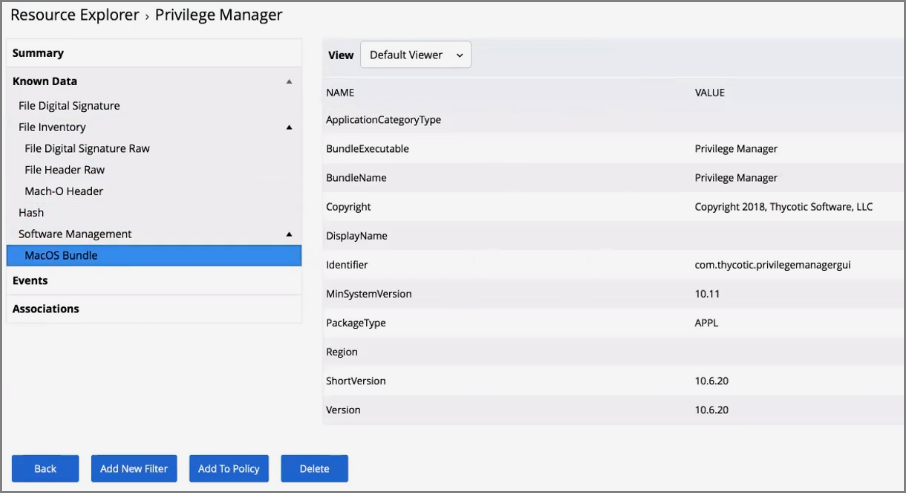

[title]: # (Inventoring .pkg Files)
[tags]: # (learning mode, macOS)
[priority]: # (101)
# Inventoring .pkg Files

Privilege Manager allows the inventory of macOS .pkg files. With the ability to upload and extract the contents within the .pkg files Privilege Manager inventories the applications that are bundled in any given .pkg.

After uploading a .pkg file select the __Go To File Details__ button.

In the Resource Explorer an Administrator can now look at all the details from the inventory.

* Showing the list of applications:

  

* Showing the main application details:

  

* Showing the information specified in the macOS bundle:

  

>**Note**:
>Any packages that deviate from the standard configuration and layout might not have their contents inventoried correctly.
