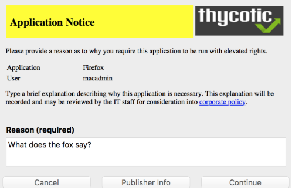
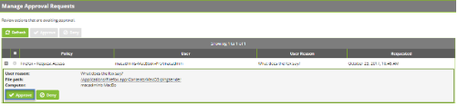
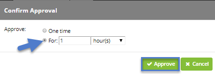
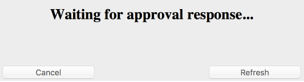
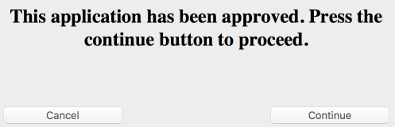

[title]: # (Require Justification - FireFox)
[tags]: # (standard user, policy, macOS)
[priority]: # (4802)
# Require Justification - FireFox

The following example provides information on setting up a justification required policy for FireFox on a macOS endpoint.

1. With a Learning Mode Policy enabled, open Firefox on a test macOS endpoint. A few minutes after doing this you should find a new item in __Admin | Event  Discovery | Policies__ titled __Firefox__.
1. Click __Create Filter__, enter a name and description and click __Create__.

   >**Note**:
   >If you are not immediately directed to an __Add New Filter__ screen, this means Privilege Manager doesn’t have enough information to target this application. In these cases you may need to create Filters manually (__Admin | Filters | Add Filter__).
1. Navigate to __Admin | Policies__ and __Add New Policy__.
1. Select __MacOS__ as a Platform, __Show All Templates__ for Policy Type and then __Other: Empty Policy__ as Template Type.
1. Name your new policy "__Firefox - Request Access (MacOS)__" and add a __Description__.
1. Click __Create__.
1. On the __Conditions__ tab, click __Edit__.
1. Under __Add Application Target__ search for the filter name as created for your Firefox policy (refer to steps above) click __Add__. 
1. Verify the __Resource Targets__ section at the bottom of this page lists the correct target computer group for macOS endpoints that you want to apply this policy to.
1. Under the __Actions__ tab, click __Add Action__.
1. Search for __Application Justification Message Action__ and __Application Approval Request Message Action__, add both of those.
1. Navigate to the __General__ tab and check the __Enabled__ box. 
1. Click __Save__.

To make sure your policy is effective, pull up Terminal on your testing macOS endpoint and run `sudo /usr/local/thycotic/agent/agentUtil.sh updateclientitems` command.

Once this Request Access-policy is updated on your endpoint, when you click Firefox you will see a prompt where the user can enter their reason for accessing Firefox:

To Accept this request, in the Privilege Manager Console navigate to __Tools | Manage Approvals__. Click the request and approve, you may do so for one time access or for a time interval:

On the macOS endpoints the user will see these messages:

__Waiting for approval__:

__Approval confirmation__:

