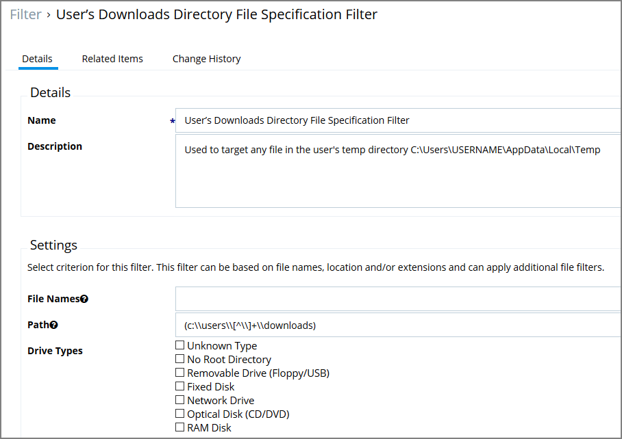
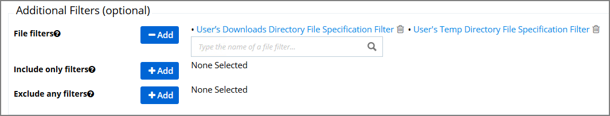
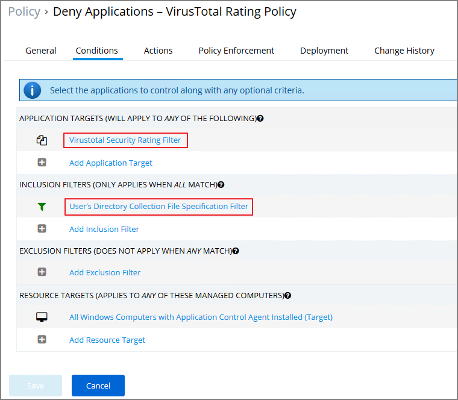

[title]: # (Reputation Checking)
[tags]: # (monitoring)
[priority]: # (4502)
# Reputation Checking

Privilege Manager analyzes applications in real-time.  This unique feature allows for reputation analysis of any unknown applications that will mitigate endpoint attacks from Ransomware, Zero-day attacks, Drive-by Downloads, and other unknown malicious software.

The monitor approach used here is that all applications that meet a general condition (i.e. executed from a specific directory or directories) will be sent to VirusTotal for a reputation check. For this use case we will perform real-time reputation analysis of unknown applications using VirusTotal.

First, you will need to integrate Privilege Manager and VirusTotal by following the Integration steps listed in the [Setting Up VirusTotal for Reputation Checking](../../../../foreign-sys/third-party/set-up-virustotal.md) topic. That section will walk you how to do the following:

1. Configure VirusTotal Ratings Provider
2. Install VirusTotal in Privilege Manager
3. Create a Security Rating Filter for VirusTotal

For information and setup steps to configure reputation checking using Cylance, see the [Cylance Integration](../../../../foreign-sys/third-party/set-up-cylance.md) topic.

## Creating Security Rating Filter

Next you have to create a Security Rating Filter for VirusTotal. Follow these steps:

1. Navigate to __Home | Filters__, the click __Add Filter__.
1. Select a platform, then __Security Rating Filter__ as a Filter Type. Name the policy and add a description.
1. Next to Security Rating System, select __Application Control Rating System__.

   
1. Next to VirusTotal Rating System click __+__.
1. Click __Create__.
1. Click __Edit__.
1. Under __Settings__, change the __Rating Level__ drop-down to specify __Bad__. 

   

   The rating level trigger is supposed to match what you want to accomplish with the policy that will be using this filter. A rating level of Bad should be used for Deny policies, and Clean for applications or files that are part of the safe list. A rating level of Suspect can be used in justification and/or learning/discovery policies.
1. Click __Save__.

## Creating User's Downloads Location, Temp Dir, and Collection Filters

1. In the Privilege Manager Console search field, enter User’s Temp Directory File Specification Filter.

   
1. Select the filter __Users’ Temp Directory File Specifications Filter__, click __Create a Copy__.
1. Name the new filter _User's Download Directory File Specification Filter_, provide a description and click __Create__.
1. Click on __Edit__.
1. Change the regular expression in the Path filed to the following: (c:\\users\\[^\\]+\\downloads), save your changes.

   
1. Finally, combine the 2 filters into a single filter to target both directories:
   1. Click __Create a Copy__.
   1. Enter the name for the new filter _User’s Directory Collection File Specification Filter_, click __Create__.
   1. Click __Edit__.
   1. Clear the data in the Path field.
   1. Under Additional Filters, click the __Add__ button to the right of __File filters__.
   1. Type __User’s Download__ to search for the filter.
   1. Click __User’s Downloads Directory File Specification Filter__ from the list to add it.
   1. Type __User’s Temp Directory__ to search for the filter.
   1. Click __User’s Temp Directory File Specification Filter__ from the list to add it (this is a default filter).

      
   1. Click __Save__.

## Creating a Policy

Next you have to create a Policy and add the filters for VirusTotal:

1. Navigate to __Home | Policies__, then click on __Add New Policy__.
1. Select Windows as a Platform, __Show All Policies__ as a Policy Type, then __Other: Empty Policy__.
1. Name the policy __Allow Applications – VirusTotal Rating__, and add a description _Deny applications flagged by VirusTotal as bad_, click __Create__.

   
1. Click __Edit__.
1. Next, select the __Actions__ tab.
1. Select __Add Action__.
1. In the search field, type Application Denied, and locate the __Application Denied Message Action__.
1. Select the action and click __Add__.
1. On the Conditions tab, add the filters.
   1. Under __Application Targets__ add the _VirusTotal Security Rating Filter_.
   1. Under __Inclusion Filters__ add the _User’s Directory Collection File Specification Filter_.

      
1. Click __Save__.

If you want the policy to apply to specific users or endpoints, it can be adjusted by clicking on the Advanced Policy View in the policy’s General tab. Other edits can be done via the Conditions tab, to add Inclusion/Exclusion filters and Resource Targets.

>**Note**:
>This policy will send any application run from the user’s Downloads or Temp directory to VirusTotal for a reputation check in real-time. If the application is graded with Bad from VirusTotal, the application will be denied.

## Viewing a File Security Ratings Report

To view a File Security Ratings report, from the main page go to __REPORTS | File Security Rating Details Report__. To see details of the applications in the report, click on the file name in the File column.
