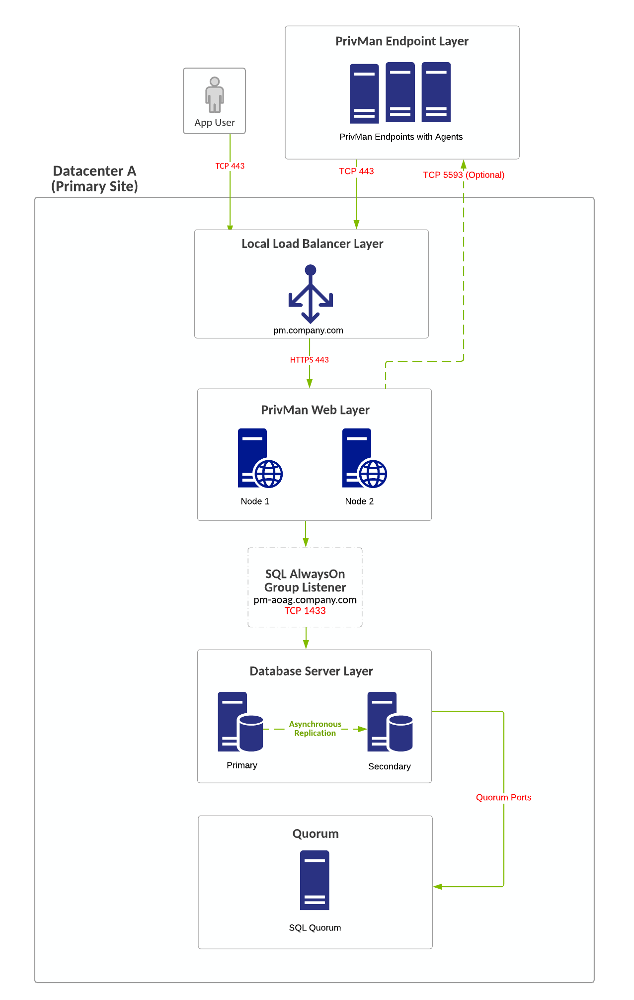

[title]: # (Architecture Diagrams)
[tags]: # (setup planning)
[priority]: # (20)
## Privilege Manager Reference Architecture Diagrams

## Component Definition

__App User__ - These are the users connecting to your Privilege Manager websites. These users will be limited to the users that perform administrative tasks (admins), to use the solution in a helpdesk role, or to perform approvals or audits.

__Privilege Manager Agents__ - These is used for application control and local user/group management.

__Load Balancers__ - Load balancers are often involved in the solution to help distribute web traffic to more than one web server. Local and Global load balancers, if available, may be used in the solution to further lower potential application downtime during upgrades, patching, and single site failures.

__Web Server__ - This is a primary component of the solution. Our web servers use IIS 7 and newer and will only work on Windows Server 2008 R2 - Windows Server 2016. For multiple web server (clustered) solutions, the web application itself can be made cluster aware and does not require being built as part of an IIS farm. Each web server acts as its own stand alone web server.

__Database Server__ - This is a primary component of the solution. Microsoft SQL Server hosts the Privilege Manager databases. We are compatible only with SQL Server 2012 or newer running on Windows Server 2012 R2 - Windows Server 2016. The Thycotic databases can be put on a stand alone server, a FCI, or preferably using an AlwaysOn AG for clustered environments. The databases can be added to an existing production SQL cluster or instance, but proper sizing of the environment should be done. Windows authentication only is advised.

__Reverse Proxy / Azure Service Bus__ - A properly configured Reverse Proxy will act as a buffer between Privilege Manager agents and the Privilege Manager server(s) to limit server exposure. Use nginx, F5, or Windows Application Request Routing 3.0 and URL Rewrite in IIS on a DMZ Server, to prevent a direct connection between Agent endpoints and your Privilege Manager web server(s). Alternatively, Azure Bus can be used, to prevent Agent endpoints connecting directly to your Privilege Manager web server(s).

__Secret Server__ - Optionally, Secret Server can be installed with Privilege Manager to use an authentication source and a storage vault for Privilege Manager credentials. Using Secret Server as the authentication source for Privilege Manager allows MFA options for login. Also, application role assignment can be assigned in Secret Server. If using Secret Server features (beyond authentication and vault storage for Privilege Manager), Secret Server should be on separate servers - for this, see [Secret Server + Privilege Manager Architectures](pm-ss-integration.md).

>**Note**:
>Every component of Privilege Manager can be made highly available to ensure a redundant architecture and to scale for future growth.

Privilege Manager can be setup for various types of authentication methods: 

* Azure Active Directory Authentication
* NTML for local webserver authentication
* ThycoticOne for Cloud Instances

## Single Site with Minimum HA

### Overview

* Minimum Cost HA Configuration.
* Single Site design, no native DR capacity. DR can be provided by means of VM replication if subnets are spanning locations, otherwise re-ip + DNS changes may be necessary.
* Due to SQL Basic Availability groups with Standard Edition, you will need to have multiple instances of SQL and a dedicated AlwaysOn availability group configuration.
* Some customers may choose to use a separate web reverse proxy or azure service bus configuration for Privilege Manager agent TCP 443 communication.
* Optionally, Privilege Manager can be integrated with Secret Server (installed on the same web servers or, preferably, on dedicated servers) for authentication and as a storage vault for Privilege Manager credentials. If using Secret Server features (beyond authentication and vault storage for Privilege Manager), Secret Server should be on separate servers.

### Requirements

* SQL Standard Edition – Basic Availability Group Configuration.
* Local load balancers can be utilized for all web server nodes.
* Configuring a file share witness for SQL quorum voting is required for SQL to stay online during single node unplanned failures.
* SQL Quorum Ports - http://dsfnet.blogspot.com/2013/04/windows-server-clustering-sql-server.html

### Virtual IP/Virtual Computer Object Requirements

* pm.company.com:443 (Load Balancer).
* pm-aoag.company.com:1433 (created as part of SQL AlwaysOn Configuration).
  * pm-aoag.company.com computer object/Virtual IP.
* Windows Failover Cluster Object (created as part of Windows Failover Clustering Configuration).
  * computer object/Virtual IP.
  * 1 additional virtual IP addresses may be required as part of Windows Failover Cluster for single site design for the network configuration of the Failover Cluster.

### Diagram

>**Note:** The reference for this diagram is A-1.

## Single Side Minimum HA (Reverse Proxy/Azure Bus)

### Overview

* Minimum Cost HA Configuration.
* Single Site design, no native DR capacity. DR can be provided by means of VM replication if subnets are spanning locations, otherwise re-ip + DNS changes may be necessary.
* Due to SQL Basic Availability groups with Standard Edition, you will need to have multiple instances of SQL and a dedicated AlwaysOn availability group configuration.
* Some customers may choose to use a separate web reverse proxy or azure service bus configuration for Privilege Manager agent TCP 443 communication.
* Optionally, Privilege Manager can be integrated with Secret Server (installed on the same web servers or, preferably, on dedicated servers) for authentication and as a storage vault for Privilege Manager credentials. If using Secret Server features (beyond authentication and vault storage for Privilege Manager), Secret Server should be on separate servers.

### Requirements

* SQL Standard Edition – Basic Availability Group Configuration.
* Local load balancers can be utilized for all web server nodes.
* Configuring a file share witness for SQL quorum voting is required for SQL to stay online during single node unplanned failures.
* SQL Quorum Ports - http://dsfnet.blogspot.com/2013/04/windows-server-clustering-sql-server.html

### Virtual IP/Virtual Computer Object Requirements

* pm.company.com:443 (Load Balancer).
* pm-aoag.company.com:1433 (created as part of SQL AlwaysOn Configuration).
  * pm-aoag.company.com computer object/Virtual IP.
* Windows Failover Cluster Object (created as part of Windows Failover Clustering Configuration).
  * computer object/Virtual IP.
  * 1 additional virtual IP addresses may be required as part of Windows Failover Cluster for single site design for the network configuration of the Failover Cluster.

### Diagram

>**Note:** The reference for this diagram is A-2.

")

## Multi Site Minimum HA/DR - Lower Cost/Manual Failover

### Overview

* Minimum Cost HA Multi-Site Configuration – Lower Infrastructure Footprint for DR..
* Multi-Site Design. SQL AlwaysOn configurations will be asynchronous for Privilege Manager database.
* DR site acts at temporary site only with no intention for long-term usage. Services in DR site being down can incur downtime.
* If a Global Load Balancer is not used, the Reverse Proxy and App Users will need to be directed to the DR Web Node, typically via DNS or IP updates.
* Due to SQL Basic Availability groups with Standard Edition, you will need to have multiple instances of SQL and a dedicated AlwaysOn availability group configuration.
* Privilege Manager can reside on the same database servers as Secret Server or separate database servers, but Secret Server and Privilege Manager should not share the same database itself. Due to SQL Basic Availability groups with Standard Edition, you will need to have multiple instances of SQL and a separate AlwaysOn availability group configuration.

### Requirements

* SQL Standard Edition – Basic Availability Group Configuration.
* If no Global Load Balancers Exist due to costs/infrastructure missing, local load balancers can be utilized for all web server nodes but DNS change may be required if primary location goes offline.
* Configuring a file share witness for SQL quorum voting is required for SQL to stay online during single node unplanned failures.
* SQL Quorum Ports - http://dsfnet.blogspot.com/2013/04/windows-server-clustering-sql-server.html

### Virtual IP/Virtual Computer Object Requirements

* pm.company.com:443 (Load Balancer).
  * pm-a.company.com (Local Load Balancer).
* pm-aoag.company.com:1433 (created as part of SQL AlwaysOn Configuration).
  * pm-aoag.company.com computer object/Virtual IP.
* Windows Failover Cluster Object (created as part of Windows Failover Clustering Configuration).
  * computer object/Virtual IP.
  * 1 additional virtual IP addresses may be required as part of Windows Failover Cluster for single site design for the network configuration of the Failover Cluster.

### Diagram

>**Note:** The reference for this diagram is B.

 - Lower Cost/Manual Failover")

## Multi Site Average HA/DR - Average Cost/Manual Failover

### Overview

* Average Cost HA Multi-Site Configuration - Lower Infrastructure Footprint for DR.
* Multi-Site Design. SQL AlwaysOn configurations will be asynchronous for Privilege Manager database.
* Secondary SQL Node at Primary Site for Planned Failover "Patching", Secondary SQL Node in DR Site for Unplanned Failover.
* DR site can act as permanent secondary site for long term use.
* Database requires manual failover at primary or DR location.
* Global Load Balancers are configured to force all traffic to go to primary site unless primary site is down (priority group activation).
* Web node in DR Site is inactive and manually activated when failover is needed.
* If the data centers have low latency between networks, it may be possible to leave the PrivMan web server in DR online, active, and processing work.
* Some customers may choose to use a separate web reverse proxy, as shown, or azure service bus configuration for Privilege Manager agent TCP 443 communication.
* Optionally, Privilege Manager can be integrated with Secret Server (installed on the same web servers or, preferably, on dedicated servers) for authentication and as a storage vault for Privilege Manager credentials. If using Secret Server features (beyond authentication and vault storage for Privilege Manager), Secret Server should be on separate servers.

### Requirements

* SQL Standard Edition.
* Global and Local Load Balancers.
* Configuring a file share witness for SQL quorum voting is recommended. A cloud witness or DFSR share is recommended for witness configuration. Simultaneous failure of both SQL nodes in the primary location can cause the failover cluster to not survive.
* SQL Quorum Ports - http://dsfnet.blogspot.com/2013/04/windows-server-clustering-sql-server.html

### Virtual IP/Virtual Computer Object Requirements

* pm.company.com:443 (Global Load Balancer).
  * pm-a.company.com:443 (Local Load Balancer).
  * pm-b.company.com:443 (Local Load Balancer).
* pm-aoag.company.com:1433 (created as part of SQL AlwaysOn Configuration).
  * pm-aoag.company.com computer object/Virtual IP.
  * 2 virtual IP addresses may be required as part of this configuration.
* Windows Failover Cluster Object (created as part of Windows Failover Clustering Configuration).
  * computer object/Virtual IP.
  * 2 additional virtual IP addresses may be required as part of Windows Failover Cluster for single site design for the network configuration of the Failover Cluster representing both networks at each respective site.

### Diagram

>**Note:** The reference for this diagram is C.

 - Average Cost/Manual Failover")

## Best HA/DR - Highest Cost/Manual Failover

### Overview

* Highest Cost HA Multi-Site Configuration – Higher Infrastructure Footprint in DR.
* Multi-Site Design. SQL AlwaysOn configurations will be asynchronous for Privilege Manager database.
* Secondary SQL Node at Primary Site for Planned Failover "Patching", Secondary SQL Node in DR Site for Unplanned Failover.
* DR site can act as permanent secondary site for long term use.
* Database requires manual failover at primary or DR location.
* Global Load Balancers are configured to force all traffic to go to primary site unless primary site is down (priority group activation).
* Web nodes in DR Site is inactive and manually activated when failover is needed.
* If the data centers have low latency between networks, it may be possible to leave the PrivMan web server in DR online, active, and processing work.
* Some customers may choose to use a separate web reverse proxy, as shown, or azure service bus configuration for Privilege Manager agent TCP 443 communication.
* Optionally, Privilege Manager can be integrated with Secret Server (installed on the same web servers or, preferably, on dedicated servers) for authentication and as a storage vault for Privilege Manager credentials. If using Secret Server features (beyond authentication and vault storage for Privilege Manager), Secret Server should be on separate servers.

### Requirements

* SQL Standard Edition.
* Global and Local Load Balancers.
* Configuring a file share witness for SQL quorum voting is recommended. A cloud witness or DFSR share is recommended for witness configuration. Simultaneous failure of both SQL nodes in the primary location can cause the failover cluster to not survive.
* SQL Quorum Ports - http://dsfnet.blogspot.com/2013/04/windows-server-clustering-sql-server.html

### Virtual IP/Virtual Computer Object Requirements

* pm.company.com:443 (Global Load Balancer).
  * pm-a.company.com:443 (Local Load Balancer).
  * pm-b.company.com:443 (Local Load Balancer).
* pm-aoag.company.com:1433 (created as part of SQL AlwaysOn Configuration).
  * pm-aoag.company.com computer object/Virtual IP.
  * 2 virtual IP addresses may be required as part of this configuration.
* Windows Failover Cluster Object (created as part of Windows Failover Clustering Configuration).
  * computer object/Virtual IP.
  * 2 additional virtual IP addresses may be required as part of Windows Failover Cluster for single site design for the network configuration of the Failover Cluster representing both networks at each respective site.

### Diagram

>**Note:** The reference for this diagram is D.

