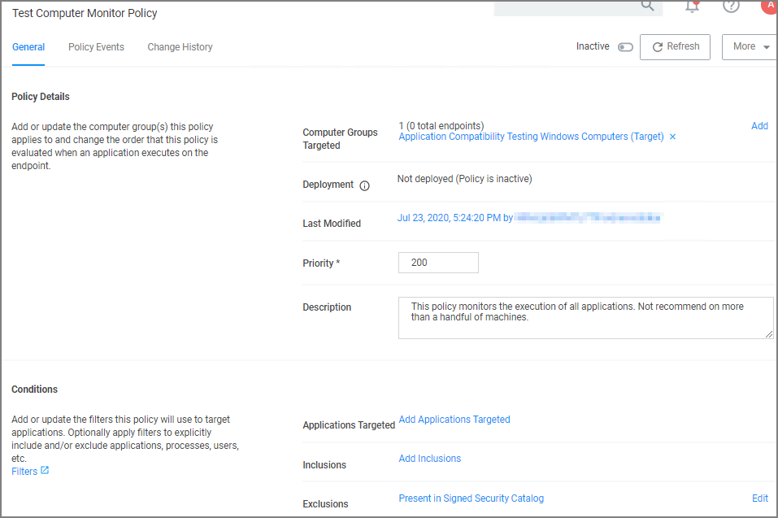

[title]: # (Monitoring)
[tags]: # (event discovery, policy feedback)
[priority]: # (1)
# Monitoring - Learning Mode Policies

At the most basic level, a Monitoring policy is a policy that takes no action, it exists only to gather data and you can use the data it gathers for audits or for assigning actions to application events retrospectively. For trials and Proof of Concept (PoC) environments these can be pointed at specific endpoints in order to learn about events that are already happening, or in order to test-run specific applications that you want to quickly introduce into Privilege Manager.

Any Monitoring policy will have the __Audit Policy Events__ set to active under the Actions section.

>**Note**:
>Audit Policy Events is generally inactive in production environments outside of specific auditing or data-collecting initiatives due to the large amount of data these policies can gather.

## Creating a Monitoring Policy

Use the policy wizard to create a monitoring policy for the learning mode phase on your instance.

1. Under your Computer Group navigate to Application Policies, click __Create Policy__.
1. On the __What type of policy?__ page select Monitoring and click __Next Step__.
1. On the __What processes do you want this policy to monitor in this computer group?__ page select __Everything__ and click __Next Step__.
1. Enter a new name for the policy and click __Create Policy__.

>**Note**: It is not recommended to run be active on more than a handful of machines.

## Discover Applications that Require Administrator Rights

The most influential applications are those that require administrator credentials to run. For setting up endpoints that are organized by Least Privilege, you can use a monitoring policy to discover all events requiring Administrator rights.

Use the policy wizard to create a monitoring policy for the learning mode phase on your instance.

1. Under your Computer Group navigate to Application Policies, click __Create Policy__.
1. On the __What type of policy?__ page select Monitoring and click __Next Step__.
1. On the __What processes do you want this policy to monitor in this computer group?__ page select __Applications Run as Admin__ and click __Next Step__.
1. Enter a new name for the policy and click __Create Policy__.

## View Policy Results

To view all feedback, or event, sent from your existing policies with the Send Policy Feedback activity checked, navigate to __Policy Events__. Events will be listed in the main section and on the left sidebar you can scope results for certain policies, computers, time frame, etc. You can use this view to assign any events to policies by clicking Assign to Policy under the event listing.

## Discover All Events on Test Endpoints

Another type of monitoring policy will discover all events on targeted machines regardless of whether the application requires Administrator Rights. This policy is used in test environments to quickly target policies at untrusted/unwanted applications, but is not recommended for production settings.

1. Under your Computer Group navigate to Application Policies, click __Create Policy__.
1. On the __What type of policy?__ page select __Monitoring__ and click __Next Step__.
1. On the __What processes do you want this policy to monitor in this computer group?__ page select __Everything__ and click __Next Step__.
1. Enter a new name for the policy and click __Create Policy__.
1. Under __Computer Groups Targeted__ add the __Application Compatibility Testing Windows Computers (Target)__ collection and remove the __Windows Computer__ target.

   
1. Click __Save Changes__.
