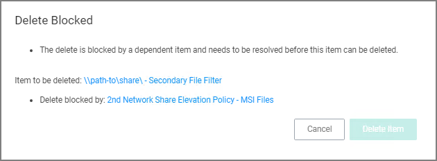

[title]: # (Deleting Items)
[tags]: # (dependencies)
[priority]: # (6)
# Deleting Items

When deleting items there might be dependencies, like a filter is used in a policy. If that filter is then deleted without modifying or also deleting the policy, the policy will stop working without anyone realizing that the filter has been deleted.

Privilege Manager detects dependencies when items are deleted and alerts the user to

* any dependent items, which block the deletion.
* any child items, which will also be deleted.

When a the __Delete__ button is clicked on a filter, in this example the filter is called __allow notepad++ any version secondary file filter__ and no dependencies are detected, a __Delete Item__ modal opens. The user can proceed by clicking the __Delete Item__ button.

If that filter is part of a policy and the __Delete__ button is clicked, the __Item Dependency: Delete Blocked__ modal opens.

From the modal the user can see that the delete is blocked by a dependent item. A tool tip is shown when hovering the mouse pointer over the icons.

The trash can icon informs about which item was selected to be deleted. The blocked icon informs which items are blocking the deletion.

While there are blocking items, the __Delete Item__ or __Delete Item and Children__ buttons are disabled. The delete button is dynamic and will only display __Delete Item and Children__ if both of those are dependencies, otherwise it will only display __Delete Item__.

Blocking dependent items can be accessed and deleted by clicking on the named item link. This opens the dependent item in another browser tab, where it can be viewed and deleted.
