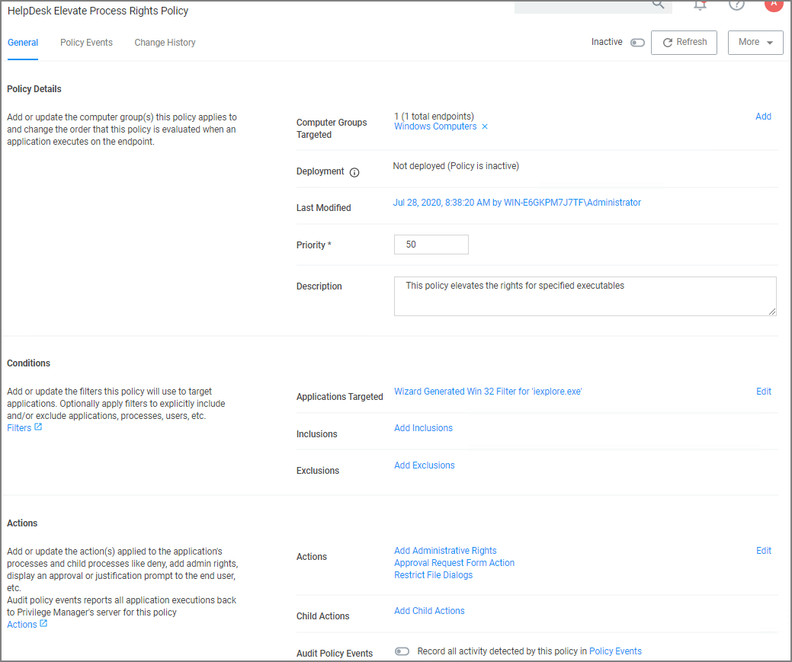

[title]: # (Help Desk Approvals)
[tags]: # (elevation request)
[priority]: # (3)
# Help Desk Approvals

Privilege Manager enables end users to request elevation and then have their request approved or denied by the helpdesk. You can approve or deny requests via the Privilege Manager console, or forward requests to a third-party ticketing system such as ServiceNow.

## Creating a Helpdesk Policy

1. Using the Policy Wizard, create a controlling policy that elevates requiring approval.
1. Select what file types you want targeted with the approval elevation.
1. Choose your targets. You can specify several different targets.
1. Name your policy and click __Create__.

   

   The important wizard added actions on this policy are:

   * __Approval Request From Action__
   * __Restrict File Dialogs__
   * __Add Administrative Rights__.
1. Set the __Inactive__ switch to __Active__.

Once the agent receives the update, users receive a message action dialog to enter their written request in the Reason (required) field which then sends a request to either the Privilege Manager console or integrated Helpdesk.

## Workflow

When end users try to open a restricted application, they must enter a reason for needing the application and send it for approval. While the request is being evaluated, whenever end users start the application a status pending message will appear. Once the request has been approved or denied, end users receive an approval or denial.

## Approve requests

To approve or deny requests in the Privilege Manager Console, go to __Admin: Tools | Manage Approvals__ to view all application requests.
