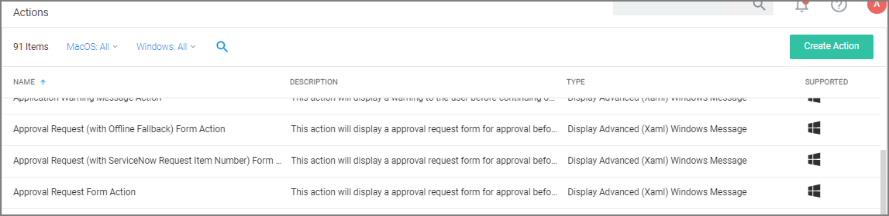
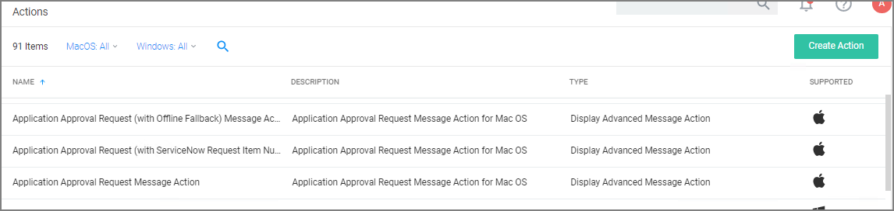
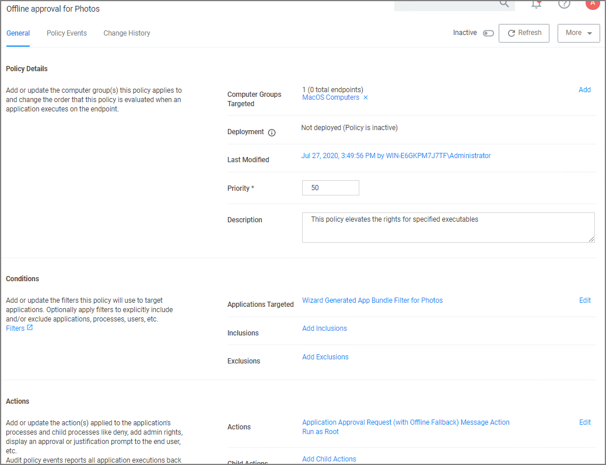
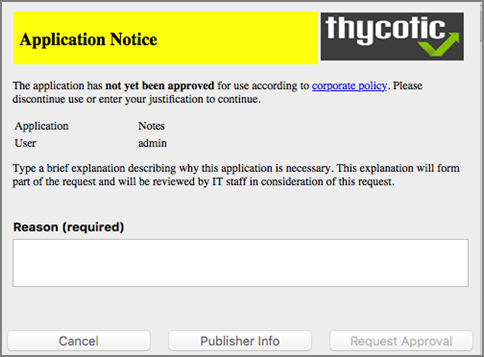
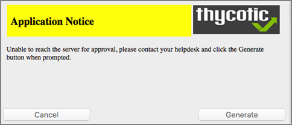
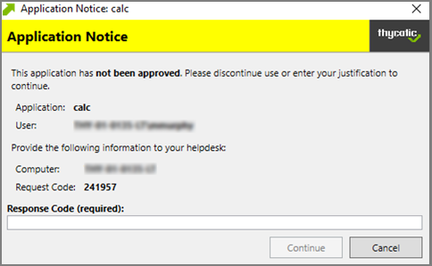
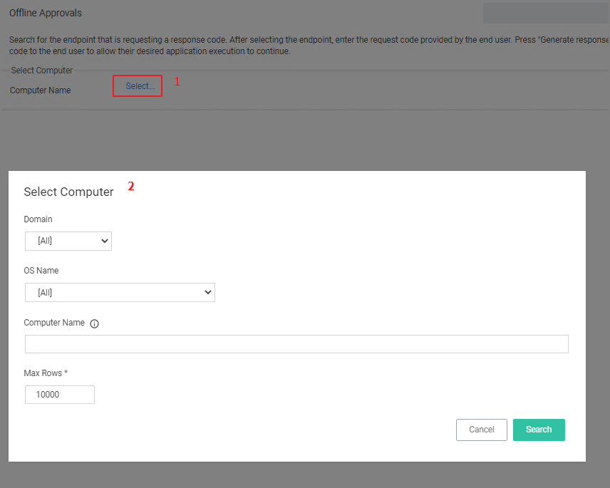

[title]: # (Offline Approvals)
[tags]: # (workflows)
[priority]: # (2)
# Offline Approvals

Approval workflows usually require an endpoint to be online to send out the approval request and then receive an approval for an application to continue to run or execute. If an endpoint is offline, an end user needs a way to also request an approval for an application to continue to execute, for such a
situation an Offline Approval process has been implemented.

During an offline approval process a prompt is triggered for a 6-digit numeric pin also called request code. The end user then calls the Help Desk and provides system information to the Help Desk representative. The Help Desk representative generates and provides a 12-character alphanumeric response code for the deployed policy residing on the offline endpoint. Once the end user enters the response code the application execution continues and other actions can be performed, for example adding administrative rights.

The message actions used in the Offline Approval policy are OS specific. Use the action:

* Windows:
  
* macOS:
  

Notifications for approvals can also be issued to mobile devices. Refer to [Mobile App section - Configure the Notification Settings](../../../../mobile/cfg-console.md#configure_the_notification_settings)

## Creating an Offline Approval Policy

For offline approvals to work, a message action supporting offline fallback needs to be configured. This example uses the macOS based message action.

1. Create an Offline Approval Policy, by specifying the specific message action:
   1. Navigate to Actions and click __Edit__.
   1. Search for and __Add__ the action __Application Approval Request (with Offline Fallback) Message Action__.
   1. Click __Update__.
1. Click __Save Changes__.

   

## Endpoint Offline Approval

When the policy created above applies, the system first attempts an online
approval request and if the server is unavailable it uses the request and
response codes to verify authorization.

1. When trying to install an application that is not explicitly white-listed via policy while offline, the following Application Notice opens:

   

1. When the system is offline, the following notice opens:

   

1. Follow the instructions to contact your helpdesk and only click **Generate** when prompted.
1. You will then see:

   

   Provide the information to the helpdesk, they will need the 6-digit code, in this example 191279, to create a response code.

1. Once your helpdesk contact verifies the authenticity of the request, you will be provided a 12-digit **Response Code** that needs to be entered in the text field.
1. Click **Continue** after entering the Response Code.

At this point the application installation should be able to continue.

## Privilege Manager Offline Approval

The following procedures provides detailed steps about the offline approval process in the Privilege Manager UI.

1. Navigate to __Admin | Tools | Offline Approval__.
1. Click __Select…__  and search to access the list of Computers with open offline approval requests.
   
1. Verify the customer's name is in the list.
1. Select the customer's computer from the list and click the __Select__ button.

   
1. Enter the __Request Code__ provided by the customer and click __Generate Response Code__.
1. Read the Response Code back to the customer to enter at the endpoint.