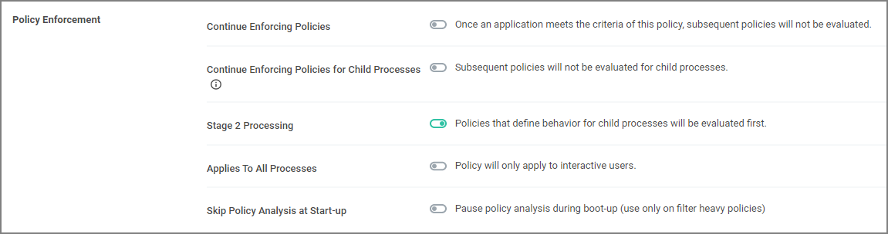

[title]: # (Catch-all Deny)
[tags]: # (deny)
[priority]: # (5)
# Catch-all Deny

A catch-all deny policy is the last policy executed following the execution of a group of allow list policies. This enables you to configure your allow list to allow approved applications, like the Windows directory or other installed applications, and then to deny everything else, like applications downloaded from the internet or a thumb drive.

To create a catch-all deny policy, follow these steps:

1. Using the Policy Wizard, create a controlling policy that blocks application execution on endpoints.
1. Select how you want the processes blocked, either __Block Silently__ or __Notify and Block__, for this example we use __Block Silently__. Click __Next Step__.
1. Select what types you want the policy to block, for this example it's __Executables__.
1. Choose your target, for this example __Existing Filter__.
1. Search for and __Add__ the __LocalSystem and Service applications__ filter.
1. Click __Update__.
1. Click __Next Step__.
1. Name your policy, add a description, and set the priority to a high value to not interfere with specific targeting policies, click __Create Policy__.
1. On the bottom of the policy page, click __Show Advanced__.
1. Under __Policy Enforcement__, ensure only __Stage 2 processing__ is set to active.

   
1. Click __Save Changes__.

If you are creating a new catch-all policy to be used in conjunction with allow list policies, please verify that the allow list is catching all system applications and that the new deny policy is the last policy executed. For additional safety you can define the exclude any parameter to exclude system and service applications.
