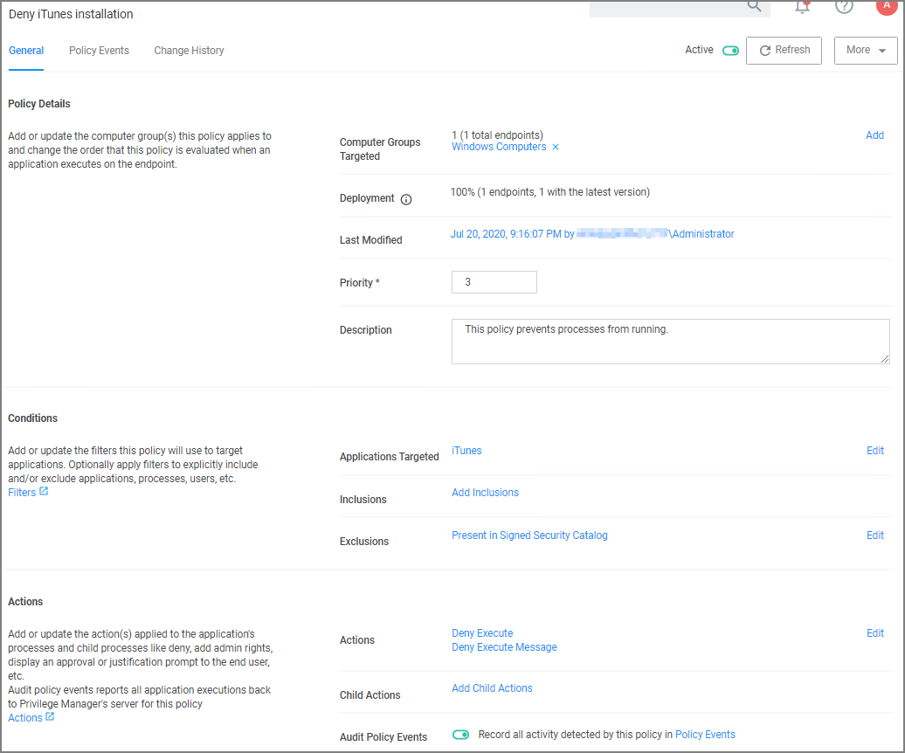

[title]: # (iTunes with File Upload)
[tags]: # (deny)
[priority]: # (5)
# iTunes with File Upload

As we've seen, there are multiple ways to introduce a new application into Privilege Manager before assigning a policy to it. For this example we will perform a File Upload for the iTunes installer to quickly deny list the iTunes program from running on target endpoints.

>**Note:** When the iTunes default filter is used, verify the correct Company name is entered to match the application targeted by the policy.
  
1. Using the Policy Wizard, create a controlling policy that blocks application execution on endpoints.
1. Select how you want the processes blocked, either __Block Silently__ or __Notify and Block__, for this example we use __Block Silently__. Click __Next Step__.
1. Select what types you want the policy to block, for this example it's __Executables__.
1. Choose your target, for this example __File Upload__.
1. Click __Choose File__ and select the installer (iTunes.exe) to upload.
1. Click __Upload File__.
1. On the __Manage Application__ page select all the identifying factors you want the filter to target.
1. Click __Create Filter__.
1. Click __Next Step__.
1. Name your policy and add a description, click __Create Policy__.
1. Set the __Inactive__ switch to __Active__.

Under the Actions tab, do not change the settings, but notice it is set to Deny Execute Message. This will produce a pop-up message to the user telling them this application execution is denied.

You can edit the policy further, if needed. Adjust the [Policy Priority](../../policies/priority.md) as needed.
