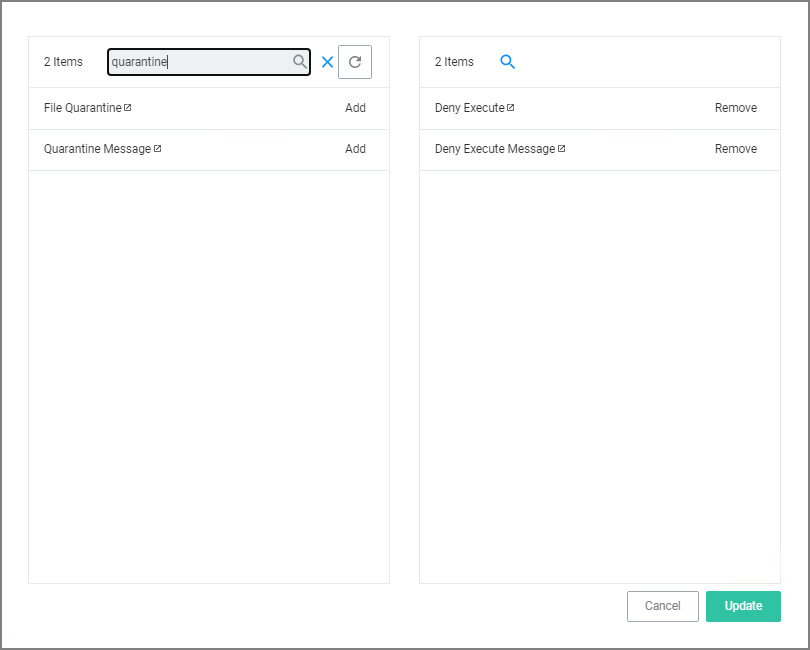
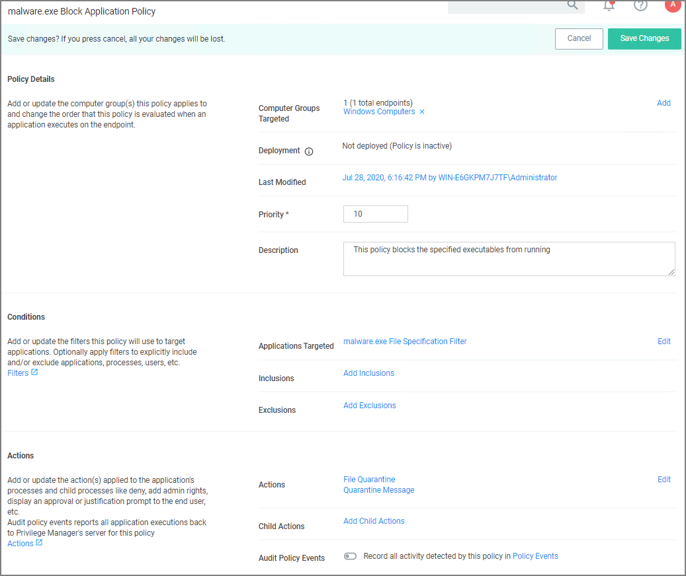

[title]: # (Quarantine Malware)
[tags]: # (deny)
[priority]: # (5)
# Quarantine Specified Malware

For known cases of malware or ransomware, you can use Privilege Manager to prevent specified applications from running and place them in a quarantine. For this example we'll target the generic executable “malware.exe,” but you can do this with any file name.

1. Navigate to __Admin | Filters__ and click __Create Filter__.
1. From the platform drop-down select the OS to target, for this example __Windows__.
1. From the type drop-down select __File Specification Filter__.
1. Add a Name and Description, click __Create__.
1. On the filter page, under __Settings: File Names__ type __malware.exe__.
1. Click __Save Changes__.
1. Under you Computer Group, select __Application Policies__.
1. Using the Policy Wizard, create a controlling policy that blocks application execution on endpoints.
1. Select how you want the processes blocked, either __Block Silently__ or __Notify and Block__, for this example we use __Block Silently__. Click __Next Step__.
1. Select what types you want the policy to block, for this example it's __Executables__.
1. Choose your target, for this example __Existing Filter__.
1. Search for and __Add__ the __malware.exe__ filter created in the above steps.
1. Click __Update__.
1. Click __Next Step__.
1. Name your policy and add a description, click __Create Policy__.
1. Under __Actions__, click __Edit__.
1. Search for __quarantine__ and __Add__ the __File Quarantine__ and __Quarantine Message__ actions.
1. __Remove__ the __Deny Execute__ and __Deny Execute Message__ actions.

   
1. Click __Update__.

   
1. Click __Save Changes__.
1. Set the __Inactive__ switch to __Active__.

Once this policy has been applied to your endpoint/s, any executable called malware.exe will be automatically blocked and quarantined if prompted to run
