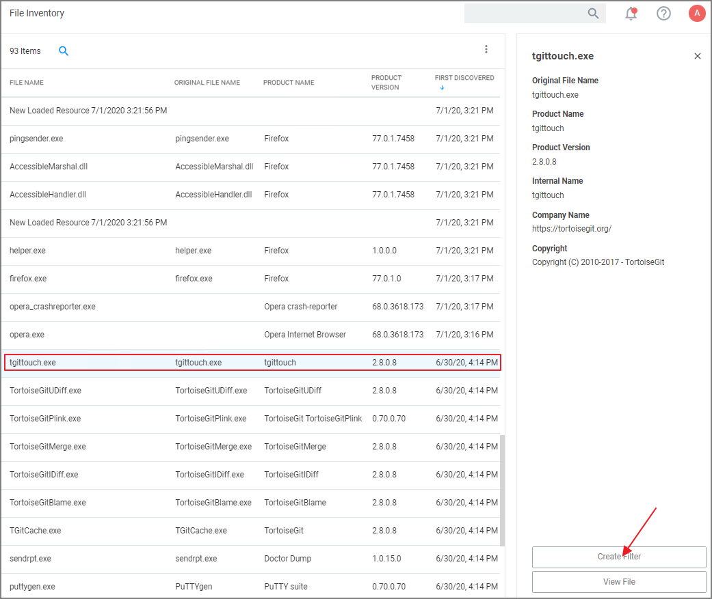

[title]: # (Specific Applications)
[tags]: # (deny list)
[priority]: # (5)
# Specific Applications

## Using File Inventory

To create a new policy using file inventory data to block specific applications, follow these steps:

1. From the navigation menu select __File Inventory__.
1. From the table grid of inventoried files, select the application you want to block.

   
1. Click __Create Filter__.
1. On the __Manage Application__ page select all the identifying factors you want the filter to target.
1. Click __Create Filter__ or __Create and Add to Policy__. Use the __Create and Add to Policy__ option if you already have a deny policy to target applications.

   Otherwise use __Create Filter__ and then use the Policy Wizard or a blank policy to add that filter.

## Using the Policy Wizard

To create a new policy using the policy wizard to block specific applications, follow these steps:

1. Using the Policy Wizard, create a controlling policy that blocks application execution on endpoints.
1. Select how you want the processes blocked, either __Block Silently__ or __Notify and Block__, for this example we use __Block Silently__. Click __Next Step__.
1. Select what types you want the policy to block, for this example it's __Executables__.
1. Choose your target, for this example __File Upload__.
1. Click __Choose File__ and select a file to upload.
1. Click __Upload File__.
1. On the __Manage Application__ page select all the identifying factors you want the filter to target.
1. Click __Create Filter__.
1. Click __Next Step__.
1. Name your policy and add a description, click __Create Policy__.
1. Set the __Inactive__ switch to __Active__.

Be sure to test the new policy on a few machines before you roll it out to the environment.
