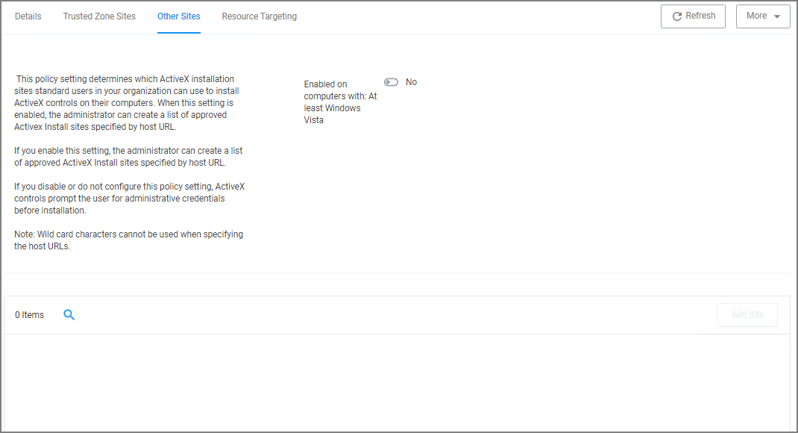

[title]: # (Setting up ActiveX Policies)
[tags]: # (elevate)
[priority]: # (4)
# Setting up ActiveX Policies

To allow add-ins to be installed via Internet Explorer, you need to create an allow policy for ActiveX.

>**Note:** You will need to import local group policy definitions before editing your Active-X Group Policy Settings.

Refer to the Local Security topic, specifically [Manage Local Groups](../../../local-security/ls-local-groups.md).

## Creating the Policy

1. Navigate to __Admin | Folders__.
1. Select __Group Policies__.
1. Click __Create__.

   
1. From the __Template__ drop-down, select __Active-X Group Policy Settings__.
1. Enter a name and description to identify the policy.
1. Click __Create__.
1. If you haven't already imported the Local Group Policy Definitions, Privilege Manager prompts you to import the definitions.

   

   Click __Go to Import Task__ and run the task. Return to the Active-X policy.

   
1. You can now add Trusted Zone sites and Other Sites and customize what actions to take when they are accessed.
   * Trusted Zone Sites tab:

   
   * Other Sites tab:

   
   1. To customize, set the __Enabled on computers with: At least Windows Vista__ to __Yes__.
   1. Click __Add Site__.

      
   1. Enter the Host Name (URL) for the site.
   1. Select from the Trusted Publishers and Signed Controls drop-down. The options are
      * Don't install
      * Prompt the user
      * Silently install
   1. Select from the Unsigned Controls drop-down. The options are
      * Don't install
      * Prompt the user
   1. Set any of the Certificate Validations switches to active specific ignore behavior, such as
      * Ignore unknown certification authority (CA)
      * Ignore invalid certificate name (CN)
      * Ignore invalid certificate date
      * Ignore wrong certificate usage
1. Click __Save Changes__.
1. On the __Resource Targeting__ tab, Privilege Manager provides instructions for setting up how to deploy the Active-X policy to Resource Targets.
1. In __Clone the following Policy__, click the __Policy__ link to open the read-only client task.
1. Duplicate the client task and give it a name identifying it as the task for your Active-X policy.

   
   1. From the __Job Settings | Command__ drop-down, select __Apply Group Policy Settings__.
   1. From the __Group Policy Setting__ drop-down, select the Active-X policy created above.

   >**Note:** Apply Group Policy Settings when you have 2 or more ActiveX policies to add to the Parameters, otherwise use the Apply Group Policy Setting item.
1. Under Job Schedule modify the schedule and/or add triggers.
1. Set the __Inactive__ switch to __Active__.
1. Click __Save Changes__.

On completing this configuration, Privilege Manager Triggers feature will then send the configured
task to the targeted endpoint.

To view the Task, go to the __Task Scheduler__. You must have administrator access to view the task inside Thycotic folder.
