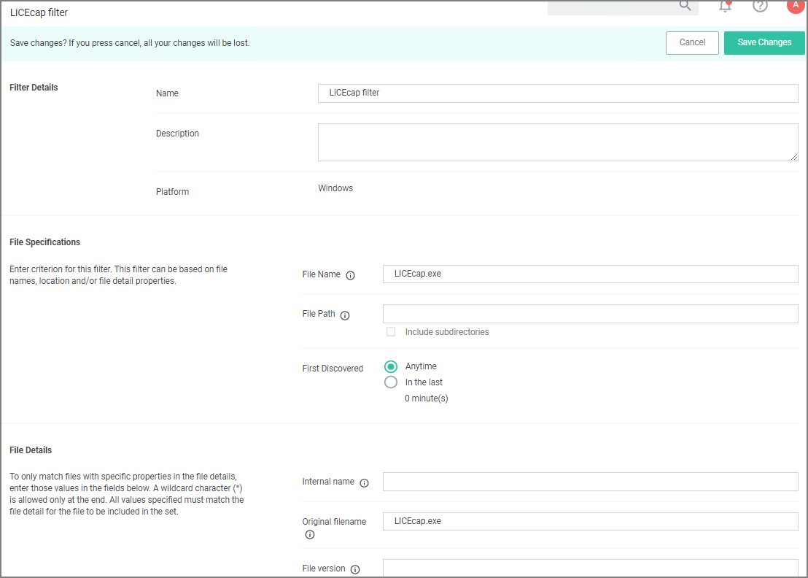
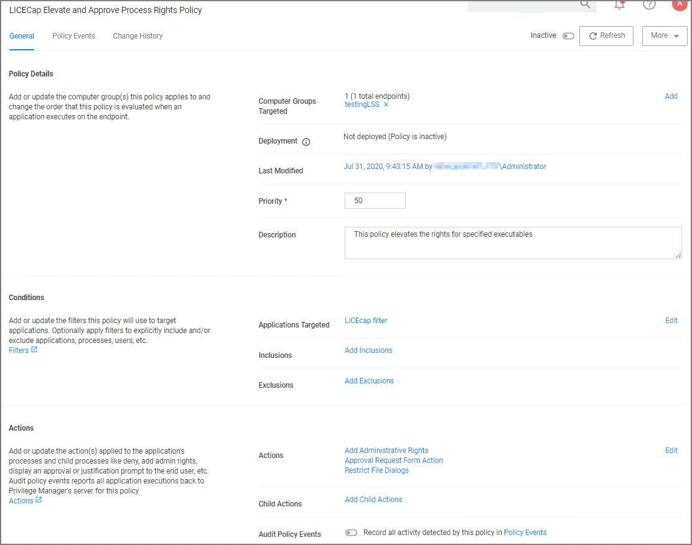
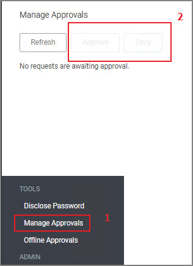

[title]: # (Execution Requires Approval)
[tags]: # (elevate)
[priority]: # (4)
# Application Execution Requires Approval

This policy type requires a user to provide a justification reason as to why they need to run a process (installer or executable). Then, the reason is submitted to specified managers via Privilege Manager __Admin: Tools | Manage Approvals__ for approval. It also depends on whether or not the Manual Approval process is used. For instance, if you have configured Service Now as your approval process handler, these approval requests won't appear in the __Admin: Tools | Manage Approvals__ area. There are several pieces to the Actions in this policy. Because Conditions and Actions are independent, these actions for approval can be applied to any condition. In this use case, we will apply this action to the LICEcap gif creator.  
First create a filter that will identify the process/executable on which Privilege Manager will act.

1. Navigate to __Admin | Filters__.
1. Click __Create Filter__.

   >**Note:** In this use case, we will target the LICEcap application (LICEcap.exe).
1. From the __Platform__ drop-down select __Windows__.
1. From the __Filter Type__ drop-down select __Blank Win32 Executable Filter__.  
1. Add a name and description, click __Create__.
1. Enter __LICEcap.exe__ in the File Name field under File Specifications as well as in the Original filename field under File Details.

   
1. Click __Save Changes__.

## Create a Policy using this Filter

1. Using the Policy Wizard, create a controlling policy that elevates requiring approval.
1. Select what file types you want targeted with the approval elevation, for this example select __Executables__.
1. Choose your targets. You can specify several different targets, for this example select __Existing Filter__.
1. Search for and add the LICEcap filter created previously.
1. Click __Update__. You may also use __File Upload__ to upload the LICEcap.exe file or __Inventoried File__ if LICEcap.exe was inventoried for this computer group.
1. Click __Next Step__.
1. Name your policy and click __Create Policy__.

   
1. Set the __Inactive__ switch to __Active__.  

   * Once the policy is delivered to the endpoint agent LICEcap.exe will require the user to enter a justification reason for running this application:  
   * Once the reason is entered by the user, the user clicks Continue to forward to the request to Privilege Manager for approval. On their desktop the Application Notice approval status is marked as Pending.
   * Finally, a privilege manager user will approve this application request

## To Approve Requests

1. Return to the Privilege Manager Dashboard and navigate to __Admin: Tools | Manage Approvals__.  

   
1. Select the approval requested from the list and click on __Approve__.
1. Select __One Time or an allotted time frame for access__ and __Manage Approve__.
1. You can now return to the desktop where the user initiated the executable, and you will see the request has been approved.
1. Click on __Continue__ and the user is allowed to run that executable.

   >**Note**: To adjust this policy to apply to specific users or endpoints, use the option to add Inclusion/Exclusion filters and Computer Groups.
